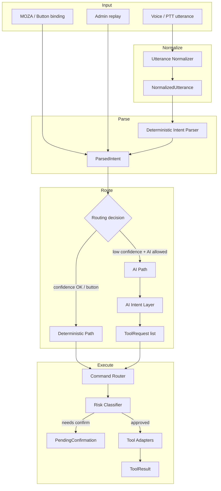
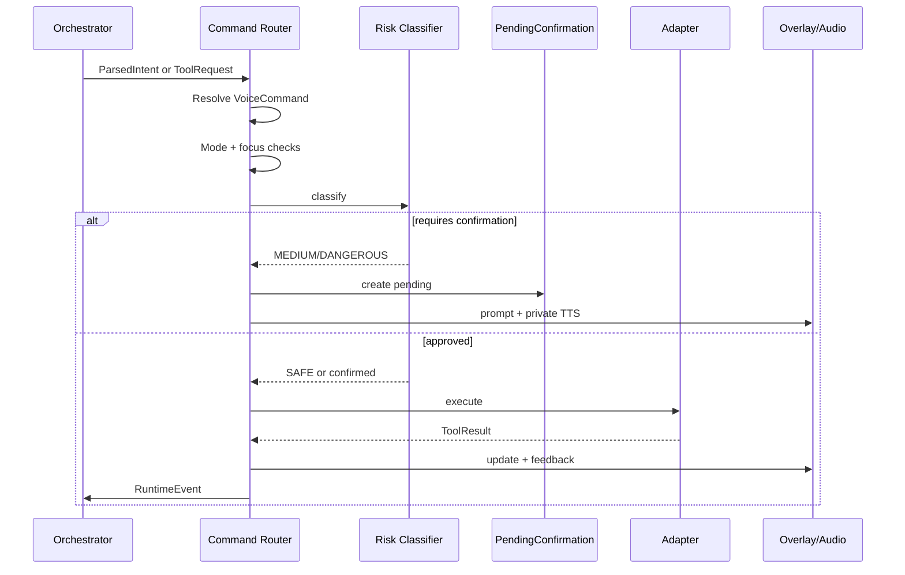
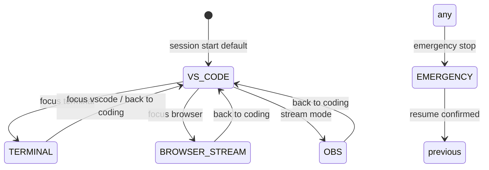
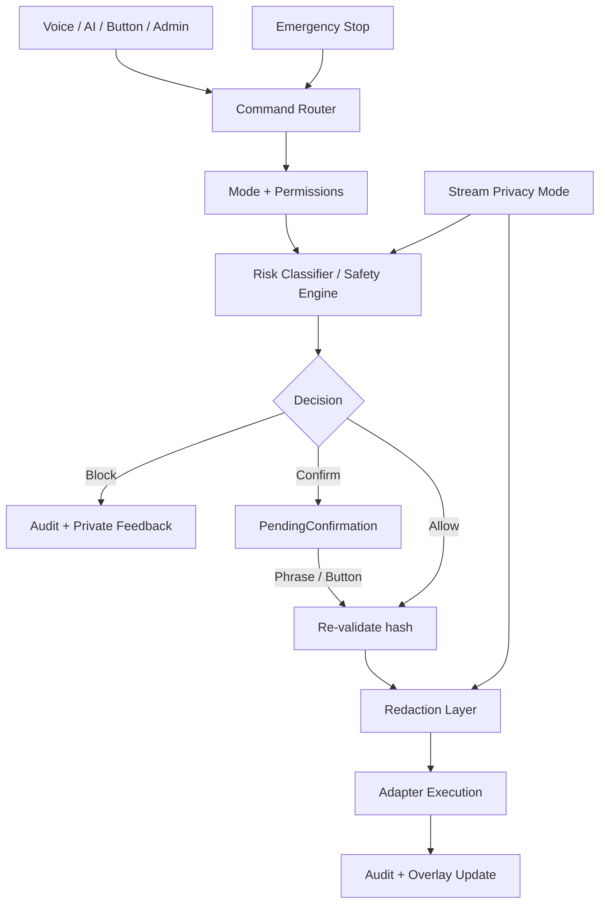
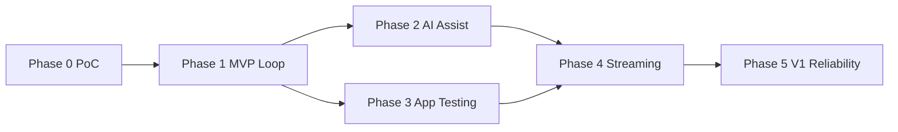

# DriftCode Harness — Master Product & Technical Specification

**Version:** 1.0  
**Status:** Design specification (no implementation code)  
**Merged from:** 14 workstream specifications  
**Platform:** Windows first · VS Code first · OpenAI direct (not Cursor)

---

## Document Control

| Item | Value |
|------|-------|
| Working title | DriftCode Harness |
| Hard invariant | The LLM is not the operating system |
| Command paths | Deterministic (no LLM) vs AI (OpenAI for reasoning only) |
| Execution gate | All actions flow through Command Router + Risk Classifier |
| Default workflow | Manual voice coding is first-class; vibe-coding is NOT default |
| Hardware | MOZA R5 wheel buttons for PTT, emergency stop, etc. |
| Browser | Dedicated stream-safe profile |
| Modes | 11 explicit modes (see Section 26) |

---

## Table of Contents

1. [Product Vision](#1-product-vision) · 2. [Main Goal](#2-main-goal) · 3. [Core User Problem](#3-core-user-problem) · 4. [Target Users](#4-target-users) · 5. [Guiding Principles](#5-guiding-principles) · 6. [Locked Assumptions](#6-locked-assumptions) · 7. [Key User Workflows](#7-key-user-workflows) · 8. [System Architecture](#8-system-architecture) · 9. [Major Subsystems](#9-major-subsystems) · 10. [Data Structures](#10-data-structures) · 11. [Voice Interaction](#11-voice-interaction) · 12. [Manual Voice-Coding](#12-manual-voice-coding) · 13. [Deterministic Command-Routing](#13-deterministic-command-routing) · 14. [AI Invocation Policy](#14-ai-invocation-policy) · 15. [AI-Assisted Coding](#15-ai-assisted-coding) · 16. [Vibe-Coding](#16-vibe-coding) · 17. [Computer Navigation](#17-computer-navigation) · 18. [VS Code Integration](#18-vs-code-integration) · 19. [Windows Automation](#19-windows-automation) · 20. [Terminal Strategy](#20-terminal-strategy) · 21. [Browser/Research](#21-browserresearch) · 22. [App-Testing](#22-app-testing) · 23. [OBS/Streaming](#23-obsstreaming) · 24. [Audio Feedback](#24-audio-feedback) · 25. [Visual Overlay](#25-visual-overlay) · 26. [Mode-Switching (11 Modes)](#26-mode-switching-all-11-modes) · 27. [AI Agent Boundaries](#27-ai-agent-boundaries) · 28. [Safety/Confirmation](#28-safetyconfirmation) · 29. [Cost-Control](#29-cost-control) · 30. [Admin Panel](#30-admin-panel) · 31. [Configuration](#31-configuration) · 32. [Profiles](#32-profiles) · 33. [Command Customization](#33-command-customization) · 34. [Runtime Monitoring](#34-runtime-monitoring) · 35. [MOZA R5](#35-moza-r5) · 36. [Stream-Safe Browser](#36-stream-safe-browser) · 37. [Talon/Cursorless Onboarding](#37-taloncursorless-onboarding) · 38. [Fail-Safe](#38-fail-safe) · 39. [MVP Scope](#39-mvp-scope) · 40. [V1 Scope](#40-v1-scope) · 41. [Future Expansion](#41-future-expansion) · 42. [Non-Goals](#42-non-goals) · 43. [Technical Risks](#43-technical-risks) · 44. [UX Risks](#44-ux-risks) · 45. [Security Risks](#45-security-risks) · 46. [Tech Stack](#46-tech-stack) · 47. [Build-vs-Buy](#47-build-vs-buy) · 48. [Roadmap](#48-roadmap) · 49. [Acceptance Criteria](#49-acceptance-criteria) · 50. [Open Questions](#50-open-questions)

---

## 1. Product Vision

**DriftCode Harness** is a **low-attention, voice-first computer operating harness** for developing software while the operator’s primary attention is on sim drifting and live streaming.

The vision is not “an AI that codes for you on stream,” and not “dictation into an editor.” It is a **layered control surface** that lets one person remain the developer: dictate and structurally edit code by voice, route deterministic actions without LLM cost or latency, invoke OpenAI only for reasoning-heavy work, test the real app in a browser, and manage stream safety — all with **glanceable** feedback and **interruptible** audio.

Success feels like: *I’m still driving the car and the project; the harness removes keyboard/mouse friction and catches me when I can’t look.*

---

## 2. Main Goal

Enable a **complete hands-free coding loop** on Windows + VS Code during a live drift stream:

| Loop stage | Hands-free expectation |
|------------|------------------------|
| Edit | Dictate symbols/snippets; navigate and refactor structurally without LLM |
| Build | Run allowlisted terminal/dev-server commands with brief status |
| Assist | Scoped AI tasks (fix error, add function) with explicit apply and safety gates |
| Verify | Open localhost in stream-safe browser; run reusable flows; surface pass/fail |
| Stream | OBS/overlay/privacy without breaking focus on the wheel |

**Primary success metric (MVP):** Complete a small web-app session — mode switches, manual dictation, one scoped AI patch with explicit apply, dev server + browser test, short feedback, emergency stop — **without touching keyboard/mouse** and **without OpenAI on deterministic commands**.

**Secondary success metric (V1):** Same loop is **reliable enough for public stream**: predictable modes, private vs stream audio separation, cost visibility, and recoverable failures.

---

## 3. Core User Problem

### Primary problem

While sim drifting with a MOZA R5 (wheel + pedals), the operator has:

- **Near-zero hand availability** for keyboard/mouse
- **Severely limited visual attention** — occasional glances only
- **Split cognitive load** — racing line, inputs, and chat/stream presence compete with coding decisions
- **High stakes on stream** — mistakes leak secrets, bore the audience, or break trust in the tool

Traditional tools assume **hands on keyboard, eyes on screen, uninterrupted focus**. Cursor-style agents assume **you can review diffs and click approve**. Dictation tools assume **you are looking at what was typed**. None of these match **drive first, develop second, stream always**.

### Problem decomposition

1. **Input:** Cannot type, click, or scroll reliably.  
2. **Feedback:** Cannot read long AI answers or dense UI.  
3. **Safety:** One misheard command can destroy files, publish, or expose credentials on stream.  
4. **Cost/latency:** Sending every utterance to an LLM is slow, expensive, and wrong for symbol-level dictation.  
5. **Identity:** Stream audience should see *a developer coding while drifting*, not a passive spectator watching automation.

DriftCode Harness exists to collapse these into a **single coherent operating model** with explicit modes, deterministic fast path, and attention-aware output.

---

## 4. Target Users and Adjacent Use Cases

### Primary persona: Stream-developer drifter

- Windows developer, VS Code user, builds web apps (fun → serious over time)
- Live streams sim + coding; MOZA R5 with mappable buttons
- New to Talon/Cursorless; needs onboarding, not expert assumptions
- Wants manual voice coding as **first-class**, AI as **accelerator**
- Cares about **stream safety**, **cost control**, and **remaining visibly in control**

### Secondary personas (V1+)

| Persona | Why Harness fits | Mode emphasis |
|---------|------------------|---------------|
| Accessibility / RSI / hands-busy pro | Same low-attention constraint, no sim | Manual dictation, Command, Review |
| Content creator “build on stream” | Public narrative + safety | Stream-control, Brief audio, privacy |
| Indie hacker with wheel desk setup | PTT on button box | MOZA bindings, deterministic macros |

### Adjacent use cases (explicitly supported by architecture, not MVP marketing)

- **Hands-busy workshop/stream repair** — Terminal + App-testing, minimal AI
- **Research while building** — Research mode, stream-safe browser, short summaries
- **Post-drive coding** — Same harness; verbosity can increase when not drifting
- **Offline practice** — Training profiles for grammar/aliases without going live

### Out of persona for MVP (see Non-goals)

Enterprise multi-seat, audience-driven commands, general OS control for arbitrary apps.

---

## 5. Guiding Principles

### P1 — User remains the developer

Manual voice coding and explicit approvals are the default story on stream. AI proposes and executes only through the command router after intent is clear.

### P2 — LLM is not the OS

Deterministic path for typing, symbols, navigation, mode switch, OBS, allowlisted shell. OpenAI for ambiguity, generation, diagnosis, synthesis.

### P3 — Attention budget is sacred

Every output channel (private TTS, stream audio, overlay, beep) is chosen for **current attention state**, not maximum information.

### P4 — Modes are contracts

Each mode advertises: what can run, whether AI is on, default verbosity, confirmations, overlay content, audio routing. Entering a mode is a **user-visible state change**.

### P5 — Fail closed, recover loud

Unknown intent → no silent failure. Dangerous action → blocked or confirmed. Emergency stop → immediate, unmistakable.

### P6 — Stream is a hostile environment

Treat overlay, browser, and AI narration as **public-by-default** unless privacy routing is active.

### P7 — Cost is a feature

Aliases, grammar, and dashboards exist so users **feel** control over token spend.

### P8 — Glanceable truth

Overlay shows mode, last command, pending confirmation, privacy flag — not paragraphs.

### P9 — Wheel buttons are high-trust

MOZA bindings for PTT, stop, confirm, cancel are faster and clearer than ambiguous voice in noise.

### P10 — Progressive disclosure

MVP proves the loop; V1 adds reliability, OBS depth, profiles — without changing the mental model.

---

## 6. Locked Implementation Assumptions

These are **UX-relevant hard constraints** for all design decisions:

| # | Assumption | UX implication |
|---|------------|----------------|
| L1 | Windows first | Shell, focus, window management APIs are Windows-centric |
| L2 | VS Code only (MVP) | All “editor” UX is VS Code extension + state sync |
| L3 | OpenAI direct (not Cursor) | Admin panel owns models, costs, prompts; no Cursor dependency |
| L4 | MOZA R5 buttons mappable | PTT, e-stop, confirm, mode toggle on wheel |
| L5 | Pluggable STT | Misrecognition UX must support provider swap + correction log |
| L6 | Dedicated stream-safe browser profile | Research/app-test never uses personal Chrome profile |
| L7 | Configurable overlay (debug → minimal) | Stream layout can evolve without re-architecting |
| L8 | Per-mode audio routing | Private / stream / silent / beep-only are first-class |
| L9 | AI auto-apply only when explicit + safe | “Apply the fix” is a deliberate act, not default |
| L10 | 11 explicit modes | No hidden “smart mode”; confusion handled by indicators |
| L11 | Command router + risk classifier always in path | AI never “direct drives” OS or editor |
| L12 | Talon/Cursorless optional with onboarding | Spec must not assume prior voice-coding expertise |

---

## 7. Key User Workflows

Each workflow assumes: **push-to-talk (voice or MOZA)**, **current mode visible on overlay**, **last action logged in admin dashboard**.

### 7.1 Hands-free coding while sim drifting

**Preconditions:** Harness running; VS Code open on project; profile “Drift stream”; Manual dictation or Command mode; PTT bound to MOZA paddle; overlay shows mode + privacy.

| Step | Actor | Action | System behavior | Feedback |
|------|-------|--------|-----------------|----------|
| 1 | User | Holds PTT, says “switch manual dictation” | Deterministic parser → mode change | Short private beep + overlay mode chip; optional one-word TTS “Manual” |
| 2 | User | Glances overlay | Sees mode, file name (if synced), privacy | No long speech |
| 3 | User | PTT: dictates line e.g. `const user = await getUser(id)` via spoken symbols | Utterance normalizer → deterministic insert via VS Code extension | Overlay: last phrase normalized; misrecognition flagged if low confidence |
| 4 | User | PTT: “select current function” | Structural command, no LLM | Private brief “Selected” or beep-only per profile |
| 5 | User | PTT: “wrap block in if statement” | Structural edit + confirmation if profile requires | Overlay shows pending confirm if medium-risk |
| 6 | User | Mis-speech | “undo last phrase” | Reverts last dictation unit; logs correction candidate |
| 7 | User | Needs help | “switch AI assist” | Mode change; AI enabled for next scoped task only |
| 8 | User | Continues drifting | No auto-narration | Silence unless command completes or error |

**Exit criteria:** File contains intended edits; no unsolicited LLM calls during steps 3–6; user never removed hands from wheel.

**Failure paths:**

- Low confidence parse → overlay “?” + repeat suggestion; no editor mutation  
- Wrong file focus → “focus VS Code” voice or wheel binding recovers  
- STT dropout → PTT release cancels partial buffer

---

### 7.2 Mode switching

**Goal:** Predictable state changes with minimal speech while driving.

| Step | User says / does | System | Overlay | Audio |
|------|------------------|--------|---------|-------|
| 1 | “What mode” or glances overlay | Reads current `ModeConfig` | Large mode label + color | Private one line or silent |
| 2 | “Switch command mode” | Deterministic; validates transition | Animates transition 300ms | Beep + optional “Command” |
| 3 | Invalid combo e.g. vibe-coding while privacy off | Blocked with reason | “Blocked: enable X” | Brief private explanation |
| 4 | Wheel: toggle manual/command | High-priority binding | Same as voice | Beep only |
| 5 | “Switch stream control” | Enters stream mode; may require confirm if leaving unsaved medium-risk | Stream icon on overlay | “Confirm stream change” if configured |
| 6 | User confirms or cancels | Router executes or aborts | Clears pending | Confirm phrase or “Cancelled” |

**Rules:**

- Mode switch **never** invokes OpenAI  
- Previous mode’s pending confirmations **cancelled or surfaced** explicitly  
- Every mode entry updates: AI default, verbosity, overlay template, audio routing

**11 modes (reference):** Manual dictation, Command, AI-assist, Vibe-coding, Research, Browser, App-testing, Review, Terminal, Stream-control, Emergency/safe.

---

### 7.3 AI-assist scoped task

**Preconditions:** AI-assist mode; editor state synced; user has selected scope or named file/function.

| Step | User | System | Safety |
|------|------|--------|--------|
| 1 | PTT: “In this file, add function `validateProfile` that checks email and age” | Creates `AiTask` with scope = active file; AI returns structured tool requests only | No direct apply |
| 2 | — | AI proposes patch preview metadata | Overlay: “AI: patch ready” + file list |
| 3 | User | Reviews via glance: overlay shows files touched, risk class | Medium: multi-file may need confirm |
| 4 | User | “Explain error briefly” (optional) | Short private TTS per brief profile | No stream unless routed |
| 5 | User | “Apply the fix” | Risk classifier → confirm if needed → router → VS Code extension apply | Audit log entry |
| 6 | User | “Undo apply” or extension undo | Reversible within session policy | — |
| 7 | User | “Stop talking” | Cancels TTS queue | — |

**Auto-apply allowed only when:** explicit apply phrase + mode allows + safe/medium approved + no protected paths + no package install/deploy.

**UX rule:** Proposal phase is **silent or overlay-only** by default; narration is opt-in (“read summary”).

---

### 7.4 App testing flow

**Preconditions:** App-testing mode (or Command with test macro); project has configured dev server URL and `AppTestFlow`.

| Step | User | System |
|------|------|--------|
| 1 | “Start dev server” | Terminal adapter runs allowlisted command; dashboard shows starting |
| 2 | — | Polls readiness on localhost |
| 3 | “Open app” | Stream-safe browser opens configured URL |
| 4 | “Run login flow” | Playwright-style flow: fill fake data, click paths |
| 5 | — | Captures console errors, network failures |
| 6 | User | “Tell me only whether it worked” | Pass/fail beep + one word private |
| 7 | User | “What failed” (optional) | Brief diagnosis; OpenAI only if deterministic rules insufficient |
| 8 | User | “Switch AI assist” + “fix the validation error” | Hands off to scoped AI workflow (7.3) |

**Overlay during test:** Step name, pass/fail, error count (not full stack on stream by default).

**Failure:** Server not up → “not ready” + retry suggestion; browser blocked → safe profile error on overlay.

---

### 7.5 Stream control

**Preconditions:** Stream-control mode; OBS adapter connected; privacy state known.

| Step | User | System | Confirm |
|------|------|--------|---------|
| 1 | “Hide transcript on overlay” | OBS/overlay adapter | Safe |
| 2 | “Enable privacy mode” | Redacts sensitive overlay fields; private AI routing enforced | May require “Confirm stream change” |
| 3 | “Switch scene to coding” | OBS scene change | Medium → confirm per profile |
| 4 | “Show debug overlay” | Full debug layout | Safe locally; warn if stream-visible |
| 5 | “Mute stream narration” | Audio routing: stream bus off | Safe |
| 6 | “End stream” | Blocked until dangerous confirm + “Confirm publish” class if applicable | Always dangerous |

**UX:** Stream mode uses **beep-heavy, word-light** defaults; destructive stream actions use **visual pending confirm** on overlay for glance confirmation.

---

### 7.6 Emergency stop

**Triggers:** Phrase (“emergency stop”, “stop harness”, “stop all”); dedicated MOZA button; admin kill switch.

| Step | System response | User recovery |
|------|-----------------|---------------|
| 1 | Immediately cancel in-flight TTS, AI tasks, browser automation, pending confirmations | — |
| 2 | Enter **Emergency/safe mode** | Overlay red banner |
| 3 | Reject non-whitelisted commands | Only: status, “resume”, “switch manual dictation”, “show dashboard” |
| 4 | Private audio: single “Stopped” or distinct alarm beep | Stream audio: silence (no panic spam) |
| 5 | Log `RuntimeEvent` with cause (voice/button/admin) | Audit trail |
| 6 | User: “resume harness” after deliberate confirm | Exits emergency; restores previous mode **only** if configured (or defaults to Command) |

**UX requirement:** Stop must work when **STT is wrong**, **AI is mid-tool**, or **browser is navigating**. One action, one outcome, no “are you sure?” chain before stop.

---

## 8. System Architecture

### 8.1 Overview

### 8.1.1 Architectural Principle

The **LLM is not the operating system**. DriftCode Harness is a modular, event-driven local system with two distinct command paths:

| Path | Purpose | OpenAI? |
|------|---------|---------|
| **Deterministic Path** | Known grammar, aliases, symbols, mode switches, wheel buttons, allowlisted terminal/OBS/browser/VS Code actions | Never |
| **AI Path** | Reasoning, generation, synthesis, ambiguity resolution, multi-step planning | Only when policy allows |

All actions—regardless of origin—must pass through the **Command Router** and **Risk Classifier / Safety Engine** before any adapter executes. The AI layer may propose actions as structured `ToolRequest` objects, but it never directly controls the machine.

### 8.1.2 The 16 Subsystems

```
┌─────────────────────────────────────────────────────────────────────────────┐
│                         ADMIN / CONTROL PANEL (16)                          │
│              config · logs · dashboard · debugging · cost view              │
└───────────────────────────────────┬─────────────────────────────────────────┘
                                    │ WebSocket / HTTP (local only)
┌───────────────────────────────────▼─────────────────────────────────────────┐
│                    LOCAL RUNTIME / ORCHESTRATOR (1)                         │
│  mode state · focus tracking · routing · safety · event bus · persistence   │
└─┬───┬───┬───┬───┬───┬───┬───┬───┬───┬───┬───┬───┬───┬───┬──────────────────┘
  │   │   │   │   │   │   │   │   │   │   │   │   │   │   │
  ▼   ▼   ▼   ▼   ▼   ▼   ▼   ▼   ▼   ▼   ▼   ▼   ▼   ▼   ▼
 (2)(3)(4)(5)(6)(7)(8)(9)(10)(11)(12)(13)(14)(15)
```

| # | Subsystem | Role | Primary Inputs | Primary Outputs |
|---|-----------|------|----------------|-----------------|
| 1 | **Local Runtime / Orchestrator** | Central coordinator, session state, event bus | All subsystem events | Routed commands, `RuntimeEvent` stream |
| 2 | **Speech Input Service** | Mic capture, STT, PTT/wake/emergency | Audio, button PTT | Raw transcript + confidence |
| 3 | **Utterance Normalizer** | Vocabulary, corrections, alias pre-expansion | Raw transcript | `NormalizedUtterance` |
| 4 | **Deterministic Intent Parser** | Mode grammar, symbol parsing, alias match | `NormalizedUtterance` | `ParsedIntent` (deterministic) |
| 5 | **AI Intent / Reasoning Layer** | OpenAI calls, structured planning | Utterance + context | `AiTask`, `ToolRequest[]` |
| 6 | **Command Router** | Mode/permission checks, adapter dispatch | `ParsedIntent` or `ToolRequest` | Adapter invocations, `ToolResult` |
| 7 | **Risk Classifier / Safety Engine** | Risk tier, confirmations, blocks, redaction | Proposed action + context | `RiskClassification`, `PendingConfirmation` |
| 8 | **VS Code Extension** | Editor control, state reporting | Tool requests | `EditorState`, edit results |
| 9 | **Terminal Adapter** | Allowlisted shell execution | `TerminalCommand` | stdout/stderr, exit code |
| 10 | **Browser Automation Adapter** | Playwright-style automation | Navigation/action requests | `BrowserState`, DOM/console/network |
| 11 | **Research Agent** | Web search + brief synthesis | Research utterances | Summaries, sources (via AI path) |
| 12 | **App-Testing Agent** | Dev server, flows, diagnosis | `AppTestFlow` refs | Pass/fail, diagnostics |
| 13 | **OBS / Streaming Adapter** | Scene/source control, privacy | Stream commands | OBS state, ack/nack |
| 14 | **Audio Feedback Layer** | TTS, beeps, routing | Mode + response content | Private/stream audio |
| 15 | **Visual Overlay Layer** | Stream/debug HUD | `StreamOverlayState` | Browser source / overlay window |
| 16 | **Admin / Control Panel** | Configuration UI, monitoring | User edits | Updated configs, log queries |

### 8.1.3 Connection Topology

**Inbound event sources**

- Microphone → Speech Input Service
- MOZA / button box → Speech Input Service (PTT) or Orchestrator (high-confidence discrete actions)
- VS Code Extension → Orchestrator (state push, command responses)
- Terminal / Browser / OBS adapters → Orchestrator (state + results)
- Admin Panel → Orchestrator (config CRUD, manual overrides)

**Outbound coordination**

- Orchestrator → Adapters (via Command Router, post-safety)
- Orchestrator → AI Layer (when invocation policy permits)
- Orchestrator → Overlay + Audio (feedback, confirmations, mode indicators)
- Orchestrator → Admin Panel (real-time `RuntimeEvent` stream)
- Orchestrator → Local persistence (logs, audit, config store)

**Shared context objects** (maintained by Orchestrator)

- Active `ModeConfig` + `ProfileConfig` + `ProjectConfig`
- Current `EditorState`, `BrowserState`, window focus
- Pending `PendingConfirmation` queue
- Active `AiTask` (if any)
- Session cost accumulator

### 8.1.4 Data Flow Summary (Two Paths)

```
[Audio/Button] → Speech Input → Normalizer → Intent Parser ──(confidence OK)──→ Command Router
                                                      │
                                                      └──(low confidence / AI mode)──→ AI Layer
                                                                                              │
                                                                                              ▼
                                                                         ToolRequest[] → Command Router
                                                                                              │
                                                                                              ▼
                                                                         Risk Classifier → Adapter(s)
                                                                                              │
                                                                                              ▼
                                                                         ToolResult → Events → Overlay/Audio/Admin
```

### 8.1.5 Subsystem Boundary Rules

| Rule | Description |
|------|-------------|
| Single router | Only the Command Router dispatches executable actions to adapters |
| AI isolation | AI Layer outputs `ToolRequest` only; never calls adapters directly |
| Safety gate | Every `ToolRequest` passes Risk Classifier before execution (reads may be exempt per policy) |
| State ownership | Orchestrator owns session/mode/focus; adapters own domain state snapshots |
| Config ownership | Admin writes config; Orchestrator validates and hot-reloads where safe |
| Event canonical form | All subsystems emit `RuntimeEvent`; Orchestrator assigns `sequenceNumber` |
| Stream safety | Overlay and stream audio consume redacted `payloadStreamSafe` only |

### 8.1.6 Deployment View (Logical, Windows-First)

| Process | Contains |
|---------|----------|
| **Harness Runtime** (main) | Orchestrator, Speech Input, Normalizer, Parser, Router, Safety, AI Layer, Audio, event bus |
| **VS Code Extension** | Separate extension host process |
| **Browser Driver** | Playwright browser + automation adapter (child process acceptable) |
| **Terminal Sessions** | Managed shells per project |
| **OBS** | External; controlled via WebSocket adapter |
| **Admin Panel** | Local web app served by runtime or static + API |
| **Overlay** | Local HTTP page consumed by OBS Browser Source |

All inter-process communication is localhost-only. No remote admin in MVP.

---

### 8.2 Two Command Paths

DriftCode Harness implements a strict dual-path execution model:

| Path | Used For | OpenAI |
|------|----------|--------|
| **Deterministic** | Manual typing, symbols, known voice commands, mode switches, emergency stop, VS Code commands, browser commands, OBS commands, allowlisted terminal, wheel/button inputs, macros, known app-test flows | **Never** |
| **AI** | Reasoning, synthesis, ambiguity resolution, explanation, code generation, research, multi-step planning, vibe-coding | **Only when policy allows** |

All AI-requested actions are emitted as structured `ToolRequest` objects and must pass through the Command Router and Risk Classifier before any adapter executes. OpenAI never directly controls the machine.

```mermaid
flowchart TB
    subgraph Input
        MIC[Microphone / PTT]
        BTN[MOZA Buttons]
        EXT[VS Code Extension]
    end
    subgraph DeterministicPath
        STT[Speech Input Service]
        NORM[Utterance Normalizer]
        PARSE[Deterministic Intent Parser]
    end
    subgraph AIPath
        AI[AI Intent / Reasoning Layer]
    end
    subgraph ExecutionGate
        ROUTER[Command Router]
        RISK[Risk Classifier / Safety Engine]
        CONF[Pending Confirmation]
    end
    subgraph Adapters
        VSC[VS Code Extension]
        TERM[Terminal Adapter]
        BRW[Browser Adapter]
        OBS[OBS Adapter]
    end
    subgraph Feedback
        AUD[Audio Feedback Layer]
        OVL[Visual Overlay Layer]
        ADM[Admin Panel]
    end
    MIC --> STT --> NORM --> PARSE
    PARSE -->|confidence OK| ROUTER
    PARSE -->|low confidence / AI mode| AI
    AI -->|ToolRequest[]| ROUTER
    BTN --> ROUTER
    ROUTER --> RISK
    RISK -->|needs confirm| CONF
    RISK -->|approved| VSC & TERM & BRW & OBS
    VSC & TERM & BRW & OBS --> AUD & OVL & ADM
    EXT --> ROUTER
```

---

## 9. Major Subsystems

The harness is organized around **16 subsystems**. Each has a single responsibility; cross-cutting concerns (safety, logging, mode state) are owned by the Orchestrator.


```
┌─────────────────────────────────────────────────────────────────────────────┐
│                         ADMIN / CONTROL PANEL (16)                          │
│              config · logs · dashboard · debugging · cost view              │
└───────────────────────────────────┬─────────────────────────────────────────┘
                                    │ WebSocket / HTTP (local only)
┌───────────────────────────────────▼─────────────────────────────────────────┐
│                    LOCAL RUNTIME / ORCHESTRATOR (1)                         │
│  mode state · focus tracking · routing · safety · event bus · persistence   │
└─┬───┬───┬───┬───┬───┬───┬───┬───┬───┬───┬───┬───┬───┬───┬──────────────────┘
  │   │   │   │   │   │   │   │   │   │   │   │   │   │   │
  ▼   ▼   ▼   ▼   ▼   ▼   ▼   ▼   ▼   ▼   ▼   ▼   ▼   ▼   ▼
 (2)(3)(4)(5)(6)(7)(8)(9)(10)(11)(12)(13)(14)(15)
```

| # | Subsystem | Role | Primary Inputs | Primary Outputs |
|---|-----------|------|----------------|-----------------|
| 1 | **Local Runtime / Orchestrator** | Central coordinator, session state, event bus | All subsystem events | Routed commands, `RuntimeEvent` stream |
| 2 | **Speech Input Service** | Mic capture, STT, PTT/wake/emergency | Audio, button PTT | Raw transcript + confidence |
| 3 | **Utterance Normalizer** | Vocabulary, corrections, alias pre-expansion | Raw transcript | `NormalizedUtterance` |
| 4 | **Deterministic Intent Parser** | Mode grammar, symbol parsing, alias match | `NormalizedUtterance` | `ParsedIntent` (deterministic) |
| 5 | **AI Intent / Reasoning Layer** | OpenAI calls, structured planning | Utterance + context | `AiTask`, `ToolRequest[]` |
| 6 | **Command Router** | Mode/permission checks, adapter dispatch | `ParsedIntent` or `ToolRequest` | Adapter invocations, `ToolResult` |
| 7 | **Risk Classifier / Safety Engine** | Risk tier, confirmations, blocks, redaction | Proposed action + context | `RiskClassification`, `PendingConfirmation` |
| 8 | **VS Code Extension** | Editor control, state reporting | Tool requests | `EditorState`, edit results |
| 9 | **Terminal Adapter** | Allowlisted shell execution | `TerminalCommand` | stdout/stderr, exit code |
| 10 | **Browser Automation Adapter** | Playwright-style automation | Navigation/action requests | `BrowserState`, DOM/console/network |
| 11 | **Research Agent** | Web search + brief synthesis | Research utterances | Summaries, sources (via AI path) |
| 12 | **App-Testing Agent** | Dev server, flows, diagnosis | `AppTestFlow` refs | Pass/fail, diagnostics |
| 13 | **OBS / Streaming Adapter** | Scene/source control, privacy | Stream commands | OBS state, ack/nack |
| 14 | **Audio Feedback Layer** | TTS, beeps, routing | Mode + response content | Private/stream audio |
| 15 | **Visual Overlay Layer** | Stream/debug HUD | `StreamOverlayState` | Browser source / overlay window |
| 16 | **Admin / Control Panel** | Configuration UI, monitoring | User edits | Updated configs, log queries |


### 9.1 Subsystem Detail

### 9.1.1 Purpose

The Orchestrator is the **single authoritative local process** for DriftCode Harness. It owns session lifecycle, mode state, configuration resolution, command routing, safety enforcement coordination, and the canonical event log.

### 9.1.2 Core Responsibilities

| Responsibility | Detail |
|----------------|--------|
| Session lifecycle | Start/stop harness, load profile/project, reconnect adapters |
| Mode management | Enter/exit modes per `ModeConfig`; enforce mode-specific grammar and tool availability |
| Focus tracking | Track foreground app, VS Code workspace, browser URL, terminal session |
| Command routing | Dispatch deterministic intents and AI `ToolRequest`s to correct adapters |
| AI invocation gate | Apply cost-control decision tree before calling OpenAI |
| Safety coordination | Invoke Risk Classifier; hold/resume actions pending confirmation |
| Event emission | Publish typed `RuntimeEvent`s to overlay, audio, admin |
| Persistence | Write audit logs, AI usage, config; optional session replay buffer |
| Emergency stop | Global halt: cancel AI tasks, clear pending confirmations, mute audio, enter safe mode |

### 9.1.3 Internal Components (Logical)

| Component | Function |
|-----------|----------|
| **Session Manager** | Profile/project binding, adapter health, dev-server status |
| **Mode State Machine** | Valid transitions, entry/exit hooks, failure behavior |
| **Context Aggregator** | Merges `EditorState`, `BrowserState`, focus, active `AiTask` into routing context |
| **Invocation Policy Engine** | Decides deterministic vs AI path per mode, utterance, and settings |
| **Confirmation Manager** | Creates/expiry/cancels `PendingConfirmation`; matches confirmation phrases |
| **Event Bus** | Pub/sub for `RuntimeEvent`; subscribers: overlay, audio, admin, logger |
| **Config Store** | Versioned read of `ProfileConfig`, `ProjectConfig`, `SafetyConfig`, aliases |
| **Cost Tracker** | Aggregates `AiUsageEvent`s; session estimates |
| **Focus Recovery** | Optional auto-return to VS Code per profile setting |
| **Adapter Registry** | Maps adapter IDs to live connections and capability flags |

### 9.1.4 Orchestrator Runtime State

Runtime state is not a single persisted model; it is the live aggregate the Orchestrator maintains.

| State Key | Type | Description |
|-----------|------|-------------|
| `sessionId` | string (UUID) | Current harness session |
| `sessionStartedAt` | datetime | Session start |
| `activeModeId` | string | Current mode identifier |
| `previousModeId` | string | For revert on failure |
| `activeProfileId` | string | Loaded profile |
| `activeProjectId` | string | Loaded project (nullable if none) |
| `emergencyStopActive` | boolean | Global halt flag |
| `streamPrivacyActive` | boolean | Redaction/privacy overlay engaged |
| `pendingConfirmations` | PendingConfirmation[] | Queue; max one active prompt to operator |
| `activeAiTask` | AiTask \| null | In-flight AI work |
| `lastNormalizedUtterance` | NormalizedUtterance \| null | Most recent speech |
| `lastParsedIntent` | ParsedIntent \| null | Most recent routed intent |
| `editorState` | EditorState | Latest from VS Code extension |
| `browserState` | BrowserState | Latest from browser adapter |
| `overlayState` | StreamOverlayState | Current HUD snapshot |
| `focusTarget` | enum | `vscode` \| `browser` \| `terminal` \| `obs` \| `other` |
| `foregroundWindowTitle` | string | Windows foreground window |
| `devServerStatus` | enum | `stopped` \| `starting` \| `ready` \| `error` |
| `adapterHealth` | map | Connection status per adapter |
| `sessionCostUsd` | number | Running AI cost total |
| `eventSequence` | integer | Last assigned `sequenceNumber` |
| `lastToolResults` | ToolResult[] | Ring buffer for dashboard |

### 9.1.5 Mode State Machine Behavior

**On mode enter**

1. Validate transition allowed from current mode
2. Emit `mode.entered` RuntimeEvent
3. Update `StreamOverlayState` mode indicator
4. Play mode-entry audio per `AudioRoutingConfig`
5. Apply mode-specific tool availability to router

**On mode exit**

1. Cancel mode-incompatible pending work (e.g. vibe task if leaving vibe mode)
2. Emit `mode.exited` RuntimeEvent
3. Revert AI invocation policy to new mode defaults

**On mode failure** (per `ModeConfig.failureBehavior`)

- `revert_previous_mode`: restore `previousModeId`
- `enter_command_mode`: switch to command mode
- `enter_emergency_safe`: emergency-safe mode with minimal tools

### 9.1.6 AI Invocation Gate (Orchestrator Side)

The Orchestrator evaluates before calling AI Layer:

| Condition | Route |
|-----------|-------|
| Emergency stop active | Block; no AI |
| Mode has `openAiEnabledDefault = false` and no explicit override utterance | Deterministic only |
| Deterministic parser confidence ≥ high threshold | Deterministic path |
| Utterance matches AI-explicit phrases ("ask AI", "explain this", "implement") | AI path |
| Low confidence + AI disabled | Brief "didn't understand" feedback |
| Low confidence + AI enabled | AI path with `taskType: clarify` |
| Expensive task + `askBeforeExpensiveAiCalls` | Prompt once before creating `AiTask` |

### 9.1.7 Communication Interfaces

| Interface | Protocol | Direction | Notes |
|-----------|----------|-----------|-------|
| VS Code Extension | Local WebSocket or IPC | Bidirectional | State push + command RPC |
| Speech Input Service | In-process or local WS | Inbound events | Low-latency partials |
| Terminal Adapter | In-process or child PTY | Bidirectional | One session per project default |
| Browser Adapter | Playwright over local WS | Bidirectional | Stream-safe profile only |
| OBS Adapter | OBS WebSocket 5.x | Bidirectional | Reconnect with backoff |
| Admin Panel | Local HTTP + WebSocket | Bidirectional | Auth: localhost token MVP |
| Overlay | HTTP/WebSocket or SSE | Outbound push | OBS Browser Source URL |
| OpenAI | HTTPS | Outbound | AI Layer only; API key from secure store |

### 9.1.8 Emergency Stop Handler

When emergency stop triggers:

1. Set `emergencyStopActive = true`
2. Cancel `activeAiTask` if running
3. Set all `PendingConfirmation.status = cancelled`
4. Stop TTS immediately; mute pending speech
5. Switch to `emergency-safe` mode (or maintain if already there)
6. Emit `emergency.stop` audit RuntimeEvent
7. Update overlay to minimal/privacy layout
8. Require explicit "resume harness" or button to clear flag

### 9.1.9 Failure Behavior

| Failure | Behavior |
|---------|----------|
| Adapter disconnect | Degrade; block commands for that adapter; show status on overlay/admin |
| AI timeout/error | Brief private feedback; log error; no silent auto-retry |
| Ambiguous intent in Command mode | Deterministic clarification prompt first |
| Config reload error | Keep last good config; warn in admin |
| Disk log full | Drop debug tier; never drop audit |

---

### 9.2 Speech Input Service

### 9.2.1 Purpose

Capture and transcribe operator speech (and PTT button state) with **pluggable STT providers**, producing raw transcripts with confidence scores for downstream normalization and parsing. Speech Input does not parse intent or enforce safety except for emergency phrase detection.

### 9.2.2 Responsibilities

| Area | Detail |
|------|--------|
| Microphone capture | Select device; optional gain normalization |
| Push-to-talk | Keyboard, MOZA-mapped key, or `ButtonBinding` |
| Wake phrase | Optional; disabled by default in stream context |
| Emergency stop phrases | High-priority pattern match on partial/final transcripts |
| STT provider abstraction | Cloud or local engine; hot-swappable per profile |
| Streaming vs batch | Streaming partials for overlay; final for routing |
| Confidence | Per-segment and utterance-level score from provider |
| Button PTT | Button down/up defines utterance boundaries |
| VAD (optional) | Trim trailing silence; reduce false finals |

### 9.2.3 Logical Components

| Component | Function |
|-----------|----------|
| **Audio Capture** | WASAPI device selection on Windows |
| **PTT Controller** | Button bindings + keyboard bindings; debounce |
| **STT Provider Registry** | Active provider, fallback chain, latency metrics |
| **Transcript Stream** | Emits partial + final events with timestamps |
| **Emergency Detector** | Parallel phrase matcher; bypasses normal queue priority |
| **Provider Health Monitor** | Reconnect, circuit breaker, offline mode (button-only) |
| **Vocabulary Hints** | Passes project custom vocabulary to provider when supported |

### 9.2.4 STT Provider Interface (Conceptual)

Each provider must expose:

| Capability | Required |
|------------|----------|
| `startStream(options)` | Yes |
| `stopStream()` | Yes |
| `onPartial(callback)` | Yes |
| `onFinal(callback)` | Yes |
| `onError(callback)` | Yes |
| Custom vocabulary injection | Optional |
| Confidence per result | Yes |
| Latency metrics | Yes |

### 9.2.5 Output Events (Pre-Model)

| Event | Payload Summary |
|-------|-----------------|
| `speech.ptt.down` | `source`: voice \| button \| wake; `timestamp` |
| `speech.ptt.up` | `durationMs`; `timestamp` |
| `speech.partial` | `text`, `confidence`, `offsetMs`, `isFinal: false` |
| `speech.final` | `text`, `confidence`, `durationMs`, `providerId`, `isFinal: true` |
| `speech.emergency` | `matchedPhrase`, `transcript`, `timestamp` |
| `speech.error` | `code`, `message`, `recoverable` |
| `speech.provider.changed` | `providerId`, `reason` |

### 9.2.6 PTT Semantics

| Source | Behavior |
|--------|----------|
| Button PTT (MOZA) | High confidence; down opens mic stream, up finalizes utterance |
| Keyboard PTT | Same as button |
| Wake phrase | Opens listening window for fixed duration or until silence |
| Admin replay | Injects text as if final transcript (testing) |

Only one PTT session active at a time. Emergency phrases processed even mid-PTT.

### 9.2.7 Configuration Inputs

- Active `ProfileConfig` → STT provider, emergency phrases, wake settings
- `ButtonBinding` where `actionType = ptt`
- `ProjectConfig.customVocabulary` → hints to provider/normalizer
- Global: mic device ID, input gain, partial emission throttle (ms)

### 9.2.8 Latency Targets (Design Goals)

| Metric | Target |
|--------|--------|
| PTT down → first partial | < 300 ms |
| PTT up → final transcript | < 800 ms (cloud dependent) |
| Emergency phrase detection | < 200 ms from match |

### 9.2.9 Non-Goals

- Does not normalize, parse, or route commands
- Does not call OpenAI for intent (STT API billing may be separate `AiUsageEvent` if applicable)
- Does not apply risk classification
- Does not write audit logs directly (emits events consumed by Orchestrator)

---

## 10. Data Structures and Configuration Models

— Complete Field Definitions

### Conventions (All Models)

| Convention | Rule |
|------------|------|
| `id` | string UUID v4 unless slug noted; immutable after creation |
| Timestamps | ISO 8601 UTC |
| `schemaVersion` | integer; increment on breaking schema change |
| Required | All fields marked **required** unless labeled optional |
| Enums | Listed explicitly; unknown values rejected at validation |
| Embedded arrays | May alternatively be stored by reference ID in persistence |

---

### 10.1 NormalizedUtterance

Represents speech after STT and normalization, ready for intent parsing.

| Field | Type | Required | Description |
|-------|------|----------|-------------|
| `id` | string (UUID) | yes | Unique utterance identifier |
| `schemaVersion` | integer | yes | Default `1` |
| `sessionId` | string (UUID) | yes | Harness session |
| `rawTranscript` | string | yes | Original STT final text |
| `normalizedText` | string | yes | Post-normalizer text used for parsing |
| `source` | enum | yes | `voice_ptt` \| `voice_wake` \| `button_macro` \| `admin_replay` \| `test` |
| `sttProviderId` | string | yes | e.g. `whisper-cloud`, `local-vosk` |
| `sttConfidence` | number (0–1) | yes | Provider confidence for final transcript |
| `language` | string | yes | BCP 47, e.g. `en-US` |
| `pttDurationMs` | integer | optional | Push-to-talk hold duration |
| `buttonBindingId` | string (UUID) | optional | If triggered via MOZA/button |
| `modeIdAtCapture` | string | yes | Active mode when utterance finalized |
| `profileId` | string | yes | Active profile |
| `projectId` | string | optional | Active project if any |
| `appliedCorrections` | SpeechCorrection[] | yes | Corrections applied; may be empty array |
| `appliedAliasPreviews` | string[] | yes | Alias phrases expanded inline during norm; may be empty |
| `appliedAliasIds` | string[] | yes | CommandAlias IDs matched in normalization pass |
| `tokens` | string[] | optional | Tokenized normalized text |
| `wordCount` | integer | yes | Token/word count of normalizedText |
| `isEmergencyPhrase` | boolean | yes | Emergency detector fired |
| `isEmpty` | boolean | yes | True if no usable content after trim |
| `isTooShortForAi` | boolean | yes | Heuristic noise guard |
| `capturedAt` | datetime | yes | Utterance end time |
| `metadata` | object | optional | Provider debug; never sent to overlay |

---

### 10.2 ParsedIntent

Output of Deterministic Intent Parser or AI intent extraction prior to tool mapping.

| Field | Type | Required | Description |
|-------|------|----------|-------------|
| `id` | string (UUID) | yes | Intent record ID |
| `schemaVersion` | integer | yes | Default `1` |
| `utteranceId` | string (UUID) | yes | Source NormalizedUtterance.id |
| `sessionId` | string (UUID) | yes | Harness session |
| `path` | enum | yes | `deterministic` \| `ai_assisted` |
| `intentType` | enum | yes | See intent types below |
| `commandId` | string | optional | Resolved VoiceCommand.id if matched |
| `aliasId` | string (UUID) | optional | Matched CommandAlias.id |
| `confidence` | number (0–1) | yes | Parser confidence |
| `confidenceBand` | enum | yes | `high` \| `medium` \| `low` \| `reject` |
| `modeId` | string | yes | Mode context used for grammar |
| `slots` | object (map) | yes | Structured parameters; empty object if none |
| `literalPayload` | string | optional | Raw text for dictation inserts |
| `targetAdapter` | enum | optional | `vscode` \| `terminal` \| `browser` \| `obs` \| `orchestrator` \| `ai` |
| `requiresAiFallback` | boolean | yes | True if deterministic parser recommends AI |
| `blockedReason` | string | optional | Pre-router block explanation |
| `alternativeIntents` | object[] | optional | `{ intentType, confidence, commandId }` for debug |
| `parseTrace` | string[] | optional | Debug steps; admin only |
| `parsedAt` | datetime | yes | Parse timestamp |

**`intentType` values:**  
`dictation`, `symbol_insert`, `editor_navigate`, `editor_transform`, `editor_select`, `mode_switch`, `terminal_run`, `browser_action`, `obs_action`, `app_test_run`, `research_request`, `confirmation_response`, `ai_request`, `macro`, `cancel`, `emergency_stop`, `focus_change`, `audio_control`, `noop`, `unknown`

**Common `slots` keys (non-exhaustive):**  
`symbol`, `text`, `target`, `direction`, `count`, `filePath`, `symbolName`, `modeId`, `url`, `commandLine`, `flowId`, `sceneName`, `confirmationType`

---

### 10.3 VoiceCommand

Canonical registry entry for a supported command (built-in or user-defined).

| Field | Type | Required | Description |
|-------|------|----------|-------------|
| `id` | string | yes | Stable slug, e.g. `editor.select.function` |
| `schemaVersion` | integer | yes | Default `1` |
| `displayName` | string | yes | Human label for admin UI |
| `description` | string | yes | What the command does |
| `category` | enum | yes | `dictation` \| `editor` \| `navigation` \| `terminal` \| `browser` \| `obs` \| `mode` \| `ai` \| `safety` \| `macro` \| `audio` |
| `grammarPatterns` | string[] | yes | Phrases/patterns for deterministic match |
| `slotSchema` | object | optional | Slot name → `{ type, required, enum?, description }` |
| `targetAdapter` | enum | yes | `vscode` \| `terminal` \| `browser` \| `obs` \| `orchestrator` |
| `adapterAction` | string | yes | Adapter-specific action key |
| `allowedModeIds` | string[] | yes | Modes where command is valid; empty = none |
| `defaultRiskTier` | enum | yes | `safe` \| `medium` \| `dangerous` |
| `requiresConfirmation` | boolean | yes | Force confirmation regardless of tier |
| `enabled` | boolean | yes | Global enable flag |
| `isBuiltIn` | boolean | yes | System vs user-defined |
| `profileOverrides` | object | optional | profileId → `{ enabled?, requiresConfirmation? }` |
| `examples` | string[] | optional | Example utterances for docs/onboarding |
| `tags` | string[] | optional | Search/filter tags |
| `createdAt` | datetime | yes | |
| `updatedAt` | datetime | yes | |

---

### 10.4 CommandAlias

User-defined phrase → command, macro, snippet, or mode mapping.

| Field | Type | Required | Description |
|-------|------|----------|-------------|
| `id` | string (UUID) | yes | |
| `schemaVersion` | integer | yes | Default `1` |
| `profileId` | string | yes | Owning profile |
| `projectId` | string | optional | Project-scoped alias |
| `phrase` | string | yes | Spoken trigger (normalized matching form) |
| `matchMode` | enum | yes | `exact` \| `prefix` \| `contains` \| `fuzzy` |
| `fuzzyThreshold` | number (0–1) | optional | Required when matchMode = fuzzy |
| `targetType` | enum | yes | `voice_command` \| `macro` \| `text_snippet` \| `mode_enter` |
| `targetCommandId` | string | optional | When targetType = voice_command |
| `targetModeId` | string | optional | When targetType = mode_enter |
| `snippetText` | string | optional | When targetType = text_snippet |
| `macroSteps` | object[] | optional | Ordered steps; see macro step shape below |
| `slotDefaults` | object | optional | Pre-filled slots passed to command |
| `priority` | integer | yes | Higher wins on conflict; default 0 |
| `enabled` | boolean | yes | |
| `usageCount` | integer | yes | Increment on each fire |
| `lastUsedAt` | datetime | optional | |
| `notes` | string | optional | Operator notes |
| `createdAt` | datetime | yes | |
| `updatedAt` | datetime | yes | |

**Macro step shape:**  
`{ order, type: command|delay|mode_enter, commandId?, modeId?, delayMs?, slotOverrides? }`

---

### 10.5 ModeConfig

Defines one operational mode (11 required modes in product spec).

| Field | Type | Required | Description |
|-------|------|----------|-------------|
| `id` | string | yes | e.g. `manual-dictation`, `ai-assist`, `emergency-safe` |
| `schemaVersion` | integer | yes | Default `1` |
| `displayName` | string | yes | UI/overlay label |
| `description` | string | yes | Short description |
| `purpose` | string | yes | Operator-facing purpose statement |
| `enterPhrases` | string[] | yes | Voice enter triggers |
| `exitPhrases` | string[] | yes | Voice exit triggers |
| `enterButtonBindingId` | string (UUID) | optional | MOZA enter binding |
| `exitButtonBindingId` | string (UUID) | optional | MOZA exit binding |
| `openAiEnabledDefault` | boolean | yes | Default AI availability in this mode |
| `allowedToolIds` | string[] | yes | Tool/adapter action IDs available |
| `aiAutonomyLevel` | enum | yes | `none` \| `suggest_only` \| `scoped_auto_apply` \| `bounded_vibe` |
| `defaultResponseLength` | enum | yes | `silent` \| `beep_only` \| `status_only` \| `brief` \| `normal` \| `deep` |
| `confirmationPolicy` | enum | yes | `profile_default` \| `strict` \| `relaxed` |
| `overlayTemplateId` | string | optional | Overlay layout preset |
| `audioRoutingOverrideId` | string (UUID) | optional | Per-mode AudioRoutingConfig override |
| `availableCommandCategories` | string[] | yes | VoiceCommand categories enabled |
| `deterministicGrammarSetId` | string | optional | Grammar pack reference |
| `failureBehavior` | enum | yes | `revert_previous_mode` \| `enter_command_mode` \| `enter_emergency_safe` |
| `streamOverlayVisibility` | enum | yes | `full_debug` \| `minimal` \| `hidden` |
| `privateAudioDefault` | enum | yes | From AudioRoutingConfig enum set |
| `streamAudioDefault` | enum | yes | `none` \| `brief` \| `narration` |
| `sortOrder` | integer | yes | Admin UI ordering |
| `isSystemMode` | boolean | yes | Cannot delete if true |
| `enabled` | boolean | yes | |

**Required mode IDs (product):**  
`manual-dictation`, `command`, `ai-assist`, `vibe-coding`, `research`, `browser`, `app-testing`, `review`, `terminal`, `stream-control`, `emergency-safe`

---

### 10.6 ProfileConfig

Stream/driving context profile (e.g. "Sim Drift Dev", "Offline Practice").

| Field | Type | Required | Description |
|-------|------|----------|-------------|
| `id` | string (UUID) | yes | |
| `schemaVersion` | integer | yes | Default `1` |
| `name` | string | yes | Display name |
| `description` | string | optional | |
| `isDefault` | boolean | yes | Load on startup if true |
| `defaultModeId` | string | yes | Starting mode |
| `safetyConfigId` | string (UUID) | yes | Linked SafetyConfig |
| `audioRoutingConfigId` | string (UUID) | yes | Linked AudioRoutingConfig |
| `overlayProfileId` | string | optional | Overlay preset reference |
| `sttProviderId` | string | yes | Preferred STT provider |
| `sttFallbackProviderId` | string | optional | Fallback STT |
| `ttsProviderId` | string | yes | Preferred TTS provider |
| `ttsVoiceId` | string | optional | Voice selection |
| `openAiModelDefault` | string | yes | e.g. `gpt-4o` |
| `openAiModelByMode` | object (map) | optional | modeId → model string |
| `aiVerbosityDefault` | enum | yes | `silent` \| `beep_only` \| `status_only` \| `brief` \| `normal` \| `deep` |
| `askBeforeExpensiveAiCalls` | boolean | yes | Cost control gate |
| `expensiveCallThresholdTokens` | integer | optional | Threshold for expensive prompt |
| `sessionCostBudgetUsd` | number | optional | Soft budget; warn when exceeded |
| `sessionCostHardStopUsd` | number | optional | Block AI when exceeded |
| `buttonBindings` | ButtonBinding[] | yes | Embedded or denormalized |
| `commandAliasIds` | string[] | yes | Profile-scoped aliases |
| `modeOverrides` | object | optional | modeId → partial ModeConfig overrides |
| `wakePhraseEnabled` | boolean | yes | |
| `wakePhrase` | string | optional | Required if wake enabled |
| `emergencyPhrases` | string[] | yes | Default includes "emergency stop", "stop harness" |
| `focusRecoveryEnabled` | boolean | yes | Auto-return focus to VS Code |
| `focusRecoveryDelaySec` | integer | optional | Delay before recovery |
| `micDeviceId` | string | optional | Windows audio device |
| `createdAt` | datetime | yes | |
| `updatedAt` | datetime | yes | |

---

### 10.7 ProjectConfig

Per-repository harness settings.

| Field | Type | Required | Description |
|-------|------|----------|-------------|
| `id` | string (UUID) | yes | |
| `schemaVersion` | integer | yes | Default `1` |
| `name` | string | yes | Project display name |
| `rootPath` | string | yes | Absolute workspace path |
| `vscodeWorkspaceFile` | string | optional | `.code-workspace` path |
| `defaultProfileId` | string (UUID) | optional | Auto-load profile when project opens |
| `devServerCommand` | string | optional | e.g. `npm run dev` |
| `devServerReadyUrl` | string | optional | HTTP readiness probe |
| `devServerReadyTimeoutMs` | integer | optional | Default 120000 |
| `devServerPort` | integer | optional | Hint for status display |
| `localAppUrl` | string | optional | e.g. `http://localhost:5173` |
| `terminalAllowlist` | string[] | yes | Permitted command patterns (glob/regex) |
| `terminalBlocklist` | string[] | yes | Forbidden patterns |
| `terminalDefaultShell` | string | optional | e.g. `powershell`, `bash` |
| `protectedPaths` | string[] | yes | No edit without elevated confirm |
| `aiEditablePaths` | string[] | yes | Glob allowlist for AI patches |
| `readOnlyPaths` | string[] | optional | AI may read but not write |
| `customVocabulary` | string[] | yes | STT/normalizer terms |
| `speechCorrections` | SpeechCorrection[] | yes | Project-scoped corrections |
| `appTestFlowIds` | string[] | yes | Linked AppTestFlow IDs |
| `packageManager` | enum | optional | `npm` \| `pnpm` \| `yarn` \| `bun` |
| `installCommand` | string | optional | e.g. `npm install` |
| `testCommand` | string | optional | Unit/integration test command |
| `buildCommand` | string | optional | |
| `gitRemotePublishBlocked` | boolean | yes | Default true |
| `browserAllowedDomains` | string[] | optional | Stream-safe research allowlist |
| `browserBlockedDomains` | string[] | optional | Always block |
| `envFilePatterns` | string[] | yes | `.env`, `.env.*` for redaction |
| `secretFilePatterns` | string[] | yes | `**/credentials*`, `**/*.pem`, etc. |
| `createdAt` | datetime | yes | |
| `updatedAt` | datetime | yes | |

---

### 10.8 SafetyConfig

Risk, confirmation, privacy, and block rules.

| Field | Type | Required | Description |
|-------|------|----------|-------------|
| `id` | string (UUID) | yes | |
| `schemaVersion` | integer | yes | Default `1` |
| `name` | string | yes | Display name |
| `requireConfirmationForMediumRisk` | boolean | yes | Global medium-tier confirm |
| `mediumRiskAutoConfirmModeIds` | string[] | optional | Modes that skip medium confirm |
| `dangerousAlwaysConfirm` | boolean | yes | Must remain true for V1 |
| `confirmationPhrases` | object | yes | See keys below |
| `confirmationTimeoutSec` | integer | yes | PendingConfirmation expiry |
| `allowVoiceConfirm` | boolean | yes | Voice phrase confirms |
| `allowButtonConfirm` | boolean | yes | MOZA confirm button |
| `blockedCommandPatterns` | string[] | yes | Regex/glob on action keys |
| `blockedShellCommands` | string[] | yes | Terminal block patterns |
| `blockedGitCommands` | string[] | yes | e.g. `push --force`, `reset --hard` |
| `secretRedactionEnabled` | boolean | yes | |
| `secretPatterns` | string[] | yes | Regex for API keys, tokens |
| `streamPrivacyDefault` | boolean | yes | Initial privacy state |
| `redactFromOverlay` | boolean | yes | |
| `redactFromStreamAudio` | boolean | yes | |
| `redactFromLogs` | enum | yes | `none` \| `partial` \| `full_secrets` |
| `maxFilesPerPatchWithoutConfirm` | integer | yes | Default 1 |
| `maxLinesPerPatchWithoutConfirm` | integer | optional | Additional guard |
| `allowPackageInstall` | boolean | yes | Default false or confirm |
| `allowGitPush` | boolean | yes | Default false |
| `allowGitForce` | boolean | yes | Default false |
| `allowDeployPublish` | boolean | yes | Default false |
| `allowObsSceneChange` | enum | yes | `confirm` \| `block` \| `allow` |
| `allowObsStreamStartStop` | enum | yes | `confirm` \| `block` |
| `allowExternalUrls` | enum | yes | `allowlist_only` \| `confirm` \| `block` |
| `allowReadEnvFiles` | boolean | yes | Default false for AI |
| `safetySettingsLocked` | boolean | yes | Requires safety_change confirm to edit |
| `auditLogRetentionDays` | integer | yes | Default 90 |
| `createdAt` | datetime | yes | |
| `updatedAt` | datetime | yes | |

**`confirmationPhrases` object (required keys):**

| Key | Example phrase |
|-----|----------------|
| `execute` | "Confirm execute." |
| `destructive` | "Confirm destructive." |
| `publish` | "Confirm publish." |
| `stream_change` | "Confirm stream change." |
| `safety_change` | "Confirm safety change." |

---

### 10.9 RiskClassification

Result of Safety Engine evaluation for a proposed action.

| Field | Type | Required | Description |
|-------|------|----------|-------------|
| `id` | string (UUID) | yes | |
| `schemaVersion` | integer | yes | Default `1` |
| `sessionId` | string (UUID) | yes | |
| `sourceIntentId` | string (UUID) | optional | ParsedIntent.id |
| `sourceToolRequestId` | string (UUID) | optional | ToolRequest.id |
| `actionSummary` | string | yes | Human-readable action description |
| `actionKey` | string | yes | Stable action identifier |
| `adapter` | enum | yes | Target adapter |
| `riskTier` | enum | yes | `safe` \| `medium` \| `dangerous` \| `blocked` |
| `confirmationRequired` | boolean | yes | |
| `confirmationType` | enum | optional | `execute` \| `destructive` \| `publish` \| `stream_change` \| `safety_change` |
| `requiredPhrase` | string | optional | Exact phrase from SafetyConfig |
| `blockReason` | string | optional | If riskTier = blocked |
| `matchedBlockPattern` | string | optional | Rule that blocked |
| `affectedResources` | string[] | yes | Files, URLs, OBS scenes, etc. |
| `estimatedImpact` | enum | optional | `read_only` \| `single_file_write` \| `multi_file_write` \| `system_level` |
| `secretExposureRisk` | boolean | yes | |
| `streamExposureRisk` | boolean | yes | |
| `promptInjectionRisk` | boolean | yes | For browser/research content |
| `evaluatedRules` | string[] | optional | Rule IDs applied |
| `evaluatedAt` | datetime | yes | |

---

### 10.10 PendingConfirmation

Action held until operator confirms, denies, or timeout.

| Field | Type | Required | Description |
|-------|------|----------|-------------|
| `id` | string (UUID) | yes | |
| `schemaVersion` | integer | yes | Default `1` |
| `sessionId` | string (UUID) | yes | |
| `riskClassificationId` | string (UUID) | yes | |
| `toolRequestId` | string (UUID) | optional | Executes on confirm |
| `parsedIntentId` | string (UUID) | optional | Alternative single-intent source |
| `batchToolRequestIds` | string[] | optional | Multi-step confirm batch |
| `confirmationType` | enum | yes | Same set as RiskClassification |
| `requiredPhrase` | string | yes | Exact phrase operator must say |
| `promptTextPrivate` | string | yes | TTS prompt (full detail) |
| `promptTextOverlay` | string | yes | Stream-safe overlay text |
| `promptTextShort` | string | yes | One-line status |
| `status` | enum | yes | `pending` \| `confirmed` \| `denied` \| `expired` \| `cancelled` |
| `createdAt` | datetime | yes | |
| `expiresAt` | datetime | yes | |
| `resolvedAt` | datetime | optional | |
| `resolvedBy` | enum | optional | `voice` \| `button` \| `admin` \| `timeout` \| `emergency_stop` |
| `confirmUtteranceId` | string (UUID) | optional | Utterance that confirmed |
| `denyReason` | string | optional | |

---

### 10.11 RuntimeEvent

Canonical event for event bus, logs, admin, and overlay subscribers.

| Field | Type | Required | Description |
|-------|------|----------|-------------|
| `id` | string (UUID) | yes | |
| `schemaVersion` | integer | yes | Default `1` |
| `sessionId` | string (UUID) | yes | |
| `sequenceNumber` | integer | yes | Monotonic per session |
| `timestamp` | datetime | yes | |
| `eventType` | string | yes | Namespaced type, e.g. `speech.final`, `intent.parsed` |
| `severity` | enum | yes | `debug` \| `info` \| `warn` \| `error` \| `audit` |
| `subsystem` | enum | yes | `orchestrator` \| `speech` \| `normalizer` \| `parser` \| `ai` \| `router` \| `safety` \| `vscode` \| `terminal` \| `browser` \| `obs` \| `overlay` \| `audio` \| `admin` |
| `correlationId` | string (UUID) | optional | Trace chain ID |
| `utteranceId` | string (UUID) | optional | |
| `intentId` | string (UUID) | optional | |
| `aiTaskId` | string (UUID) | optional | |
| `toolRequestId` | string (UUID) | optional | |
| `toolResultId` | string (UUID) | optional | |
| `payload` | object | yes | Full event data (local) |
| `payloadStreamSafe` | object | optional | Redacted for overlay/stream |
| `message` | string | optional | Human-readable summary |
| `durationMs` | integer | optional | Completed operation duration |
| `success` | boolean | optional | |
| `errorCode` | string | optional | |
| `errorMessage` | string | optional | Sanitized |

**Standard `eventType` prefixes:**  
`session.*`, `speech.*`, `utterance.*`, `intent.*`, `mode.*`, `safety.*`, `tool.*`, `ai.*`, `adapter.*`, `overlay.*`, `audio.*`, `config.*`, `emergency.*`

---

### 10.12 AiTask

One AI reasoning/generation unit of work.

| Field | Type | Required | Description |
|-------|------|----------|-------------|
| `id` | string (UUID) | yes | |
| `schemaVersion` | integer | yes | Default `1` |
| `sessionId` | string (UUID) | yes | |
| `utteranceId` | string (UUID) | yes | Triggering utterance |
| `correlationId` | string (UUID) | yes | Links related events |
| `modeId` | string | yes | Mode at invocation |
| `profileId` | string | yes | |
| `projectId` | string | optional | |
| `taskType` | enum | yes | `code_assist` \| `explain` \| `refactor` \| `research` \| `app_test_diagnosis` \| `vibe_coding` \| `clarify` \| `review` |
| `status` | enum | yes | `queued` \| `running` \| `completed` \| `failed` \| `cancelled` |
| `model` | string | yes | OpenAI model ID |
| `systemPromptVersion` | string | yes | Prompt template version |
| `userPromptSummary` | string | yes | Redacted summary for logs |
| `contextRefs` | object | yes | See contextRefs shape below |
| `toolRequestsEmitted` | string[] | yes | ToolRequest IDs produced |
| `responseSummary` | string | optional | Brief operator-facing result |
| `responseLength` | enum | yes | Requested verbosity |
| `invocationReason` | string | yes | Why AI path was taken |
| `deterministicAttempted` | boolean | yes | Whether parser tried first |
| `estimatedInputTokens` | integer | optional | Pre-call estimate |
| `estimatedOutputTokens` | integer | optional | |
| `actualInputTokens` | integer | optional | Post-call |
| `actualOutputTokens` | integer | optional | |
| `estimatedCostUsd` | number | optional | |
| `actualCostUsd` | number | optional | |
| `startedAt` | datetime | optional | |
| `completedAt` | datetime | optional | |
| `errorCode` | string | optional | |
| `errorMessage` | string | optional | Sanitized |
| `cancelledBy` | enum | optional | `user` \| `emergency_stop` \| `timeout` \| `mode_change` |

**`contextRefs` shape:**

| Key | Type | Description |
|-----|------|-------------|
| `editorFile` | string | Active file path |
| `selection` | string | Selected text hash or truncated excerpt |
| `diagnostics` | object[] | Relevant errors |
| `browserUrl` | string | Current URL |
| `terminalLastOutput` | string | Truncated |
| `recentIntents` | string[] | Last N intent summaries |
| `modeId` | string | |
| `projectRoot` | string | |

---

### 10.13 AiUsageEvent

Granular OpenAI billing/usage log entry.

| Field | Type | Required | Description |
|-------|------|----------|-------------|
| `id` | string (UUID) | yes | |
| `schemaVersion` | integer | yes | Default `1` |
| `sessionId` | string (UUID) | yes | |
| `aiTaskId` | string (UUID) | yes | Parent task |
| `timestamp` | datetime | yes | |
| `provider` | string | yes | `openai` |
| `model` | string | yes | |
| `operation` | enum | yes | `chat_completion` \| `embedding` \| `stt` \| `tts` |
| `inputTokens` | integer | yes | 0 if N/A |
| `outputTokens` | integer | yes | 0 if N/A |
| `audioSeconds` | number | optional | STT/TTS duration billing |
| `totalTokens` | integer | yes | |
| `costUsd` | number | yes | From rate table |
| `rateTableVersion` | string | yes | Pricing snapshot |
| `modeId` | string | yes | Cost attribution |
| `profileId` | string | yes | |
| `projectId` | string | optional | |
| `utteranceId` | string (UUID) | optional | |
| `wasAvoidable` | boolean | yes | Could deterministic path work? |
| `avoidabilitySuggestion` | string | optional | Suggested alias or command |
| `requestId` | string | optional | Provider request ID |
| `latencyMs` | integer | optional | Round-trip latency |

---

### 10.14 ToolRequest

Structured action request—always executed via Command Router after safety.

| Field | Type | Required | Description |
|-------|------|----------|-------------|
| `id` | string (UUID) | yes | |
| `schemaVersion` | integer | yes | Default `1` |
| `sessionId` | string (UUID) | yes | |
| `correlationId` | string (UUID) | yes | Trace chain |
| `source` | enum | yes | `deterministic_intent` \| `ai_task` \| `app_test_agent` \| `admin_manual` \| `macro` |
| `sourceId` | string (UUID) | yes | Intent, AiTask, flow, or macro ID |
| `adapter` | enum | yes | `vscode` \| `terminal` \| `browser` \| `obs` \| `orchestrator` |
| `action` | string | yes | Adapter action key |
| `parameters` | object | yes | Action-specific params |
| `description` | string | yes | Human-readable; used in confirmation UI |
| `priority` | enum | yes | `immediate` \| `normal` \| `background` |
| `idempotencyKey` | string | optional | Dedup key |
| `requiresRiskCheck` | boolean | yes | True except approved read-only probes |
| `riskClassificationId` | string (UUID) | optional | After evaluation |
| `status` | enum | yes | `pending` \| `awaiting_confirmation` \| `executing` \| `completed` \| `failed` \| `cancelled` |
| `dependsOnRequestId` | string (UUID) | optional | Ordering for multi-step |
| `timeoutMs` | integer | optional | Execution timeout |
| `createdAt` | datetime | yes | |

**Example `action` keys by adapter:**

| Adapter | Examples |
|---------|----------|
| vscode | `insert_text`, `apply_patch`, `navigate_symbol`, `select_function`, `rename_symbol` |
| terminal | `run_command`, `kill_process` |
| browser | `navigate`, `click`, `fill`, `get_console`, `run_flow_step` |
| obs | `set_scene`, `toggle_source`, `set_privacy` |
| orchestrator | `switch_mode`, `set_focus`, `cancel_task` |

---

### 10.15 ToolResult

Outcome of ToolRequest execution.

| Field | Type | Required | Description |
|-------|------|----------|-------------|
| `id` | string (UUID) | yes | |
| `schemaVersion` | integer | yes | Default `1` |
| `toolRequestId` | string (UUID) | yes | |
| `sessionId` | string (UUID) | yes | |
| `correlationId` | string (UUID) | yes | |
| `adapter` | enum | yes | Same as request |
| `action` | string | yes | Echo from request |
| `success` | boolean | yes | |
| `resultType` | enum | yes | `void` \| `text` \| `patch` \| `state_snapshot` \| `structured` \| `image_ref` |
| `output` | string | optional | Text output, truncated |
| `structuredData` | object | optional | Typed payload |
| `stateSnapshot` | object | optional | EditorState/BrowserState delta |
| `artifacts` | object[] | optional | `{ type, path, redacted }` screenshots, patches |
| `errorCode` | string | optional | |
| `errorMessage` | string | optional | Sanitized |
| `durationMs` | integer | yes | |
| `startedAt` | datetime | yes | |
| `completedAt` | datetime | yes | |
| `auditRedacted` | boolean | yes | True if secrets stripped before persist |
| `retryCount` | integer | yes | Default 0 |

---

### 10.16 EditorState

Snapshot from VS Code Extension.

| Field | Type | Required | Description |
|-------|------|----------|-------------|
| `timestamp` | datetime | yes | Snapshot time |
| `connected` | boolean | yes | Extension connected to orchestrator |
| `workspaceName` | string | optional | |
| `workspaceFolders` | string[] | yes | Root paths |
| `activeFilePath` | string | optional | Relative to workspace preferred |
| `activeFileAbsolutePath` | string | optional | Absolute path |
| `activeLanguageId` | string | optional | e.g. `typescript`, `tsx` |
| `cursorLine` | integer | optional | 0-based |
| `cursorCharacter` | integer | optional | 0-based |
| `selection` | object | optional | `{ startLine, startCharacter, endLine, endCharacter, text, isEmpty }` |
| `selectedSymbol` | object | optional | `{ name, kind, range, containerName }` |
| `visibleRange` | object | optional | `{ startLine, endLine }` |
| `openEditors` | string[] | yes | File paths |
| `diagnostics` | object[] | yes | `{ file, line, character, severity, message, code, source }` |
| `gitBranch` | string | optional | |
| `gitDirty` | boolean | optional | Uncommitted changes exist |
| `isDirty` | boolean | yes | Active editor unsaved |
| `tabCount` | integer | yes | Open editor tabs |
| `lastEditSource` | enum | optional | `voice` \| `ai` \| `manual` \| `unknown` |
| `lastEditAt` | datetime | optional | |
| `extensionVersion` | string | yes | Semver |
| `capabilities` | string[] | yes | Supported adapter actions |

**`severity` in diagnostics:** `error` \| `warning` \| `information` \| `hint`

---

### 10.17 BrowserState

Snapshot from Browser Automation Adapter.

| Field | Type | Required | Description |
|-------|------|----------|-------------|
| `timestamp` | datetime | yes | |
| `connected` | boolean | yes | |
| `profileId` | string | yes | Stream-safe profile identifier |
| `browserEngine` | string | yes | e.g. `chromium` |
| `currentUrl` | string | optional | Full URL (redact for overlay) |
| `currentDomain` | string | optional | Domain only for overlay |
| `currentTitle` | string | optional | Page title |
| `pageStatus` | enum | yes | `idle` \| `loading` \| `ready` \| `error` \| `closed` |
| `isLocalhost` | boolean | yes | |
| `isAllowlistedDomain` | boolean | yes | |
| `privacyIndicator` | enum | yes | `safe` \| `external` \| `blocked` |
| `consoleMessageCount` | integer | yes | Buffer size |
| `lastConsoleErrors` | object[] | yes | `{ level, message, timestamp, url, line? }` |
| `lastConsoleWarnings` | object[] | optional | Same shape |
| `lastNetworkFailures` | object[] | yes | `{ url, status, method, timestamp }` |
| `pendingRequests` | integer | optional | In-flight count |
| `activeFlowId` | string (UUID) | optional | Running AppTestFlow |
| `flowStepIndex` | integer | optional | 0-based current step |
| `flowStepName` | string | optional | |
| `screenshotRef` | string | optional | Local path; not stream by default |
| `viewport` | object | optional | `{ width, height }` |
| `automationEngine` | string | yes | e.g. `playwright` |
| `automationEngineVersion` | string | yes | |

---

### 10.18 TerminalCommand

Request and execution record for shell commands.

| Field | Type | Required | Description |
|-------|------|----------|-------------|
| `id` | string (UUID) | yes | |
| `schemaVersion` | integer | yes | Default `1` |
| `sessionId` | string (UUID) | yes | |
| `projectId` | string (UUID) | yes | |
| `commandLine` | string | yes | Full command |
| `normalizedCommandLine` | string | yes | Whitespace/command normalized for classification |
| `workingDirectory` | string | yes | Absolute cwd |
| `source` | enum | yes | `voice` \| `ai` \| `app_test` \| `admin` \| `startup` |
| `classification` | enum | yes | `allowlisted` \| `medium` \| `dangerous` \| `blocked` |
| `classificationReason` | string | optional | |
| `allowlistMatchId` | string | optional | Matched ProjectConfig pattern |
| `riskClassificationId` | string (UUID) | optional | |
| `status` | enum | yes | `pending` \| `awaiting_confirmation` \| `running` \| `completed` \| `failed` \| `cancelled` |
| `exitCode` | integer | optional | |
| `stdout` | string | optional | Truncated for storage |
| `stderr` | string | optional | Truncated |
| `stdoutTruncated` | boolean | yes | True if over limit |
| `stderrTruncated` | boolean | yes | |
| `stdoutLineCount` | integer | optional | |
| `startedAt` | datetime | optional | |
| `completedAt` | datetime | optional | |
| `durationMs` | integer | optional | |
| `toolRequestId` | string (UUID) | optional | Link to router |
| `processId` | integer | optional | OS PID while running |

---

### 10.19 AppTestFlow

Reusable browser test flow definition.

| Field | Type | Required | Description |
|-------|------|----------|-------------|
| `id` | string (UUID) | yes | |
| `schemaVersion` | integer | yes | Default `1` |
| `projectId` | string (UUID) | yes | |
| `name` | string | yes | e.g. "Login happy path" |
| `description` | string | optional | |
| `triggerPhrases` | string[] | yes | Voice invocation phrases |
| `voiceCommandId` | string | optional | Linked VoiceCommand |
| `requiresDevServer` | boolean | yes | |
| `devServerReadyUrlOverride` | string | optional | Override project default |
| `startUrl` | string | yes | Usually project localAppUrl |
| `steps` | object[] | yes | Ordered steps |
| `fakeDataProfileId` | string | optional | Named test data set |
| `timeoutMs` | integer | yes | Whole-flow timeout |
| `stepDefaultTimeoutMs` | integer | yes | Per-step default |
| `retryCount` | integer | yes | Flow-level retries |
| `retryDelayMs` | integer | yes | Between retries |
| `onFailure` | enum | yes | `stop` \| `continue` \| `diagnose_with_ai` |
| `successCriteria` | string | optional | Human-readable pass definition |
| `tags` | string[] | optional | |
| `enabled` | boolean | yes | |
| `lastRunAt` | datetime | optional | |
| `lastRunStatus` | enum | optional | `passed` \| `failed` \| `skipped` \| `cancelled` |
| `lastRunDurationMs` | integer | optional | |
| `lastFailureStepIndex` | integer | optional | |
| `lastFailureMessage` | string | optional | |
| `createdAt` | datetime | yes | |
| `updatedAt` | datetime | yes | |

**Step object fields:**

| Field | Type | Required | Description |
|-------|------|----------|-------------|
| `id` | string | yes | Step ID within flow |
| `name` | string | optional | Display name |
| `type` | enum | yes | `navigate` \| `click` \| `fill` \| `select` \| `assert_text` \| `assert_visible` \| `assert_url` \| `wait` \| `wait_for_selector` \| `screenshot` \| `inspect_console` \| `inspect_network` \| `press_key` |
| `selector` | string | optional | CSS/test id selector |
| `value` | string | optional | Fill value or expected text |
| `url` | string | optional | Navigate target |
| `timeoutMs` | integer | optional | Step override |
| `optional` | boolean | yes | Continue on failure if true |
| `screenshotOnFailure` | boolean | optional | |
| `description` | string | optional | Operator-facing |

---

### 10.20 StreamOverlayState

HUD state pushed to overlay layer and OBS browser source.

| Field | Type | Required | Description |
|-------|------|----------|-------------|
| `timestamp` | datetime | yes | |
| `sessionId` | string (UUID) | yes | |
| `layoutMode` | enum | yes | `full_debug` \| `minimal` \| `privacy` |
| `activeModeId` | string | yes | |
| `activeModeDisplayName` | string | yes | |
| `modeColor` | string | yes | Hex accent color |
| `modeIcon` | string | optional | Icon key |
| `lastCommandSummary` | string | optional | Stream-safe |
| `lastIntentSummary` | string | optional | Stream-safe |
| `confidenceBand` | enum | optional | `high` \| `medium` \| `low` |
| `aiStatus` | enum | yes | `idle` \| `thinking` \| `speaking` \| `error` |
| `aiTaskSummary` | string | optional | Redacted brief status |
| `confirmationPrompt` | string | optional | Visible confirm request |
| `confirmationVisible` | boolean | yes | |
| `privacyActive` | boolean | yes | |
| `privacyBannerText` | string | optional | e.g. "PRIVACY ON" |
| `appTestStatus` | enum | optional | `idle` \| `running` \| `passed` \| `failed` |
| `appTestFlowName` | string | optional | |
| `devServerStatus` | enum | optional | `stopped` \| `starting` \| `ready` \| `error` |
| `focusTarget` | string | yes | |
| `activeFileBasename` | string | optional | No full path in minimal mode |
| `browserDomain` | string | optional | Domain only |
| `transcriptVisible` | boolean | yes | |
| `lastTranscriptLine` | string | optional | Redacted if shown |
| `recentEvents` | object[] | optional | Last N stream-safe `{ timestamp, message }` |
| `connectionStatus` | object | yes | `{ vscode, browser, obs, openai, admin }` each: `connected` \| `degraded` \| `disconnected` |
| `sessionCostUsd` | number | optional | Shown in debug layout only |
| `emergencyStopActive` | boolean | yes | |
| `version` | string | yes | Overlay renderer version |

---

### 10.21 AudioRoutingConfig

Per-profile audio output policy; overridable per mode.

| Field | Type | Required | Description |
|-------|------|----------|-------------|
| `id` | string (UUID) | yes | |
| `schemaVersion` | integer | yes | Default `1` |
| `name` | string | yes | |
| `defaultOutput` | enum | yes | `private` \| `stream` \| `both` \| `beep_only` \| `silent` |
| `modeOverrides` | object (map) | optional | modeId → output enum |
| `privateDeviceId` | string | optional | Headset/output device |
| `streamDeviceId` | string | optional | Virtual cable to OBS |
| `beepSoundId` | string | optional | Asset reference |
| `beepVolume` | number (0–1) | yes | |
| `ttsSpeed` | number | yes | 0.5–2.0 |
| `ttsVolume` | number (0–1) | yes | |
| `maxSpeechDurationSec` | integer | yes | Auto-interrupt long TTS |
| `interruptEnabled` | boolean | yes | "Stop talking" honored |
| `confirmationsPrivateOnly` | boolean | yes | Default true |
| `aiResponsesDefault` | enum | yes | `brief_private` \| `stream_narration` \| `silent` \| `beep_only` |
| `errorFeedback` | enum | yes | `beep` \| `brief_voice` \| `silent` |
| `modeEntryChime` | boolean | yes | Play sound on mode switch |
| `successChime` | boolean | yes | On successful tool completion |
| `failureChime` | boolean | yes | On failure |

---

### 10.22 ButtonBinding

MOZA R5 / button box / keyboard binding.

| Field | Type | Required | Description |
|-------|------|----------|-------------|
| `id` | string (UUID) | yes | |
| `schemaVersion` | integer | yes | Default `1` |
| `profileId` | string (UUID) | yes | |
| `name` | string | yes | e.g. "PTT", "Emergency Stop" |
| `label` | string | optional | Short overlay label |
| `deviceId` | string | yes | MOZA or input device identifier |
| `deviceType` | enum | yes | `moza_r5` \| `keyboard` \| `gamepad` \| `other` |
| `inputType` | enum | yes | `joystick_button` \| `keyboard_key` \| `combo` |
| `inputCode` | string | yes | Button index or key code |
| `modifierKeys` | string[] | optional | e.g. `["ctrl"]` |
| `actionType` | enum | yes | See action types below |
| `targetModeId` | string | optional | mode_enter / mode_toggle |
| `targetCommandId` | string | optional | custom_command |
| `debounceMs` | integer | yes | Default 50 |
| `requireHoldMs` | integer | optional | Long-press threshold |
| `repeatEnabled` | boolean | yes | Allow repeat while held |
| `enabled` | boolean | yes | |
| `priority` | integer | yes | Higher wins; emergency = 1000 |
| `createdAt` | datetime | yes | |
| `updatedAt` | datetime | yes | |

**`actionType` values:**  
`ptt`, `emergency_stop`, `confirm`, `cancel`, `mode_toggle`, `mode_enter`, `repeat_last`, `focus_vscode`, `mute_ai`, `custom_command`

---

### 10.23 SpeechCorrection

STT misrecognition → intended term mapping.

| Field | Type | Required | Description |
|-------|------|----------|-------------|
| `id` | string (UUID) | yes | |
| `schemaVersion` | integer | yes | Default `1` |
| `scope` | enum | yes | `global` \| `profile` \| `project` |
| `scopeId` | string | optional | Profile or project ID when scoped |
| `misrecognition` | string | yes | What STT produces |
| `correction` | string | yes | Replacement text |
| `matchType` | enum | yes | `exact_word` \| `phrase` \| `regex` |
| `caseSensitive` | boolean | yes | |
| `wholeWordOnly` | boolean | yes | Avoid partial word replace |
| `priority` | integer | yes | Higher applied first |
| `enabled` | boolean | yes | |
| `usageCount` | integer | yes | |
| `lastUsedAt` | datetime | optional | |
| `suggestedBySystem` | boolean | yes | From misrecognition debugger |
| `sourceUtteranceId` | string (UUID) | optional | Origin utterance if suggested |
| `notes` | string | optional | |
| `createdAt` | datetime | yes | |
| `updatedAt` | datetime | yes | |

---

### 10.24 Model Relationship Summary

```
ProfileConfig ──references──► SafetyConfig, AudioRoutingConfig, ButtonBinding[], CommandAlias
ProjectConfig ──references──► AppTestFlow[], SpeechCorrection[], terminal allowlists
ModeConfig    ──used by────► Orchestrator session state
NormalizedUtterance ──1:1──► ParsedIntent (typical) ──0:n──► ToolRequest
AiTask ──1:n──► ToolRequest ──1:1──► ToolResult
ToolRequest ──1:1──► RiskClassification ──0:1──► PendingConfirmation
Session ──1:n──► RuntimeEvent, AiUsageEvent
AppTestFlow ──executes via──► Browser Adapter + Terminal Adapter
StreamOverlayState ◄──aggregated from── Orchestrator runtime state
```

---

## 11. Voice Interaction Model

### 11. Voice Interaction Model

#### 11.1 Design Principles

| Principle | Requirement |
|-----------|-------------|
| **Determinism** | Every accepted utterance maps to exactly one parse tree action or explicit rejection |
| **Low latency** | Partial results stream to the editor within ≤150 ms of word boundary |
| **Safety first** | Emergency stop always wins over all other voice input |
| **Explicit activation** | No ambient dictation; voice is only captured in an armed state |
| **Auditability** | Every phrase produces a `SpeechCorrection` record before execution |

#### 11.2 Activation Modes

DriftCode supports three mutually exclusive **capture modes**. Only one may be active at a time; mode is shown in the status bar and optionally via a HUD overlay.

##### 11.2.1 Push-to-Talk (Keyboard)

| Property | Value |
|----------|-------|
| **Default binding** | `Ctrl+Space` (hold) |
| **Behavior** | Microphone opens on key-down; closes on key-up |
| **Partial streaming** | Enabled while held |
| **Commit trigger** | Key-up OR explicit commit phrase (`done`, `enter phrase`) |
| **Debounce** | 80 ms trailing silence before final commit on key-up |

**Flow:**

```
KeyDown → open mic → stream partials → KeyUp → finalize utterance → parse → execute
```

##### 11.2.2 Wake Phrase

| Property | Value |
|----------|-------|
| **Default phrase** | `"drift code"` (configurable, 2–4 syllables) |
| **Behavior** | Always-on low-power keyword spotter; full ASR opens for one utterance window |
| **Window duration** | 8 s after wake, extendable by `"keep listening"` |
| **Commit trigger** | 1.2 s trailing silence OR `"done"` |
| **False-positive guard** | Wake must score ≥0.92 confidence; rejected wakes are logged, not executed |

**State machine:**

```
Idle ──wake(≥0.92)──► Armed ──utterance──► Parsing ──execute──► Idle
                         │
                         └──timeout(8s)──► Idle
```

Wake phrase and PTT share the same downstream pipeline after activation.

##### 11.2.3 MOZA Button PTT (Hardware)

| Property | Value |
|----------|-------|
| **Device** | MOZA side-stick / wheel button (configurable button index) |
| **Behavior** | Identical to keyboard PTT semantically |
| **Platform hook** | Windows Raw Input / HID listener (background service) |
| **Fallback** | If MOZA driver unavailable, button mapping disabled with visible warning |
| **Priority** | MOZA PTT = keyboard PTT (either can arm capture; last press wins if simultaneous) |

#### 11.3 Capture Pipeline (All Modes)

```
[Mic / ASR stream]
       │
       ▼
[Utterance Normalizer]  ← streaming + final pass
       │
       ▼
[Grammar Parser (deterministic)]
       │
       ├──► Reject + beep + reason toast
       │
       └──► Execute via VS Code command / TextMate edit
                 │
                 └──► SpeechCorrection record persisted
```

#### 11.4 Emergency Stop Phrases

Emergency stop is **global**, **mode-agnostic**, and **pre-grammar**: evaluated on raw normalized text before any parse attempt.

| Phrase (any match) | Action |
|--------------------|--------|
| `"stop"` | Halt current utterance; discard buffer |
| `"stop drift"` | Halt + disarm capture mode entirely |
| `"cancel"` | Halt + undo in-progress streaming insertions only |
| `"abort phrase"` | Halt + revert last committed phrase (see §2.12) |
| `"emergency stop"` | Halt + disarm + cancel all pending edits in session queue |

**Priority:** Emergency phrases are checked on **every partial** (not only final). Implementation must cancel in-flight VS Code edit operations within 50 ms.

**Audio feedback:** Single low tone (200 Hz, 100 ms) on stop; no speech confirmation (avoid feedback loop).

#### 11.5 Non-Goals (Voice Interaction)

- Continuous ambient dictation
- LLM-based intent recovery on parse failure
- Voice-only file navigation without grammar rules (handled in Agent mode separately)

---

## 12. Manual Voice-Coding Model

### 12. Manual Voice-Coding Grammar

#### 12.1 Overview

Manual mode uses a **phrase-oriented grammar**: users speak in a controlled vocabulary where English words stand in for syntax. The parser is a PEG/LALR-style deterministic grammar over **normalized tokens** (post–Utterance Normalizer).

**Core utterance shape:**

```
[command_prefix]? (code_phrase | editor_command | correction_command) [commit_suffix]?
```

| Slot | Examples |
|------|----------|
| `command_prefix` | `type`, `insert`, `say` |
| `commit_suffix` | `done`, `enter phrase`, `commit` |

Default prefix for code insertion: **`type`**.

#### 12.2 Tokenization Rules

1. Input is lowercased except inside **preserved spans** (string literals, marked identifiers).
2. Words separated by whitespace; no punctuation required in speech.
3. Multi-word **reserved phrases** are matched longest-first (e.g., `optional chain` before `optional`).
4. Identifiers are emitted as tokens only after normalization rules (§2.7).

#### 12.3 Keywords

Keywords are spoken as English words. The grammar maintains a fixed keyword table per language (TypeScript/JavaScript default).

| Spoken | Emitted |
|--------|---------|
| `const` | `const` |
| `let` | `let` |
| `var` | `var` |
| `function` | `function` |
| `async` | `async` |
| `await` | `await` |
| `return` | `return` |
| `if` | `if` |
| `else` | `else` |
| `for` | `for` |
| `while` | `while` |
| `switch` | `switch` |
| `case` | `case` |
| `break` | `break` |
| `continue` | `continue` |
| `try` | `try` |
| `catch` | `catch` |
| `finally` | `finally` |
| `throw` | `throw` |
| `new` | `new` |
| `class` | `class` |
| `extends` | `extends` |
| `implements` | `implements` |
| `import` | `import` |
| `export` | `export` |
| `from` | `from` |
| `default` | `default` |
| `typeof` | `typeof` |
| `instanceof` | `instanceof` |
| `in` | `in` |
| `of` | `of` |
| `true` | `true` |
| `false` | `false` |
| `null` | `null` |
| `undefined` | `undefined` |
| `this` | `this` |
| `super` | `super` |

**Phrase example (required):**

> **Say:** `type const user equals await get user open paren id close paren`  
> **Emit:** `const user = await getUser(id)`

Breakdown:

| Spoken segment | Rule applied | Output |
|----------------|--------------|--------|
| `const user` | keyword + identifier | `const user` |
| `equals` | operator alias | `=` |
| `await get user` | keyword + identifier (spaces collapsed per §2.7) | `await getUser` |
| `open paren id close paren` | bracket phrase + identifier | `(id)` |

#### 12.4 Symbols & Brackets

| Spoken | Emitted | Notes |
|--------|---------|-------|
| `open paren` / `close paren` | `(` / `)` | |
| `open bracket` / `close bracket` | `[` / `]` | |
| `open brace` / `close brace` | `{` / `}` | |
| `open angle` / `close angle` | `<` / `>` | JSX/HTML context disambiguated by mode |
| `open template` / `close template` | `` ` `` / `` ` `` | |
| `open string` / `close string` | `"` / `"` | toggles string literal mode in normalizer |
| `semicolon` | `;` | |
| `comma` | `,` | |
| `dot` | `.` | |
| `colon` | `:` | |
| `question` | `?` | |
| `bang` / `exclamation` | `!` | |
| `at sign` | `@` | |
| `hash` | `#` | |
| `dollar` | `$` | |
| `percent` | `%` | |
| `caret` | `^` | |
| `ampersand` | `&` | |
| `pipe` | `\|` | |
| `backslash` | `\` | |
| `forward slash` / `slash` | `/` | |
| `tilde` | `~` | |
| `backtick` | `` ` `` | alias for template delimiter |

**Required example:**

> **Say:** `open brace`  
> **Emit:** `{`

#### 12.5 Punctuation (Natural Language Aliases)

| Spoken | Emitted |
|--------|---------|
| `period` / `full stop` | `.` (property access in code context) |
| `ellipsis` | `...` |
| `quote` | `'` |
| `double quote` | `"` |
| `new line` | `\n` (inserts line break) |
| `tab` | `\t` |
| `space` | literal space (explicit) |

Inside `open string` … `close string`, punctuation words are emitted literally as characters unless escaped by `end string`.

#### 12.6 Operators

Operators use spoken aliases; compound operators are multi-word phrases (longest match).

| Spoken | Emitted |
|--------|---------|
| `equals` / `assign` | `=` |
| `equals equals` | `==` |
| `triple equals` / `strict equals` | `===` |
| `not equals` | `!=` |
| `strict not equals` | `!==` |
| `plus` | `+` |
| `minus` | `-` |
| `times` / `star` | `*` |
| `divide` | `/` |
| `mod` / `modulo` | `%` |
| `plus equals` | `+=` |
| `minus equals` | `-=` |
| `times equals` | `*=` |
| `increment` | `++` |
| `decrement` | `--` |
| `fat arrow` | `=>` |
| `thin arrow` | `->` (TS type predicates / PHP interop profile) |
| `optional chain` | `?.` |
| `nullish coalesce` | `??` |
| `and and` / `logical and` | `&&` |
| `or or` / `logical or` | `\|\|` |
| `not` / `logical not` | `!` |
| `greater` | `>` |
| `less` | `<` |
| `greater equals` | `>=` |
| `less equals` | `<=` |
| `spread` | `...` |
| `bitwise and` | `&` |
| `bitwise or` | `\|` |
| `bitwise xor` | `^` |
| `shift left` | `<<` |
| `shift right` | `>>` |
| `unsigned shift right` | `>>>` |

**Required examples:**

> **Say:** `fat arrow` → **Emit:** `=>`  
> **Say:** `optional chain` → **Emit:** `?.`

#### 12.7 Function Names, Variable Names & Casing Conventions

Identifiers are spoken as space-separated words. A **casing prefix** selects the joining strategy.

| Spoken prefix | Rule | Example speech → emit |
|---------------|------|-------------------------|
| *(none)* | **camelCase** (default) | `get user profile` → `getUserProfile` |
| `camel case` | camelCase (explicit) | `camel case get active profile` → `getActiveProfile` |
| `pascal case` | PascalCase | `pascal case user service` → `UserService` |
| `snake case` | snake_case | `snake case max_retry_count` → `max_retry_count` |
| `kebab case` | kebab-case | `kebab case nav item` → `nav-item` |
| `literal` | no transformation | `literal useState` → `useState` |
| `spell` | character-by-character | `spell i d` → `id` |

**Rules:**

1. Default camelCase capitalizes every word after the first.
2. If the user speaks underscores or hyphens explicitly (`max underscore retry`), they are preserved regardless of prefix.
3. Digits attach to preceding segment: `version 2` → `version2` (camelCase) or `Version2` (PascalCase).
4. **Required example:** `camel case get active profile` → `getActiveProfile`

**Function call syntax:**

```
<identifier> open paren <arg_list>? close paren
```

**Method chain:**

```
<expr> dot <identifier> open paren ... close paren
```

#### 12.8 Imports

| Spoken pattern | Emit |
|----------------|------|
| `import <id> from quote <path> quote` | `import <id> from "<path>"` |
| `import open brace <id_list> close brace from quote <path> quote` | named imports |
| `import star as <id> from quote <path> quote` | namespace import |
| `import type <id> from quote <path> quote` | TS type-only import |
| `import quote <path> quote` | side-effect import |

`<id_list>`: comma-separated identifiers with optional `as` aliases (`foo as bar`).

**Example:**

> `import open brace use state comma use effect close brace from quote react quote`  
> → `import { useState, useEffect } from "react"`

#### 12.9 Conditions & Control Flow

| Spoken | Emit / Action |
|--------|---------------|
| `if <expr> open brace` | `if (<expr>) {` — `if` wrapper command auto-adds parens if missing |
| `else if <expr> open brace` | `else if (<expr>) {` |
| `else open brace` | `else {` |
| `while <expr> open brace` | `while (<expr>) {` |
| `for open paren let <id> equals ... close paren open brace` | standard C-style for |
| `for <id> in <expr> open brace` | for-in |
| `for <id> of <expr> open brace` | for-of |
| `switch <expr> open brace` | `switch (<expr>) {` |
| `case <literal> colon` | `case <literal>:` |
| `default colon` | `default:` |

**Required example:**

> **Say:** `wrap block in if statement`  
> **Action:** Selects current block (or innermost block containing selection), wraps as:  
> `if (<condition_placeholder>) {\n  <block>\n}`  
> with cursor placed inside condition parens.

Condition placeholder is a snippet tab-stop unless user speaks condition in same utterance:

> `wrap block in if statement user dot is active`

#### 12.10 Object Properties

| Spoken | Emit |
|--------|------|
| `<key> colon <value>` | `<key>: <value>` |
| `open brace <prop_list> close brace` | object literal |
| `computed open bracket <expr> close bracket` | `[<expr>]` key |
| `shorthand <id>` | `<id>` (ES shorthand property) |
| `spread <id>` | `...<id>` |

**Example:**

> `open brace name colon quote alice quote comma age colon 30 close brace`  
> → `{ name: "alice", age: 30 }`

#### 12.11 JSX / HTML Tags

JSX/HTML sub-grammar activates when file language mode is `javascriptreact`, `typescriptreact`, or `html`.

| Spoken | Emit |
|--------|------|
| `tag <name>` | `<name>` |
| `close tag <name>` | `</name>` |
| `self closing tag <name>` | `<name />` |
| `open tag <name> ... close tag` | element with inferred name |
| `prop <name> equals <value>` | `<name>={...}` or `<name="...">` based on value type |
| `prop <name>` (boolean) | `<name>` |

Tag names use PascalCase default for JSX components, lowercase for HTML intrinsic elements (configurable).

**Example:**

> `tag div prop class name equals quote container quote close tag`  
> → `<div className="container"></div>` (JSX profile)

#### 12.12 CSS Classes & Selectors

Activates in CSS/SCSS/Less or within Tailwind string contexts.

| Spoken | Emit |
|--------|------|
| `class <segments>` | `.` + kebab-joined segments |
| `hash class <segments>` | `#` + kebab-joined |
| `selector <segments>` | full selector string |
| `tailwind <utility words>` | space-separated utilities |

**Example:**

> `class flex items center gap 4` → `.flex-items-center-gap-4` (selector mode)  
> or `flex items-center gap-4` (Tailwind insert mode)

#### 12.13 Short Snippets

Snippets are triggered by `snippet <name>` or `insert <name>`. Backed by a static snippet table (no LLM).

| Spoken | Inserts |
|--------|---------|
| `snippet react component` | functional component boilerplate |
| `snippet use effect` | `useEffect(() => { }, []);` |
| `snippet arrow function` | `() => { }` |
| `snippet try catch` | try/catch/finally block |
| `snippet console log` | `console.log()` |

#### 12.14 Terminal Commands

Terminal sub-mode activated by prefix `term` or `shell` (routes to integrated terminal, not editor buffer).

| Spoken | Action |
|--------|--------|
| `term <words>` | type command + Enter |
| `term type <words> no enter` | type without executing |
| `term ctrl c` | send SIGINT |
| `term clear` | `clear` or `cls` on Windows |

**Example:**

> `term git status` → runs `git status` in active terminal

#### 12.15 Editor Commands (Non-Insert)

These bypass code emission and invoke VS Code / Cursorless-equivalent actions.

| Spoken | Action |
|--------|--------|
| `delete current line` | deleteLine |
| `duplicate line` | copyLineDown |
| `move line up` / `move line down` | move line |
| `select current function` | expand selection to function scope (AST-based) |
| `select word` | select word at cursor |
| `go to line <n>` | navigate |
| `find <text>` | open find with text |
| `comment line` | toggle line comment |
| `format document` | format |
| `save file` | save |

**Required examples:**

> `delete current line` → deletes line under cursor  
> `select current function` → selects enclosing function body

#### 12.16 Undo & Correction Commands

Operates on **phrase boundaries**, not individual tokens.

| Spoken | Action |
|--------|--------|
| `undo last phrase` | revert last committed voice edit (single SpeechCorrection unit) |
| `redo phrase` | re-apply reverted phrase |
| `undo last <n> phrases` | multi-phrase revert (max 10) |
| `replace last phrase with <new phrase>` | atomic undo + re-parse + execute |
| `correct <old> to <new>` | in last phrase, swap normalized span (Levenshtein-guided slot match) |
| `abort phrase` | emergency stop + revert in-progress (see §1.4) |

**Required example:**

> `undo last phrase` → restores editor state to pre-phrase snapshot

#### 12.17 Grammar Disambiguation (Deterministic)

| Conflict | Resolution rule |
|----------|-----------------|
| `dot` as punctuation vs decimal | if surrounded by digits → decimal; else property access |
| `less` / `greater` vs JSX | JSX mode: inside `tag` phrase → angle brackets; else comparison |
| `slash` | `//` if `comment slash slash` phrase; otherwise division |
| `quote` strings | normalizer tracks open/close string mode |
| `in` keyword vs English | keyword table wins in code context after `type` prefix |

Parse failures produce: `{ error: "unexpected_token", token, position, suggestions[] }` where suggestions come from a static expected-token set.

---

### 12.1 Required Grammar Examples

The following utterances MUST resolve on the deterministic path with zero OpenAI calls:

| Spoken utterance | Expected editor result |
|------------------|------------------------|
| "type const user equals await get user open paren id close paren" | `const user = await getUser(id)` |
| "camel case get active profile" | `getActiveProfile` |
| "pascal case Voice Command Router" | `VoiceCommandRouter` |
| "open brace" | `{` |
| "close paren" | `)` |
| "fat arrow" | `=>` |
| "optional chain" | `?.` |
| "delete current line" | Deletes current line |
| "undo last phrase" | Reverts last dictation unit |
| "replace last word with profile" | Replaces last dictated word |
| "select current function" | Selects enclosing function |
| "wrap block in if statement" | Wraps selection in `if` block |

Manual coding must not invoke OpenAI unless the user explicitly requests AI help (e.g., switches to AI-assist mode).

---

## 13. Deterministic Command-Routing Model

### 13. Deterministic Command-Routing Model

#### 13.1 Architectural role

The command-routing model is the **central policy layer** of DriftCode Harness. It sits between human input (voice, wheel buttons, admin UI) and machine effects (editor, shell, browser, OBS, Windows focus). Its job is to decide **how** an input is interpreted (deterministic vs AI-assisted reasoning) and to ensure that **every** executable action is expressed as an auditable `VoiceCommand` or validated `ToolRequest` before any adapter runs.

Routing is intentionally boring, fast, and predictable. Reasoning is optional, billed, and sandboxed.

#### 13.2 The two execution paths

### Path A — Deterministic path

| Property | Value |
|----------|-------|
| **Name** | Deterministic path |
| **OpenAI invoked** | Never |
| **Primary producer** | Deterministic Intent Parser, MOZA `ButtonBinding`, Admin UI command replay |
| **Output artifact** | `ParsedIntent` → canonical `VoiceCommand` |
| **Latency budget** | Target &lt; 200 ms from normalized utterance to adapter dispatch (excluding adapter runtime) |
| **Cost** | Zero LLM tokens |
| **Trust model** | Rule match, alias, or button = high trust; fuzzy match = constrained trust |

**Deterministic path handles:**

- Manual dictation tokens (keywords, symbols, operators, brackets, punctuation)
- Casing transforms (camelCase, PascalCase, snake_case, kebab-case)
- Structural code editing (navigate, select, move, duplicate, delete, wrap, rename, extract)
- Mode switching and harness meta-commands
- Emergency stop and safe-mode latch
- VS Code extension commands registered in grammar
- Allowlisted terminal templates and named project scripts
- Stream-safe browser navigation and UI automation steps
- OBS/stream overlay commands on allowlist
- Windows focus switching among approved applications
- Short macros and alias expansions
- App-testing flow steps defined as deterministic sequences
- Confirmation phrase recognition (“Confirm execute”, etc.)
- Verbosity and audio routing toggles
- Read-only status queries (“where am I”, “git status” via safe templates)

**Deterministic path explicitly does not handle:**

- Ambiguous natural language with no grammar match
- Novel shell commands outside allowlist/templates
- Multi-step implementation planning
- Web research synthesis
- Interpreting arbitrary webpage content into actions
- Deciding risk tier (that is Risk Classifier; parser may only emit `riskHint`)

### Path B — AI path

| Property | Value |
|----------|-------|
| **Name** | AI path |
| **OpenAI invoked** | Yes — reasoning/generation only |
| **Primary producer** | AI Intent/Reasoning Layer |
| **Output artifact** | `AiTask` → one or more `ToolRequest` → converted to `VoiceCommand`(s) → **re-enters Command Router** |
| **Latency budget** | Unbounded; subject to profile timeouts and cost gates |
| **Cost** | Metered per `AiUsageEvent` |
| **Trust model** | Model output is untrusted until risk + confirmation + mode policy approve each tool request |

**AI path handles:**

- Code generation, patch proposal, scoped refactor
- Error explanation and debugging narrative
- Research summarization with citations
- App-test failure diagnosis
- Ambiguity resolution when deterministic confidence is insufficient and policy allows AI
- Vibe-coding multi-step implementation plans (as tool request chains, not direct execution)
- “Explain briefly” and deep explanation when explicitly requested

**AI path hard constraints:**

1. The model **never** calls adapters, OS APIs, or shell directly.
2. The model returns structured `ToolRequest` objects and/or non-executing text.
3. Every `ToolRequest` is mapped to a registered `VoiceCommand` and processed identically to voice-initiated commands.
4. Auto-apply requires: explicit user implementation intent + mode allows + risk classifier approves + patch scope allowed.
5. AI cannot modify routing policy, `SafetyConfig`, confirmation requirements, or emergency latch.
6. AI cannot bypass blocked command patterns or allowlists.
7. All AI invocations log reason codes for cost dashboard and alias suggestions.

#### 13.3 Routing decision algorithm

For each input event `E` (normalized utterance or button binding):

```
1. IF emergency latch active AND E not in emergency whitelist:
     → reject or queue per emergency rules (Section 7)
2. IF E is ButtonBinding:
     → ParsedIntent with confidence = 1.0, source = BUTTON, path = DETERMINISTIC
3. ELSE run Deterministic Intent Parser → ParsedIntent P
4. IF P.intentType in GLOBAL_EMERGENCY_GRAMMAR:
     → path = DETERMINISTIC, preempt all pending (Section 7)
5. IF P.confidence >= ModeConfig.deterministicThreshold:
     → path = DETERMINISTIC
6. ELSE IF P matched fuzzy-only AND P.riskHint >= MEDIUM:
     → path = DETERMINISTIC but router forces confirmation (no AI fallback)
7. ELSE IF user phrase in EXPLICIT_AI_TRIGGERS OR mode requires AI for this intent class:
     → IF ModeConfig.openAiEnabled AND profile allows:
          → path = AI
     ELSE:
          → REJECT with AI_DISABLED
8. ELSE IF alias recovery or secondary fuzzy pass succeeds above threshold:
     → path = DETERMINISTIC
9. ELSE IF profile.allowAiFallbackOnLowConfidence:
     → IF expensive AI gate enabled: create PendingConfirmation type AI_COST
     → ELSE path = AI
10. ELSE:
     → REJECT with CONFIDENCE_LOW; log for misrecognition dashboard
```

#### 13.4 Path selection precedence (deterministic wins)

| Priority | Condition | Effect |
|----------|-----------|--------|
| 1 | Emergency phrase or emergency button | Deterministic emergency handler; cancel AI/TTS/pending |
| 2 | Active `PendingConfirmation` | Only confirmation/cancel phrases parsed deterministically |
| 3 | Button binding | Deterministic |
| 4 | Exact grammar + alias match ≥ threshold | Deterministic |
| 5 | Profile `deterministicOnlySession` | AI path disabled entirely |
| 6 | Explicit “ask AI” in AI-enabled mode | AI path |
| 7 | Low confidence + fallback allowed | AI path (optional cost confirm) |

#### 13.5 AI invocation reason codes (logged)

| Code | Meaning |
|------|---------|
| `LOW_CONFIDENCE` | Parser score below threshold |
| `EXPLICIT_AI` | User diction (“ask AI”, “explain this”) |
| `MODE_DEFAULT` | Mode treats utterance class as AI-first |
| `FAILURE_DIAGNOSIS` | App-test or terminal failure analysis |
| `AMBIGUITY_RESOLUTION` | Multiple intents; AI disambiguates to tool requests only |
| `USER_CONFIRMED_COST` | Passed AI cost gate |

#### 13.6 Cost-control integration

- **Default:** Stream session while sim drifting should be ≥ 85% deterministic by utterance count.
- Per-mode `openAiEnabledDefault` can hard-disable AI (Manual, Command, Terminal, Browser, Stream-control, Emergency).
- `aiInvocationThreshold` is separate from `deterministicThreshold`: band between them may prompt “say again” or offer AI, not auto-invoke.
- Optional profile: **ask before expensive AI calls** → router holds `PendingConfirmation` until “Confirm execute” or cancel.
- Admin dashboard lists utterances that incorrectly hit AI path → suggests new `CommandAlias` entries.

#### 13.7 Routing diagram



---

### 13.2 Deterministic Intent Parser Design

Deterministic Intent Parser Design

#1 Purpose and boundaries

The Deterministic Intent Parser converts `NormalizedUtterance` (and button events) into `ParsedIntent` **without network I/O**. It is the primary cost-control and safety front door: if the parser can understand the user, the harness should not spend tokens.

**In scope:** pattern matching, slot extraction, alias expansion, project vocabulary, fuzzy recovery, confidence scoring, path recommendation.  
**Out of scope:** risk finalization (Risk Classifier), adapter execution (Command Router), LLM disambiguation (AI path).

#2 Input and output contracts

### Input: `NormalizedUtterance` (minimum fields used by parser)

| Field | Description |
|-------|-------------|
| `utteranceId` | Correlation ID |
| `timestamp` | UTC |
| `rawTranscript` | STT output |
| `normalizedText` | Post-normalizer text |
| `words[]` | Token-level confidences from STT |
| `activeMode` | Mode at capture time |
| `activeProfileId` | Profile for thresholds |
| `activeProjectId` | Vocabulary and allowlists |
| `source` | `VOICE`, `BUTTON`, `ADMIN` |
| `locale` | e.g. `en-US` |

### Output: `ParsedIntent`

| Field | Description |
|-------|-------------|
| `parsedIntentId` | UUID |
| `utteranceId` | Link to source |
| `timestamp` | Parse time |
| `modeAtParse` | Mode used for grammar filter |
| `intentType` | Enum (see §2.6) |
| `intentSubtype` | Fine-grained rule ID |
| `slots` | Map of slot name → value |
| `canonicalCommandId` | Maps to `VoiceCommand` registry |
| `confidence` | 0.0–1.0 composite |
| `confidenceBreakdown` | Per-signal scores |
| `pathRecommendation` | `DETERMINISTIC`, `AI`, `REJECT` |
| `matchedRuleId` | Grammar rule |
| `aliasIds[]` | Chain of aliases applied |
| `riskHint` | `SAFE`, `MEDIUM`, `DANGEROUS` (hint only) |
| `alternatives[]` | Top-N other matches for debugging |
| `status` | `OK`, `INVALID_CONFIG`, `SPLIT`, `NO_MATCH` |
| `blockReason` | Optional: `FOCUS_MISMATCH`, etc. |

#3 Processing pipeline (ordered stages)

### Stage 1 — Segmentation

- Split on configurable phrase boundaries (“then”, “and then”) only in Command mode and above.
- Manual dictation mode: treat entire PTT window as one phrase unless explicit “next phrase” command.
- Preserve quoted regions for literal strings.

### Stage 2 — Early alias expansion

- If `CommandAlias.expandEarly = true` (default): replace longest matching alias phrases before grammar.
- Record `aliasIds[]` for audit.
- Max alias chain depth: 8; circular aliases rejected at config load.

### Stage 3 — Mode grammar filter

- Load grammar pack for `activeMode` from `ModeConfig.grammarPackId`.
- Rules outside pack are invisible unless marked `global: true`.
- Global rules always include: emergency, mode switch, cancel pending, stop talking, privacy toggle (except when emergency whitelist restricts).

### Stage 4 — Pattern matching

- Each rule: `pattern` (token sequence with slots), `intentType`, `commandId`, `slotDefinitions`, `minConfidenceFloor`.
- Slot types: `literal`, `fileName`, `symbolName`, `scriptName`, `flowName`, `sceneName`, `urlHost`, `number`, `freeText` (restricted modes).
- First exact match wins unless rule priority specified.

### Stage 5 — Project vocabulary boost

- `ProjectConfig.customTerms`, known file paths, npm script names, `AppTestFlow` names.
- Matching a project term adds to vocabulary signal in confidence breakdown.

### Stage 6 — Fuzzy recovery pass

- Applied only if no exact match: edit distance and optional phonetic folding against command corpus for active mode.
- Return up to 3 `alternatives[]`.
- **Policy:** fuzzy-only match cannot auto-execute `DANGEROUS` hints; `MEDIUM`+ requires confirmation at router even if confidence ≥ threshold.

### Stage 7 — Confidence composition

See §2.5.

### Stage 8 — Path recommendation

- `DETERMINISTIC` if confidence ≥ `ModeConfig.deterministicThreshold` and command allowed in mode.
- `AI` if below threshold but `intentType` is AI-class and mode enables OpenAI.
- `REJECT` if below threshold and no fallback.

#4 Mode-specific grammar packs

| Mode | Grammar pack ID | Primary rule families |
|------|-------------------|------------------------|
| Manual dictation | `grammar.manual` | Dictation tokens, casing, undo/replace phrase, symbol names |
| Command | `grammar.command` | Mode switch, focus, macros, verbosity, privacy |
| AI-assist | `grammar.aiassist` | AI triggers + read/navigate + apply fix |
| Vibe-coding | `grammar.vibe` | Implement/continue/stop + chain helpers |
| Research | `grammar.research` | Search docs, open official, save source |
| Browser | `grammar.browser` | Navigate, click, fill, scroll, console read |
| App-testing | `grammar.apptest` | Run flow, server start, assert, retry |
| Review | `grammar.review` | Read selection, diff summary, accept/reject patch |
| Terminal | `grammar.terminal` | Run script templates, cancel job |
| Stream-control | `grammar.stream` | OBS scenes, overlay, transcript hide |
| Emergency/safe | `grammar.emergency` | Resume, status, mute, cancel — whitelist only |

### Example rule categories (non-exhaustive; implementers extend registry)

**`grammar.manual`:** `type {tokens}`, `open brace`, `close paren`, `fat arrow`, `optional chain`, `camel case {words}`, `undo last phrase`, `replace last word with {word}`, `delete current line`, `select current function`, `wrap block in if statement`.

**`grammar.command`:** `switch to {mode}`, `focus {target}`, `run macro {name}`, `cancel`, `repeat last`, `overlay debug`, `overlay minimal`.

**`grammar.terminal`:** `run dev server`, `run tests`, `run {scriptName}`, `cancel terminal`, `git status`.

**`grammar.browser`:** `open localhost`, `open app`, `click {label}`, `fill {field} with {value}`, `go back`, `read console`.

**`grammar.stream`:** `scene {name}`, `hide transcript`, `privacy on`, `privacy off` (confirm), `mute stream narration`.

#5 Confidence score model

### Composite formula (default weights)

```
confidence = clamp01(
  0.45 * exactRuleScore +
  0.20 * aliasExactScore +
  0.15 * sttWordConfidenceAvg +
  0.10 * projectVocabularyHit +
  0.10 * fuzzyQualityScore
)
```

| Signal | Calculation |
|--------|-------------|
| `exactRuleScore` | 1.0 if full rule match; 0 if none |
| `aliasExactScore` | 1.0 if alias triggered; else 0 |
| `sttWordConfidenceAvg` | Mean of word confidences from STT |
| `projectVocabularyHit` | 1.0 if slot matches known project term |
| `fuzzyQualityScore` | `1 - (editDistance / maxLen)` capped 0–1 |

**Adjustments:**

- Alias boost: `+aliasConfidenceBoost` (default 0.15, max 1.0) from `CommandAlias`.
- Multi-intent penalty: −0.25 if utterance matches multiple incompatible rules.
- Focus mismatch: ×0.5 if editor command but `EditorState.hasFocus = false`.
- Button source: fixed `confidence = 1.0`, skip composite.

### Per-mode thresholds (defaults, overridable in `ModeConfig`)

| Mode | `deterministicThreshold` | `aiOfferThreshold` (optional prompt) | `rejectBelow` |
|------|--------------------------|--------------------------------------|---------------|
| Manual dictation | 0.72 | N/A (no AI for tokens) | 0.45 |
| Command | 0.80 | 0.55 | 0.55 |
| AI-assist | 0.75 (non-AI cmds) | 0.50 | 0.50 |
| Vibe-coding | 0.75 | 0.50 | 0.50 |
| Research | 0.78 | 0.55 | 0.55 |
| Browser | 0.85 | 0.60 | 0.60 |
| App-testing | 0.80 | 0.55 | 0.55 |
| Review | 0.78 | 0.55 | 0.55 |
| Terminal | 0.85 | 0.60 | 0.60 |
| Stream-control | 0.88 | 0.65 | 0.65 |
| Emergency/safe | 0.90 | AI disabled | 0.90 |

### Manual dictation special rule

Pure dictation tokens **never** invoke AI path on low confidence. Instead: reject, private “didn’t catch that”, or repeat last normalization. AI requires explicit mode switch or AI-trigger phrase outside dictation grammar.

#6 `intentType` enumeration (parser)

| Value | Description |
|-------|-------------|
| `DICTATION` | Insert text / symbols |
| `STRUCTURAL_EDIT` | AST-aware editor operations |
| `MODE_SWITCH` | Change harness mode |
| `FOCUS` | Window/app focus |
| `TERMINAL` | Shell template |
| `BROWSER` | Automation step |
| `OBS` | Streaming control |
| `MACRO` | Run alias chain |
| `AI_TRIGGER` | Hand off to AI layer (not execution) |
| `CONFIRMATION` | Confirm/cancel pending |
| `VERBOSITY` | Response length control |
| `AUDIO_ROUTE` | Private/stream/beep/silent |
| `PRIVACY` | Stream privacy |
| `STATUS_READ` | Read-only queries |
| `EMERGENCY` | Safe latch / stop |
| `APP_TEST` | Flow step |

#7 Fuzzy matching constraints

- Max edit distance: 2 for commands &gt; 8 chars, 1 for shorter.
- Never fuzzy-match destructive intents (`delete repo`, `push`, etc.) without exact allowlist template.
- Phonetic fold optional for project terms only in V1.
- Top alternative surfaced in overlay debug view only.

#8 Parser failure modes

| Condition | Parser output | Router action |
|-----------|---------------|---------------|
| No match | `status: NO_MATCH`, confidence 0 | Reject or AI per §1.3 |
| Invalid alias target | `status: INVALID_CONFIG` | Reject; log config error |
| Split utterance | Two `ParsedIntent` records | Router serializes; user hears “two commands” |

---

### 13.3 Command Router Responsibilities and Flow

Command Router — Responsibilities and Flow

#1 Purpose

The Command Router is the **only execution authority** in the harness. It enforces mode policy, invokes the Risk Classifier, manages confirmations, dispatches adapters, coordinates concurrent access, and emits events for overlay, audio, and audit.

#2 Responsibilities (complete list)

1. Accept `ParsedIntent` (deterministic path) or validated `ToolRequest` (AI path).
2. Resolve `canonicalCommandId` → `VoiceCommand` definition from registry.
3. Validate command against `VoiceCommand.allowedModes[]` for `activeMode`.
4. Validate global emergency latch and stream privacy flags.
5. Attach context snapshot: `EditorState`, `BrowserState`, `TerminalCommand` history, `StreamOverlayState`.
6. Call Risk Classifier → receive `RiskClassification`.
7. Create and manage `PendingConfirmation` when required.
8. Match confirmation phrases to pending action; re-validate risk before execute.
9. Select adapter: `vscode`, `terminal`, `browser`, `obs`, `windows`, `orchestrator`.
10. Enforce single-writer policy for dangerous operations (one Medium+ write at a time per profile).
11. Execute idempotent debounce for duplicate button/utterance within `debounceMs` (default 300).
12. Execute vibe-coding chains step-by-step with abort on failure policy.
13. Redact secrets from `ToolResult` before overlay and stream-facing channels.
14. Emit `RuntimeEvent` for every state transition.
15. Update `StreamOverlayState` fields: `lastCommand`, `lastResult`, `pendingConfirmation`.
16. Invoke Audio Feedback Layer per `AudioRoutingConfig`.
17. Return structured rejection codes to Orchestrator and admin dashboard.
18. Log full audit record (pre/post state hashes for patches).

#3 VoiceCommand registry (conceptual)

Each `VoiceCommand` record includes:

| Field | Description |
|-------|-------------|
| `commandId` | Stable ID |
| `displayName` | Admin UI |
| `adapter` | Target subsystem |
| `adapterMethod` | Operation name |
| `allowedModes[]` | Mode whitelist |
| `defaultRisk` | `SAFE`, `MEDIUM`, `DANGEROUS` |
| `slotSchema` | Required/optional slots |
| `idempotent` | Safe to debounce/retry |
| `requiresFocus` | `VS_CODE`, `BROWSER`, etc. |
| `blockedInPrivacy` | If true, blocked when stream privacy on |

#4 End-to-end flow (numbered)

```
Step 1  — Receive ParsedIntent OR dequeue ToolRequest from completed AiTask
Step 2  — Map to VoiceCommand; if unknown → REJECT UNKNOWN_COMMAND
Step 3  — Check emergency latch (Section 7)
Step 4  — Check mode permission matrix (Section 4)
Step 5  — Check focus requirements; if missing → REJECT FOCUS_REQUIRED
Step 6  — Build execution context package
Step 7  — Risk Classifier.classify(VoiceCommand, context) → RiskClassification
Step 8  — IF blocked → REJECT RISK_BLOCKED; audit log
Step 9  — IF requiresConfirmation → create PendingConfirmation; overlay + private audio; STOP
Step 10 — IF confirmation utterance received → verify phrase type matches risk tier
Step 11 — Re-run risk classify (state may have changed)
Step 12 — Dispatch to adapter (async with timeout per command class)
Step 13 — Capture ToolResult; apply redaction
Step 14 — Emit RuntimeEvent SUCCESS/FAILURE
Step 15 — Update overlay + trigger audio per mode routing
Step 16 — IF vibe chain active AND result OK → Orchestrator schedules next ToolRequest
Step 17 — IF failure → mode-specific failure behavior (Section 4)
```

#5 PendingConfirmation interaction

| Field | Role |
|-------|------|
| `pendingId` | UUID |
| `commandId` | Pending action |
| `riskTier` | From classifier |
| `requiredPhraseType` | `EXECUTE`, `DESTRUCTIVE`, `PUBLISH`, `STREAM_CHANGE`, `SAFETY_CHANGE` |
| `expiresAt` | Default 30s (profile-overridable) |
| `contextSnapshot` | Focus, file, patch summary |

**Accepted phrases (exact registry):**

- “Confirm execute.”
- “Confirm destructive.”
- “Confirm publish.”
- “Confirm stream change.”
- “Confirm safety change.”

**Cancel phrases:** “cancel”, “abort”, “never mind” (deterministic, global).

On timeout: auto-cancel, private audio “cancelled”, overlay clears prompt.

#6 Concurrency and preemption matrix

| Priority | Source | Behavior |
|----------|--------|----------|
| 1 | Emergency stop | Latch safe; cancel all pending AI and confirmations; stop TTS |
| 2 | Cancel utterance/button | Clear current pending only |
| 3 | Confirm button/phrase | Execute single pending if valid |
| 4 | New voice command | Queue if adapter busy (default); Terminal mode may cancel running job first |
| 5 | AI tool chain step | Proceed only after previous step success unless vibe policy says continue |

#7 Rejection codes (complete)

| Code | User-facing private feedback (example) |
|------|----------------------------------------|
| `MODE_BLOCKED` | “Not allowed in this mode.” |
| `AI_DISABLED` | “AI is off. Switch mode or enable in profile.” |
| `CONFIDENCE_LOW` | “Didn’t catch that. Try again.” |
| `RISK_BLOCKED` | “Blocked for safety.” |
| `ALLOWLIST_MISS` | “That command isn’t allowed.” |
| `FOCUS_REQUIRED` | “Focus the editor first.” |
| `CONFIRMATION_EXPIRED` | “Confirmation timed out.” |
| `EMERGENCY_LATCH` | “Safe mode — command not allowed.” |
| `UNKNOWN_COMMAND` | “Unknown command.” |
| `ADAPTER_OFFLINE` | “VS Code not connected.” |

#8 Router flow diagram



---

## 14. AI Invocation Policy

### 14. AI Invocation Policy

#### 14.1 Core Principle

OpenAI is a **reasoning and generation service**, not the command executor. Every utterance enters the **Deterministic Intent Parser** first. OpenAI is invoked only when the deterministic path cannot resolve the request with sufficient confidence, or when the active mode explicitly requires reasoning/generation.

**Hard rule:** Manual dictation, symbol insertion, structural editing, mode switching, allowlisted terminal commands, browser navigation macros, OBS controls, and wheel/button inputs **never** invoke OpenAI.

#### 14.2 Pre-Invocation Gate (Orchestrator)

Before any OpenAI call, the orchestrator evaluates:

| Gate | Condition | Outcome if fail |
|------|-----------|-----------------|
| Mode gate | `ModeConfig.openAiEnabled == true` | Reject with brief audio: "AI off in this mode." |
| Explicit gate | User did not use AI-trigger phrase in manual/command modes | Route deterministically or ask: "Say 'ask AI' to use OpenAI." |
| Cost gate | Session budget exceeded or `askBeforeExpensiveCalls` pending | Prompt user approval |
| Safety gate | Stream privacy / emergency stop active | Block or queue |
| Rate gate | Per-minute call limit exceeded | Queue or reject with retry hint |

#### 14.3 Decision Tree

```
Utterance received (post-normalizer)
│
├─ Emergency stop phrase or button?
│   └─ YES → Deterministic: Emergency/safe mode. NO OpenAI.
│
├─ Active mode == Manual dictation?
│   ├─ Contains explicit AI trigger ("ask AI", "use AI", "explain with AI")?
│   │   └─ YES → AI path (scoped explain/generate)
│   └─ NO → Deterministic only (dictation, symbols, structural commands)
│
├─ Active mode == Command?
│   ├─ Matches alias / grammar with confidence ≥ threshold?
│   │   └─ YES → Deterministic execution. NO OpenAI.
│   ├─ Low confidence (< threshold) AND mode allows AI fallback?
│   │   └─ YES → AI Intent Layer (intent disambiguation only)
│   └─ NO → Re-prompt or fail-safe. NO OpenAI unless user says "ask AI"
│
├─ Active mode == Terminal / Browser / Stream-control?
│   └─ Deterministic adapter commands only. NO OpenAI.
│
├─ Active mode == Review?
│   ├─ "Explain" / "Summarize" / "What's wrong"?
│   │   └─ AI path (read-only context, brief response)
│   └─ Navigation/read commands → Deterministic
│
├─ Active mode == AI-assist?
│   └─ AI path (default). Deterministic for mode switch, cancel, confirm.
│
├─ Active mode == Vibe-coding?
│   └─ AI path (bounded multi-step). Deterministic for stop/cancel/confirm.
│
├─ Active mode == Research?
│   └─ AI path after deterministic browser fetch/search dispatch.
│       OpenAI synthesizes; browser actions are ToolRequests.
│
├─ Active mode == App-testing?
│   ├─ Run flow / inspect / retry → Deterministic (Playwright adapter)
│   ├─ Diagnose failure → Deterministic heuristics first
│   └─ Heuristics insufficient OR user asks "why failed" / "fix it"
│       → AI path (diagnosis / patch proposal)
│
└─ Default → Deterministic attempt → if unresolved, offer AI (never silent auto-call)
```

#### 14.4 Confidence Thresholds

| Parser confidence | Behavior |
|-------------------|----------|
| ≥ 0.92 | Execute deterministically; log as non-AI |
| 0.75–0.91 | Execute if single candidate; else confirm verbally |
| 0.50–0.74 | Do not execute; offer top 2 candidates or AI disambiguation |
| < 0.50 | Fail-safe; suggest alias creation; no OpenAI unless mode is AI-native |

#### 14.5 Explicit AI Trigger Phrases (Manual/Command modes)

Required phrases that **opt in** to OpenAI from non-AI modes:

- "Ask AI …"
- "Use AI to …"
- "Explain with AI …"
- "Generate …" (only in AI-assist after mode entry, or with confirm in command mode)

Without these, manual coding and command parsing remain LLM-free.

#### 14.6 Invocation Logging

Every OpenAI call records an `AiUsageEvent` with **invocation reason** enum:

- `mode_required`
- `low_confidence_disambiguation`
- `explicit_user_request`
- `code_generation`
- `refactor`
- `error_explanation`
- `research_synthesis`
- `app_test_diagnosis`
- `patch_review`
- `vibe_coding_step`

Deterministic successes log `invocationReason: none`.

---

## 15. AI-Assisted Coding Model

### 15. AI-Assisted Coding Model

#### 15.1 Purpose

AI-assist mode supports **scoped, developer-directed** tasks: one function, one error, one selected block, one file section. The user remains author; AI proposes or applies bounded changes.

#### 15.2 Scoped Task Types

| Task type | Scope boundary | Default output |
|-----------|----------------|----------------|
| `implement_function` | Single function in active file or named file | Patch + 1-sentence summary |
| `fix_error` | Diagnostic at cursor or named error | Patch or inline suggestion |
| `refactor_block` | Current selection only | Patch |
| `add_validation` | Named form/component | Patch |
| `explain_error` | Read-only | Brief spoken explanation |
| `style_match_next` | Next function/block | Patch matching project style |
| `apply_pending_fix` | Previously proposed patch | Apply via router |

#### 15.3 Context Assembly (Read-Only to Model)

The AI Intent Layer receives a **bounded context package**:

- Active `EditorState` (file, selection, cursor, diagnostics)
- Relevant project config (language, formatter, test command)
- Last N lines of terminal output if error-related
- User utterance + mode + verbosity setting
- **Excluded by default:** `.env`, secrets, full repo, unrelated files

User may voice "include related file X" to expand scope (logged, risk-checked).

#### 15.4 Patch Workflow

```
1. User issues scoped instruction (voice)
2. Orchestrator creates AiTask (type: ai_assist, status: planning)
3. AI Intent Layer calls OpenAI → returns ToolRequest(s), NOT raw edits
4. Typical sequence:
   a. read_file / read_selection (ToolRequest → adapter → ToolResult)
   b. propose_patch (ToolRequest with unified diff or structured edit ops)
5. Risk Classifier evaluates patch:
   - File count, protected paths, dependency changes, delete ops
6. If auto-apply allowed AND user explicitly requested implementation:
   - apply_patch ToolRequest → VS Code Extension
7. Else:
   - Queue PendingConfirmation or speak: "Patch ready. Say apply fix."
8. AiTask → completed | awaiting_confirmation | failed
9. Brief audio: "Done." / "Needs confirm." / "Blocked: [reason]."
```

#### 15.5 Auto-Apply Conditions (All Required)

Auto-apply executes **only** when every condition is true:

1. User utterance contains implementation intent ("build", "fix", "add", "apply", "implement")
2. Active mode is AI-assist (not Review, not Manual)
3. `ModeConfig.autoApplyPatches == true` and profile allows it
4. Risk classifier returns `safe` or approved `medium`
5. Patch touches only files in `ProjectConfig.allowedPaths`
6. No protected files (`SafetyConfig.protectedGlobs`)
7. No `package.json` / lockfile / env file changes without separate confirm
8. No git push, deploy, or publish operations
9. Patch is logged with before/after hash; undo stack available in VS Code
10. Stream privacy mode does not expose patch content on overlay unless configured

#### 15.6 Non-Auto-Apply (Always Confirm or Propose Only)

- Multi-file refactors (> `ProjectConfig.maxAutoApplyFiles`, default 2)
- Deletes or renames
- New dependencies
- Changes to config, CI, or safety settings
- Patches failing static size threshold (lines changed)

#### 15.7 Response Length (Driving Context)

| Verbosity | AI-assist behavior |
|-----------|-------------------|
| `silent` | Overlay status only |
| `beep` | Success/fail tone |
| `brief` (default) | ≤ 15 words spoken |
| `status` | Pass/fail + file name |
| `fix_only` | No explanation; apply or queue patch |
| `deep` | Full explanation on request only |

Interrupt phrases ("stop talking", "next step only") truncate in-flight TTS and subsequent model instructions.

---

## 16. Vibe-Coding Model

### 16. Vibe-Coding Model

#### 16.1 Purpose

Vibe-coding is a **separate, opt-in mode** for broader implementation passes (e.g., "build the login form end-to-end"). It is **not the default** and must be visually and audibly distinct on stream.

#### 16.2 Entry Requirements

- Explicit mode switch: "Enter vibe coding" or configured MOZA binding
- Overlay shows **VIBE** badge (high visibility)
- Optional countdown confirm: "Vibe mode. Say confirm execute to start."
- `ModeConfig.vibeCodingEnabled` must be true in profile

#### 16.3 Bounded Autonomy

| Constraint | Default limit | Configurable |
|------------|---------------|--------------|
| Max steps per session | 8 ToolRequest cycles | Yes |
| Max files touched | 5 | Yes |
| Max duration | 10 minutes | Yes |
| Max OpenAI calls | 15 per session | Yes |
| Allowed adapters | VS Code, Terminal (allowlist), Browser (localhost only) | Restricted |
| Forbidden | git push, deploy, OBS public messages, safety config, env files | Never |

Each step: plan → ToolRequest → router → result → next plan. **No unbounded agent loop.**

#### 16.4 Step Contract

Each vibe step must declare:

- `objective` (one sentence)
- `expectedToolRequests` (preview for overlay)
- `estimatedCost` (optional pre-check if `askBeforeExpensiveCalls`)

User can voice **"pause vibe"**, **"stop vibe"**, **"undo last step"** at any time → deterministic, immediate.

#### 16.5 Safety Constraints

- Every ToolRequest passes Risk Classifier; dangerous actions always need confirmation phrase
- Terminal: only `ProjectConfig.vibeAllowedCommands` (e.g., `npm test`, `npm run dev`)
- No package install without explicit "confirm execute"
- Stream overlay shows step N/M and current action category (safe/medium/dangerous)
- Emergency stop aborts vibe session; `AiTask` → `cancelled`

#### 16.6 Exit Behavior

- On completion: brief summary + "Exit vibe coding?"
- On limit hit: auto-pause + "Step limit reached."
- On failure: revert optional last patch; return to AI-assist or Command mode

#### 16.7 Product Identity Guardrail

Vibe-coding sessions are **not** stream-facing narrations by default. Private audio summarizes; stream sees minimal status ("Implementing…") to preserve "developer is driving" identity.

---

## 17. Computer Navigation Model

Computer Navigation Model

#1 Focus targets (canonical)

| Target ID | Application | Automation surface |
|-----------|-------------|-------------------|
| `VS_CODE` | Visual Studio Code | VS Code Extension |
| `TERMINAL` | Project terminal window | Terminal Adapter |
| `BROWSER_STREAM` | Stream-safe browser profile | Browser Adapter |
| `OBS` | OBS Studio | OBS Adapter |
| `ADMIN_PANEL` | Local harness admin UI | Orchestrator / web |
| `SIM` | Racing sim | **No automation** unless explicit opt-in; never steal focus automatically |

#2 Focus state (Orchestrator)

| Variable | Description |
|----------|-------------|
| `currentFocus` | Active target ID |
| `lastCodingFocus` | Last VS_CODE or TERMINAL |
| `focusChangedAt` | Timestamp |
| `focusConfidence` | `EXPLICIT`, `INFERRED`, `STALE` |

#3 Navigation command taxonomy

### Hard focus commands (deterministic)

| Command | Effect | Risk |
|---------|--------|------|
| `focus vscode` | Bring VS Code foreground | SAFE |
| `focus terminal` | Bring terminal foreground | SAFE |
| `focus browser` | Bring stream browser foreground | SAFE |
| `focus obs` | Bring OBS foreground | SAFE |
| `focus admin` | Bring admin panel foreground | SAFE |
| `back to coding` | `focus vscode` + restore last file from `EditorState` | SAFE |

### Soft focus (request only)

- Browser mode entering does not force Windows focus if sim has priority — overlay shows “browser ready” until user confirms “focus browser”.

### Editor navigation (VS Code adapter)

| Command class | Examples |
|---------------|----------|
| File | `open file {name}`, `next file`, `close file` |
| Symbol | `go to symbol`, `go to definition` |
| Line | `go to line {n}` |
| Selection | `select current function`, `expand selection` |

### Browser navigation (Browser adapter)

| Command class | Examples |
|---------------|----------|
| URL | `open localhost`, `open app url` |
| History | `go back`, `go forward`, `refresh` |
| Interaction | `click`, `fill`, `scroll` |

### Recovery commands

| Command | Output |
|---------|--------|
| `where am I` | Mode + focus + file + URL + pending confirm |
| `what window` | Windows title (redacted) |

#4 Focus state machine



#5 Cross-surface handoff sequences

### Standard coding loop (deterministic macros)

1. `VS_CODE` — edit
2. `TERMINAL` — `run dev server`
3. Wait `devServerReady` event
4. `BROWSER_STREAM` — `open localhost`
5. `VS_CODE` — `back to coding`

### App-test handoff

- App-testing mode may auto-run steps 2–4; focus policy per profile.

#6 MOZA button integration (navigation-related)

| Binding | Maps to | Confidence |
|---------|---------|------------|
| Focus VS Code | `focus.vscode` | 1.0 |
| PTT | No focus change | N/A |
| Emergency | Emergency latch | 1.0 |
| Confirm | Pending confirm | 1.0 |
| Cancel | Cancel pending | 1.0 |

Buttons **never** invoke shell or editor operations except through `VoiceCommand` registry.

#7 Stream-safe navigation constraints

| Rule | Behavior |
|------|----------|
| Non-allowlist app focus | MEDIUM confirm or block |
| Clipboard from browser | Redacted; MEDIUM+ |
| Admin on stream monitor | Overlay warning if `warnAdminVisible` |

#8 Focus loss during dictation

- Manual mode: phrase buffer holds up to 5s for refocus.
- Timeout: discard buffer; private “focus editor”.

---

## 18. VS Code Integration Strategy

### 18.1 VS Code Integration Strategy

### 1.1 Design stance

DriftCode Harness treats VS Code as the **primary coding surface**, not a generic window to automate. Integration is **API-first, extension-native** rather than coordinate-based UI automation or synthetic keyboard injection into the editor.

The extension is a **thin, deterministic execution layer** plus a **continuous state reporter**. It does not parse voice, classify risk, or call OpenAI. Those responsibilities stay in the orchestrator.

### 1.2 Integration layers

| Layer | Responsibility | Owner |
|-------|----------------|-------|
| **Voice & intent** | STT, normalization, deterministic parsing, AI reasoning | Orchestrator subsystems |
| **Command routing** | Mode checks, permissions, risk classification, audit | Command Router + Safety Engine |
| **Editor execution** | Insert text, structural edits, navigation, patch apply, diagnostics read | VS Code Extension |
| **Editor awareness** | Active file, selection, symbols, diagnostics, workspace context | VS Code Extension → `EditorState` |
| **Focus management** | Bring VS Code to foreground when coding modes active | Windows Automation Adapter (orchestrator); extension confirms focus via heartbeat |

### 1.3 VS Code capabilities leveraged

- **Text edits:** `WorkspaceEdit`, `TextEditor.edit`, snippet insertion
- **Navigation:** Quick Open, Go to Symbol, Go to Definition, reveal in explorer
- **Structural operations:** Rename Symbol (Language Server Protocol), built-in refactor commands where available
- **Diagnostics:** Problems panel, per-file diagnostic collection
- **Document model:** Line/column positions, selections, visible ranges
- **Workspace:** Multi-root folders, active editor group, open tabs
- **Commands API:** Invoke registered VS Code commands for operations without direct API (e.g., "Format Document", "Fold All")
- **Optional Cursorless bridge:** If Cursorless is installed, extension may delegate structural selection commands to Cursorless actions via command invocation — never bypass orchestrator

### 1.4 What VS Code integration explicitly avoids (MVP)

- Multi-editor support (Cursor, JetBrains, Neovim)
- Building a custom language server for harness control
- Embedding AI chat UI inside VS Code (OpenAI lives in orchestrator)
- Reading arbitrary files outside workspace without explicit command
- Auto-saving or auto-committing without router approval
- Mouse/coordinate control as primary navigation strategy

### 1.5 Phased rollout

| Phase | VS Code capability |
|-------|-------------------|
| **Phase 0 (PoC)** | Extension connects to orchestrator; insert text; read active file; basic navigation (open file, go to line) |
| **Phase 1 (MVP)** | Full manual dictation path; structural selection/navigation; diagnostics read; `EditorState` push; patch preview/apply with safety gates |
| **Phase 2 (AI Assist)** | Scoped patch workflow; multi-file edit support with confirmation; symbol rename; extract/wrap via LSP + fallbacks |
| **Phase 5 (V1 reliability)** | Focus recovery; stale-state detection; misrecognition debugging hooks; project-scoped vocabulary hints from open files |

### 1.6 Operational assumptions

- User runs **VS Code on Windows** with the DriftCode extension installed and enabled per workspace.
- Extension auto-connects to local orchestrator on startup (configurable port/token).
- Extension is **workspace-scoped**: only activates for configured project roots.
- Manual voice coding and structural commands use the **deterministic path** — zero LLM latency for editor mutations.
- Stream safety: extension never writes secrets to output channels visible on overlay unless redaction pipeline approves.

---

### 18.2 VS Code Extension Responsibilities

The extension is an **Editor Adapter** with strictly bounded duties.

### 2.1 Connection & lifecycle

- Register with orchestrator on activation; emit heartbeat every N seconds.
- Report extension version, VS Code version, enabled language IDs.
- Gracefully reconnect after orchestrator restart.
- Refuse commands when disconnected unless local queue policy allows (default: refuse and report error).

### 2.2 Insert text (manual dictation path)

- Insert dictated text at **active cursor** or **last explicit anchor**.
- Support **replace selection**, **insert after selection**, **new line above/below**.
- Apply **snippet-aware** insertion when orchestrator sends structured snippet payloads.
- Maintain **phrase-level undo grouping** so "undo last phrase" maps to a single undo transaction.
- Respect **language-aware** auto-close behavior configuration (orchestrator may disable for manual mode).
- Never interpret natural language — only execute typed `InsertText` commands with exact payloads.

### 2.3 Apply patches (AI-assist / vibe-coding path)

- Accept unified diff or structured multi-edit patch from orchestrator (post risk approval).
- **Preview mode:** compute affected ranges, return diff summary without applying (for confirmation flows).
- **Apply mode:** apply via `WorkspaceEdit`; return per-hunk success/failure.
- Support **single-file** (MVP) and **multi-file** (V1) patches.
- Block patches touching **protected paths** (orchestrator sends block list; extension double-checks).
- Record **reversible edit metadata** (before snapshot hash or undo stack depth) for audit.
- Never fetch or generate patches — only apply what router sends.

### 2.4 Navigation

- Open file by workspace-relative path or fuzzy name match (orchestrator resolves intent; extension executes).
- Switch active editor tab / editor group.
- Go to line, go to symbol (file/workspace), go to definition/reference.
- Reveal file in explorer.
- Close tab / save file (save may require confirmation via router).
- Scroll visible range without moving cursor (for glance-friendly context).

### 2.5 Diagnostics

- Read diagnostics for active file and optionally whole workspace.
- Filter by severity (error, warning, info).
- Return **stable diagnostic IDs** (file + range + message hash) for voice reference ("fix first error").
- Surface **nearest diagnostic to cursor** for low-attention workflows.
- Never auto-fix diagnostics unless explicit `ApplyCodeAction` command received from router.

### 2.6 Editor state reporting

- Push `EditorState` on meaningful changes (see Section 3).
- Respond to on-demand `GetEditorState` requests.
- Include **redacted previews** of selection/content when stream privacy mode active.
- Timestamp all snapshots for orchestrator staleness checks.

### 2.7 Structural editing (see Section 4)

- Execute structural commands: select, move, duplicate, delete, wrap, rename, extract.
- Prefer LSP/refactor providers; fall back to tree-sitter or heuristic block detection where LSP unavailable.
- Return **action result** with affected ranges and success/failure reason.

### 2.8 Selection & context read (for AI path)

- Return selected text, surrounding function/block, imports section, visible viewport text — scoped and size-limited.
- Honor **max token / max line** limits from project config.
- Redact secrets via orchestrator-provided patterns before AI handoff (extension may apply local regex pass).

### 2.9 Non-responsibilities (hard boundaries)

- Voice capture or STT
- Intent parsing or alias matching
- OpenAI calls
- Risk classification or confirmation UX (orchestrator + overlay)
- Terminal, browser, OBS control
- Git operations (unless via explicit VS Code Git API command routed from orchestrator)

---

### 18.3 EditorState Data Model Fields

`EditorState` is the canonical snapshot the extension publishes to the orchestrator. All timestamps are ISO 8601 UTC. Positions use **0-based line, 0-based character** (VS Code convention).

### 3.1 Identity & freshness

| Field | Type | Description |
|-------|------|-------------|
| `snapshotId` | string (UUID) | Unique ID for this snapshot |
| `timestamp` | datetime | When snapshot was captured |
| `extensionVersion` | string | DriftCode extension version |
| `vscodeVersion` | string | VS Code engine version |
| `connectionStatus` | enum | `connected`, `reconnecting`, `degraded` |
| `isStale` | boolean | Orchestrator-computed; extension sets `sequenceNumber` for detection |

| Field | Type | Description |
|-------|------|-------------|
| `sequenceNumber` | integer | Monotonic counter per session; increments on each push |

### 3.2 Workspace context

| Field | Type | Description |
|-------|------|-------------|
| `workspaceFolders` | array of `{ name, uri, index }` | Open workspace roots |
| `activeWorkspaceFolder` | string (uri) \| null | Root for active file |
| `projectId` | string \| null | Orchestrator-assigned project ID if bound |

### 3.3 Active editor

| Field | Type | Description |
|-------|------|-------------|
| `hasActiveEditor` | boolean | Whether a text editor is focused |
| `activeEditor` | object \| null | See below |

**`activeEditor` object:**

| Field | Type | Description |
|-------|------|-------------|
| `documentUri` | string | Absolute file URI |
| `relativePath` | string | Path relative to workspace |
| `languageId` | string | e.g. `typescript`, `typescriptreact` |
| `isDirty` | boolean | Unsaved changes |
| `isUntitled` | boolean | Untitled buffer |
| `lineCount` | integer | Total lines |
| `encoding` | string | File encoding if known |
| `eol` | enum | `LF`, `CRLF` |

### 3.4 Cursor & selection

| Field | Type | Description |
|-------|------|-------------|
| `cursor` | `{ line, character }` | Primary cursor position |
| `selections` | array of `{ anchor, active, isEmpty }` | All selections |
| `selectedText` | string \| null | Primary selection text (may be redacted/truncated) |
| `selectedTextLength` | integer | Full length before truncation |
| `selectionKind` | enum \| null | `none`, `word`, `line`, `block`, `function`, `symbol`, `unknown` |

### 3.5 Visible viewport

| Field | Type | Description |
|-------|------|-------------|
| `visibleRanges` | array of `{ start, end }` | Visible line ranges |
| `visibleTextPreview` | string \| null | Truncated visible content for glance/debug |
| `centerLine` | integer | Approximate center of viewport |

### 3.6 Structural context (best-effort)

| Field | Type | Description |
|-------|------|-------------|
| ` enclosingSymbol` | object \| null | `{ name, kind, range }` — function/class/method at cursor |
| `breadcrumb` | array of `{ name, kind, uri }` | Symbol path from root to cursor |
| `scopeKind` | enum \| null | `global`, `function`, `class`, `block`, `jsx`, `unknown` |

### 3.7 Open tabs & editor groups

| Field | Type | Description |
|-------|------|-------------|
| `openTabs` | array of `{ uri, relativePath, isActive, isDirty, isPinned }` | Tab strip state |
| `activeEditorGroupIndex` | integer | Which group has focus |
| `editorGroupCount` | integer | Number of groups |

### 3.8 Diagnostics summary

| Field | Type | Description |
|-------|------|-------------|
| `diagnosticsInActiveFile` | array of DiagnosticSummary | See below |
| `diagnosticCounts` | `{ errors, warnings, infos, hints }` | Active file counts |
| `workspaceErrorCount` | integer \| null | Optional; expensive, on-demand only |

**`DiagnosticSummary` object:**

| Field | Type | Description |
|-------|------|-------------|
| `id` | string | Stable diagnostic reference |
| `severity` | enum | `error`, `warning`, `info`, `hint` |
| `message` | string | Truncated message |
| `range` | `{ start, end }` | Location |
| `source` | string \| null | e.g. `typescript`, `eslint` |
| `code` | string \| number \| null | Diagnostic code if any |

### 3.9 Insertion & dictation anchors

| Field | Type | Description |
|-------|------|-------------|
| `lastInsertPosition` | `{ line, character }` \| null | Last dictation insert point |
| `lastPhraseUndoGroupId` | string \| null | Maps to undo stack for phrase undo |
| `dictationModeActive` | boolean | Whether manual dictation session is active |

### 3.10 Privacy & streaming

| Field | Type | Description |
|-------|------|-------------|
| `privacyMode` | boolean | Stream privacy active — redact sensitive previews |
| `redactionApplied` | boolean | Whether fields were truncated/redacted |
| `safePreviewOnly` | boolean | Only metadata, no content previews |

### 3.11 Focus & availability

| Field | Type | Description |
|-------|------|-------------|
| `vscodeFocused` | boolean | VS Code window has OS focus |
| `editorFocused` | boolean | Text editor area focused vs panel/sidebar |
| `readyForCommands` | boolean | Extension accepting commands (not busy) |
| `lastCommandResult` | object \| null | `{ commandId, success, error, completedAt }` |

### 3.12 Optional Cursorless/Talon bridge state (V1)

| Field | Type | Description |
|-------|------|-------------|
| `cursorlessInstalled` | boolean | Cursorless extension detected |
| `cursorlessActive` | boolean | Cursorless mode enabled |
| `lastStructuralTarget` | string \| null | Cursorless hat/scope identifier if applicable |

---

### 18.4 Structural Code Editing Commands

Structural commands are **deterministic**, parsed by the Intent Parser, routed through the Command Router, and executed by the extension. Each command returns a **StructuralEditResult**: `{ success, command, affectedRanges, description, errorCode, undoGroupId }`.

### 4.1 Command taxonomy

#### Navigation commands

| Voice / intent examples | Behavior |
|-------------------------|----------|
| "go to file X" / "open auth service" | Resolve and open file; focus editor |
| "go to line N" | Move cursor; optionally center viewport |
| "go to function X" / "go to symbol X" | Workspace or file symbol search |
| "go to definition" / "go back" | LSP navigation |
| "next error" / "previous error" | Jump among diagnostics in active file |
| "switch to tab X" / "close tab" | Tab management |

#### Selection commands

| Voice / intent examples | Behavior |
|-------------------------|----------|
| "select word" / "select line" | Expand selection by granularity |
| "select current function" / "select block" | AST/LSP/heuristic block selection |
| "select enclosing function" | Expand outward one scope level |
| "select all references" (scoped) | Symbol references in file or workspace |
| "grow selection" / "shrink selection" | Incremental selection adjustment |
| "select lines N through M" | Line-range selection |

#### Move / duplicate / delete commands

| Voice / intent examples | Behavior |
|-------------------------|----------|
| "move line up/down" | Transpose lines |
| "move function up/down" | Move enclosing block |
| "duplicate line" / "duplicate function" | Copy block below original |
| "delete line" / "delete current line" | Remove line(s) |
| "delete function" / "delete block" | Remove enclosing block |
| "delete word" / "delete selection" | Remove selected range |
| "clear line" | Delete line contents, preserve newline |

#### Wrap commands

| Voice / intent examples | Behavior |
|-------------------------|----------|
| "wrap block in if statement" | Insert wrapper with placeholder condition |
| "wrap in try catch" | Insert try/catch scaffold |
| "wrap in function" | Anonymous or named wrapper |
| "wrap selection in parens/brackets" | Delimiter wrap |
| "comment block" / "uncomment block" | Toggle line/block comment per language |

#### Rename commands

| Voice / intent examples | Behavior |
|-------------------------|----------|
| "rename symbol to X" | LSP rename across project (medium-risk; confirm per profile) |
| "rename file to X" | File rename via workspace edit (medium-risk) |

#### Extract commands

| Voice / intent examples | Behavior |
|-------------------------|----------|
| "extract function" / "extract to function X" | LSP extract method or heuristic |
| "extract variable" / "extract constant" | Introduce binding for selection |
| "extract interface" (TS) | Language-specific refactor when available |

### 4.2 Execution strategy (priority order)

1. **VS Code built-in command** (if stable and language-agnostic)
2. **Language Server Protocol refactor/rename/code action**
3. **Cursorless delegation** (if installed and command maps cleanly)
4. **Tree-sitter / bracket-matching heuristic** (fallback for block detection)
5. **Fail with explicit error** — never silently guess destructive edits

### 4.3 Structural command requirements

- All structural commands support **undo last structural action** via shared undo group.
- Destructive structural commands (`delete`, `rename`, multi-file extract) inherit **risk classification** from Safety Engine.
- Commands must work in **Manual dictation** and **Command mode** without LLM.
- AI-assist may *request* structural commands via ToolRequest, but execution still goes through router.
- Block detection must handle common web stacks: JS/TS, TSX/JSX, CSS, HTML, JSON.

### 4.4 MVP vs V1 structural scope

| Capability | MVP | V1 |
|------------|-----|-----|
| Navigate file/line/symbol | Yes | Yes |
| Select line/word/function (heuristic) | Yes | Improved |
| Delete/move/duplicate line | Yes | Yes |
| Wrap in if/try/comment | Basic templates | Language-aware |
| Rename symbol | Single-file or confirm | Full LSP rename |
| Extract function/variable | Best-effort | Robust LSP |
| Cursorless integration | Optional read-only detect | Active delegation |

---

### 18.5 Communication Protocol (Extension ↔ Local Runtime Orchestrator)

### 5.1 Transport & security

- **Protocol:** JSON-RPC 2.0 over **WebSocket** (primary) with **localhost HTTP** fallback for one-shot commands.
- **Binding:** `127.0.0.1` only; configurable port (default documented in admin panel).
- **Auth:** Shared workspace token in extension settings + orchestrator config; reject unauthenticated connections.
- **TLS:** Not required for localhost MVP; optional for remote dev scenarios post-V1.

### 5.2 Connection lifecycle messages

| Direction | Message | Purpose |
|-----------|---------|---------|
| Extension → Orchestrator | `extension.hello` | Version, workspace URIs, capabilities |
| Orchestrator → Extension | `extension.welcome` | Session ID, config snapshot, privacy flags |
| Extension → Orchestrator | `extension.heartbeat` | Lightweight alive + focus bit |
| Either | `extension.disconnect` | Graceful shutdown |
| Extension → Orchestrator | `editor.stateChanged` | Push `EditorState` (full or delta) |

### 5.3 State push strategy

- **Event-driven push** on: active editor change, selection change, document edit (debounced 100–300 ms), diagnostic change, tab change, focus change.
- **Periodic push** every 5 s as backstop even if idle.
- **Delta mode (V1):** Send `EditorStateDelta` with changed fields only; orchestrator merges.
- Orchestrator may send `editor.getState` at any time; extension responds with full snapshot.

### 5.4 Command invocation pattern

All editor mutations are **orchestrator-initiated** (extension never acts on voice directly).

| Step | Actor | Action |
|------|-------|--------|
| 1 | Orchestrator | Sends `editor.execute` with `commandId`, `params`, `correlationId`, `riskToken` |
| 2 | Extension | Validates session, privacy, busy state |
| 3 | Extension | Executes; collects result |
| 4 | Extension | Returns `editor.result` with success/failure, undo group, affected URIs |
| 5 | Orchestrator | Logs RuntimeEvent; updates overlay/dashboard |

**`editor.execute` params (conceptual fields):**

| Field | Description |
|-------|-------------|
| `correlationId` | Trace ID across router/audit |
| `commandId` | Namespaced command e.g. `editor.insertText`, `editor.applyPatch` |
| `params` | Command-specific payload |
| `mode` | Active harness mode at dispatch time |
| `riskToken` | Proof that Safety Engine approved (if required) |
| `timeoutMs` | Max execution time |
| `dryRun` | Preview only, no mutation |

### 5.5 Core command IDs (minimum set)

| commandId | Purpose |
|-----------|---------|
| `editor.insertText` | Manual dictation insert |
| `editor.applyPatch` | Apply unified/structured patch |
| `editor.previewPatch` | Diff preview |
| `editor.navigate` | File/line/symbol navigation |
| `editor.select` | Structural selection |
| `editor.transform` | Move/duplicate/delete/wrap |
| `editor.rename` | Symbol/file rename |
| `editor.extract` | Extract function/variable |
| `editor.runVsCodeCommand` | Passthrough to VS Code command palette API |
| `editor.getSelectionContext` | Scoped text for AI (size-limited) |
| `editor.getDiagnostics` | Fetch diagnostics |
| `editor.save` | Save active or specified files |
| `editor.undo` / `editor.redo` | Harness-managed undo phrases |
| `editor.phraseUndo` | Undo last dictation phrase group |

### 5.6 Error model

| errorCode | Meaning | Orchestrator behavior |
|-----------|---------|----------------------|
| `NOT_CONNECTED` | Orchestrator unreachable | Queue or fail fast per config |
| `BUSY` | Prior command in flight | Retry or reject |
| `INVALID_PARAMS` | Malformed command | Log, speak brief error |
| `FILE_NOT_FOUND` | Target missing | Suggest correction |
| `LSP_UNAVAILABLE` | Refactor not supported | Fallback or fail |
| `PROTECTED_PATH` | Blocked file | Require elevated confirm or abort |
| `PATCH_CONFLICT` | Stale patch | Request AI regenerate |
| `TIMEOUT` | Command exceeded limit | Cancel, report partial state |

### 5.7 Event streaming to admin panel

Extension does not talk to admin UI directly. Orchestrator fan-outs:

- `RuntimeEvent` entries for every command/result
- Live dashboard fields: current file, cursor line, error count, last command latency
- Misrecognition debug: attach last N `EditorState` snapshots to failed commands

### 5.8 Backpressure & concurrency

- **Single-flight default:** One mutating command at a time (MVP).
- **Read commands** (`getState`, `getDiagnostics`) may run concurrent with writes.
- Orchestrator respects `readyForCommands` flag from `EditorState`.
- Emergency stop cancels in-flight command via `editor.cancel` with best-effort abort.

---

### 18.6 Build vs Buy: Talon / Cursorless vs Custom Extension

### 6.1 Decision summary

| Component | Recommendation | Rationale |
|-----------|----------------|-----------|
| **Custom DriftCode VS Code Extension** | **Build (required)** | Only way to integrate with orchestrator, audit, safety, streaming privacy, and unified command router. Non-negotiable core adapter. |
| **VS Code Extension API** | **Buy/use** | Platform foundation; do not reimplement editor primitives. |
| **Cursorless** | **Integrate optionally (V1 primary)** | Best-in-class structural selection via voice; steep onboarding but high payoff for hands-free block editing. |
| **Talon** | **Integrate for STT/grammar (optional layer)** | Strong voice coding ecosystem; overlaps with custom deterministic parser — use selectively, not as OS. |
| **Synthetic keyboard injection into VS Code** | **Avoid** | Fragile, breaks on keybindings, bypasses audit, bad for streaming reliability. |

### 6.2 Custom extension (build)

**Pros:** Full orchestrator integration; deterministic cost path; stream-safe redaction; unified audit; project-scoped behavior; no dependency on user mastering Talon scripts.

**Cons:** Engineering effort for structural edits without Cursorless; must maintain compatibility with VS Code releases.

**Verdict:** **Build.** This is the harness editor adapter.

### 6.3 Cursorless (integrate, not replace)

**Pros:** Mature structural selection grammar; reduces custom AST work; aligns with voice-first editing; active community.

**Cons:** User has no prior experience — requires onboarding; adds extension dependency; command set not identical to DriftCode grammar; integration glue needed.

**Verdict:** **Optional for MVP, recommended for V1.** MVP uses built-in/LSP/heuristic structural commands. V1 adds Cursorless delegation for selection-heavy workflows ("select function", "move block"). Extension detects Cursorless and exposes bridge commands; orchestrator grammar maps DriftCode phrases → Cursorless actions where 1:1 mapping exists.

### 6.4 Talon (integrate selectively)

**Pros:** Powerful voice macro system; community grammars; can handle OS-level PTT outside VS Code.

**Cons:** Separate scripting environment; overlaps with DriftCode Intent Parser; split brain if both parse "go to function"; Windows setup complexity; harder to audit unified command flow.

**Verdict:** **Do not make Talon the primary control plane.** Consider Talon only for:
- OS-level push-to-talk routing (alternative to native harness STT)
- Optional import of community coding grammars during onboarding
- Power-user profile, not default MVP profile

Default MVP path: **Harness Speech Input Service + Deterministic Intent Parser + Custom Extension.**

### 6.5 Hybrid architecture (recommended)

```
Voice → Orchestrator (parse, route, safety) → Custom VS Code Extension
                                                    ↓ (optional V1)
                                              Cursorless commands
```

- **Manual dictation:** Custom extension insert path only.
- **Structural edits:** Custom extension first; Cursorless fallback when installed.
- **AI patches:** Custom extension apply path only.
- **Onboarding product feature:** Guided setup wizard for Cursorless + recommended Talon alternatives (native STT).

### 6.6 Defer / avoid

| Approach | Verdict |
|----------|---------|
| Rebuild Cursorless inside DriftCode | Defer indefinitely |
| Talon-as-orchestrator | Reject — violates single command router principle |
| UI automation (AutoHotkey) for editor typing | Avoid except emergency fallback |
| Multi-editor adapter interface | Defer post-V1 |

---

### 18.7 Acceptance Criteria — VS Code Integration

### 7.1 MVP acceptance criteria

1. **Connection reliability:** Extension connects to orchestrator within 5 s of VS Code workspace open; reconnects automatically within 10 s after orchestrator restart.

2. **Manual dictation without LLM:** User can dictate at least a 10-token code phrase (keywords, operators, punctuation) and see exact insertion at cursor with zero OpenAI calls logged.

3. **Phrase undo:** "Undo last phrase" reverses the entire last dictation insert in one action.

4. **Navigation by voice:** User can open a named file, go to a line number, and jump to a function/symbol in the active file — all deterministic.

5. **Structural basics:** User can select current line, select current function (heuristic acceptable), delete current line, and move line up/down by voice.

6. **EditorState visibility:** Admin dashboard shows current file path, cursor line, dirty state, and active-file error count updated within 2 s of editor changes.

7. **Diagnostics read:** User can ask for "first error" and orchestrator receives accurate diagnostic message and location from extension.

8. **AI patch apply:** After explicit user confirmation in AI-assist mode, a single-file patch applies successfully and reports success/failure to audit log.

9. **Protected paths:** Patch or command targeting a configured protected file (e.g. `.env`) is blocked by extension with `PROTECTED_PATH` error.

10. **Emergency stop:** In-flight editor command cancels within 1 s of emergency stop; no partial unlogged edits remain.

11. **Focus reporting:** `vscodeFocused` and `editorFocused` accurately reflect state for focus-recovery workflows.

12. **Latency:** Deterministic insert commands complete end-to-end (voice release → text visible) in under 800 ms median under normal load.

13. **No router bypass:** Extension rejects commands without valid session; no backdoor API exposed beyond localhost + token.

14. **Stream privacy:** With privacy mode on, `EditorState` content previews are redacted/truncated; no full-file leaks in overlay events.

15. **MVP session test:** Complete a small coding task hands-free: create a function via dictation, navigate to another file, fix a typed error with AI-assist patch apply — all through VS Code integration only.

### 7.2 V1 acceptance criteria (VS Code-specific)

1. **Cursorless bridge:** If Cursorless installed, at least 80% of documented structural selection commands delegate successfully with clear fallback when not installed.

2. **Multi-file patches:** AI-assist can apply a reviewed 2–5 file patch with per-file result reporting and single undo group option.

3. **LSP rename/extract:** Rename symbol and extract function work in TypeScript/JavaScript projects with confirmation for workspace-wide impact.

4. **Delta state sync:** Editor state push bandwidth reduced via delta updates without dashboard staleness > 2 s.

5. **Focus recovery:** "Return to VS Code" + "go back to last file" restores previous editor tab and cursor within 3 s.

6. **Misrecognition debug:** Failed editor commands attach last 3 `EditorState` snapshots and last insert payload in admin debug view.

7. **Project vocabulary hints:** Extension exposes open-file symbol list (names only) to orchestrator for improved fuzzy file/symbol resolution.

8. **Language coverage:** Structural selection heuristics work acceptably in `.ts`, `.tsx`, `.js`, `.jsx`, `.css`, `.html` for MVP project types.

9. **Stability:** 2-hour streamed session without extension crash or requiring VS Code reload.

10. **Version compatibility:** Extension supports current VS Code stable and documents minimum engine version.

### 7.3 Failure behaviors (must pass)

| Scenario | Expected behavior |
|----------|-------------------|
| Orchestrator down | Extension shows status bar warning; commands fail with `NOT_CONNECTED`; no silent edits |
| LSP offline | Structural commands degrade to heuristics or speak "not supported" |
| Stale patch | `PATCH_CONFLICT` returned; user prompted to refresh context |
| User manual edit during dictation | Next `EditorState` reflects new cursor; no overwrite unless commanded |
| VS Code modal/dialog open | `readyForCommands=false`; orchestrator waits or notifies user |

---

## Cross-subsystem dependencies

| Partner subsystem | Dependency |
|-------------------|------------|
| **Command Router** | All `editor.execute` commands originate here |
| **Safety Engine** | `riskToken` for medium/dangerous edits |
| **Deterministic Intent Parser** | Maps voice → `commandId` + params |
| **AI Intent Layer** | Requests context via `getSelectionContext`; never calls extension directly |
| **Windows Automation** | OS focus to VS Code; extension confirms via focus fields |
| **Admin Panel** | Displays `EditorState` fields on dashboard |
| **Visual Overlay** | Shows mode + current file + error count (not full code by default) |
| **Voice Grammar** | Phrase inventory must map 1:1 to supported `commandId` set |

---

## Open questions (VS Code workstream)

1. **Undo granularity:** Should phrase undo span multiple files if dictation switched files mid-phrase?
2. **Multi-root workspaces:** How does fuzzy file open resolve across roots — profile priority order?
3. **Cursorless grammar mapping:** Maintain DriftCode-native phrases only, or adopt Cursorless phrase names in docs?
4. **AI context window:** Default max lines for `getSelectionContext` per language?
5. **Format-on-save interaction:** Should harness disable format-on-save during manual dictation mode?
6. **Remote WSL/Dev Containers:** In scope for V1 or explicitly deferred?
7. **Copilot/other AI extensions:** Coexistence policy — ignore, disable recommendation, or detect interference?

---

*This document is the VS Code Extension subagent deliverable for merge into the unified DriftCode Harness product specification.*

[REDACTED]

---

## 19. Windows Automation Strategy

### 19. Windows Automation Strategy

#### 19.1 Design Goals

The Windows automation layer exists to support **deterministic, low-attention computer control** — not general-purpose desktop automation. It must:

- Execute known commands without LLM involvement
- Prefer **semantic/API-based control** over fragile pixel/coordinate automation
- Integrate with the Command Router, Risk Classifier, and audit log
- Remain stream-safe (no accidental secret exposure, no uncontrolled input injection)
- Operate reliably while VS Code, terminal, browser, and OBS are the primary targets

#### 19.2 Layered Automation Model

Windows automation is split into four tiers, used in priority order:

| Tier | Mechanism | Use Cases |
|------|-----------|-----------|
| **Tier 1: Native/API adapters** | VS Code Extension API, Playwright, OBS WebSocket, named-pipe/JSON-RPC to harness-owned processes | Editor actions, browser flows, OBS control, dev server lifecycle |
| **Tier 2: Shell/process control** | PowerShell, Windows Terminal, `CreateProcess`, job objects | Allowlisted terminal commands, process start/stop, readiness probes |
| **Tier 3: Window/focus management** | Win32 `SetForegroundWindow`, UIA, process/window title matching | App switching, focus recovery, window enumeration |
| **Tier 4: Input simulation (last resort)** | AutoHotkey v2, SendInput, keyboard shortcuts | MOZA-mapped keys, emergency stop hotkeys, rare fallback when no API exists |

**Principle:** Tier 4 is a supplement, not the foundation. Coordinate-based mouse control is explicitly **not** a primary strategy.

#### 19.3 AutoHotkey vs Alternatives

#### Recommended: AutoHotkey v2 (AHK) as Tier-4 companion

**Why AHK fits DriftCode Harness:**

- Mature Windows keyboard/mouse simulation
- Low-latency hotkey handling (critical for MOZA-mapped buttons)
- Can run as a lightweight sidecar that forwards button events to the Local Runtime via named pipe, WebSocket, or stdin/stdout
- Good for "hold-to-talk" PTT semantics and chord detection
- Widely used in sim-racing communities alongside MOZA Pit House

**AHK responsibilities (narrow scope):**

- Receive MOZA-mapped keyboard/joystick events and normalize them into harness `ButtonBinding` events
- Optional: global emergency-stop hotkey listener with highest priority
- Optional: focus-assist shortcuts (e.g., Alt+Tab macro only when orchestrator requests)
- **Not responsible for:** terminal execution, VS Code editing, browser automation, or safety decisions

#### Alternatives evaluated

| Tool | Verdict | Notes |
|------|---------|-------|
| **PowerShell + .NET (SendKeys, UIAutomation)** | **Primary for Tier 2–3** | Built-in, scriptable, good for window enumeration and process control; weaker for low-latency global hotkeys |
| **Python (pywinauto, pyautogui, uiautomation)** | **Secondary option inside Local Runtime** | Useful for UIA queries; pyautogui coordinate clicks discouraged as primary |
| **AutoIt** | **Not recommended** | Similar to AHK but smaller ecosystem; no clear advantage |
| **Sikuli / vision-based** | **Deferred (non-MVP)** | Fragile, high latency, stream-resolution dependent |
| **Windows UI Automation (UIA) directly** | **Use via PowerShell or .NET in runtime** | Best for reading window state; paired with API adapters |
| **Talon (Windows)** | **Separate concern (voice/cursorless)** | Not a replacement for harness OS control; may coexist |
| **WinAppDriver** | **Not recommended** | Deprecated/low momentum |
| **Custom low-level hook (WH_KEYBOARD_LL)** | **Overkill for MVP** | Only if AHK latency or packaging becomes a blocker |

#### Recommended architecture

```
MOZA Pit House → keyboard/joystick mapping
       ↓
AutoHotkey sidecar (optional but recommended for MVP)
       ↓ normalized ButtonEvents
Local Runtime / Orchestrator
       ↓ ToolRequests
Adapters: VS Code Extension | Terminal | Browser | OBS | Windows Focus Service
```

The **Windows Focus Service** is a harness-owned module (PowerShell or .NET) responsible for window discovery, focus switching, and focus-state reporting — not delegated entirely to AHK.

#### 19.4 Windows Automation Subsystem Boundaries

**In scope:**

- Focus tracking and recovery across harness-managed apps
- Terminal session management for project shells
- Process lifecycle (dev server start/stop, readiness detection)
- Global hotkey ingestion from MOZA-mapped inputs
- Window enumeration and semantic app identification

**Out of scope (MVP):**

- Arbitrary third-party app automation
- Full desktop OCR/vision understanding
- Unrestricted shell access
- Mouse path recording/replay
- Remote desktop / multi-machine control

#### 19.5 Failure and Degradation Behavior

- If AHK sidecar dies: PTT falls back to keyboard key (if mapped at OS level) or voice wake phrase; orchestrator logs degraded state on overlay
- If focus switch fails: retry once with alternate strategy (title match → process name → HWND cache); then report failure and suggest voice command "focus VS Code"
- If terminal session lost: do not silently spawn new shell for dangerous commands; safe read-only commands may auto-recover per profile policy

#### 19.6 Integration with Two Command Paths

All Windows automation actions invoked through this layer use the **Deterministic Path** unless the originating intent came from an AI `ToolRequest` — and even then, execution still passes through Command Router and Risk Classifier before any adapter runs.

| Path | Windows automation role |
|------|---------------------------|
| **Deterministic** | Mode switch, focus switch, allowlisted terminal recipe, button binding, emergency stop |
| **AI** | AI may *request* terminal command or focus change via structured `ToolRequest`; adapter executes only after classification and confirmation |

The LLM is never given direct shell, Win32, or SendInput access.

#### 19.7 Process Ownership Model

| Process | Owner | Lifetime |
|---------|-------|----------|
| Local Runtime / Orchestrator | Harness installer | User session, auto-restart on crash |
| AutoHotkey sidecar | Harness installer | Started/stopped with runtime |
| Windows Focus Service | Embedded in runtime or separate helper | Same as runtime |
| PowerShell terminal sessions | Terminal Adapter | Per project session; recycled on project switch |
| VS Code Extension host | VS Code | External; connected via IPC |

---

## 20. Terminal/Shell Strategy

### 20. Terminal / Shell Strategy

#### 20.1 Philosophy

The terminal is a **high-risk surface**. The harness treats it as a gated tool, not a free-form shell. Every command passes through:

1. **Parsing and normalization**
2. **Allowlist / blocklist matching**
3. **Risk classification** (Safe / Medium / Dangerous)
4. **Confirmation gate** (when required)
5. **Execution in a managed session**
6. **Output capture, redaction, and summarization**

AI may *propose* terminal commands via `ToolRequest`, but **never executes directly**.

#### 20.2 Shell Choice

| Environment | MVP Role |
|-------------|----------|
| **PowerShell 7+** | Default harness shell on Windows; consistent JSON output, good process control |
| **cmd.exe** | Avoid as default; allow only if project explicitly requires it |
| **Git Bash / WSL** | Deferred post-MVP unless project profile demands it |

Each `ProjectConfig` declares:

- Default shell executable
- Working directory (project root)
- Environment variable allowlist
- Named terminal profiles (e.g., `dev`, `test`, `build`)

#### 20.3 Command Sources

Commands may originate from:

- Voice ("run dev server", "run tests")
- Configured `CommandAlias` → `TerminalCommand` template
- App-testing flow steps
- AI `ToolRequest` (subject to same gates)
- Admin panel manual run (debug only)

All sources converge on the same Terminal Adapter pipeline.

#### 20.4 Allowlist Model

Three-tier command authorization:

#### Tier A — Named command recipes (preferred)

Pre-configured, parameterized commands defined in `ProjectConfig`:

- `dev_server_start`
- `dev_server_stop`
- `run_unit_tests`
- `run_lint`
- `git_status`
- `typecheck`

Voice maps to recipe name, not raw shell string. Safest and most stream-friendly.

#### Tier B — Pattern allowlist

Regex or prefix rules for medium-trust commands:

- `npm run <script>` where `<script>` ∈ configured scripts list
- `pnpm test`
- `curl localhost:*` (read-only local probes)
- `git diff`, `git log --oneline -n 10`

#### Tier C — Blocked by default

Everything not in Tier A or B is **denied** unless:

- Active mode is `Terminal mode` **and**
- Profile permits ad-hoc commands **and**
- Command passes blocklist scan **and**
- Required confirmation obtained

MVP should rely heavily on **Tier A**; Tier C ad-hoc is V1+ and profile-gated.

#### 20.5 Blocklist Patterns (always deny without explicit dangerous confirmation)

- `rm -rf`, `Remove-Item -Recurse -Force` on broad paths
- `git push`, `git reset --hard`, `git clean -fd`
- `format`, `diskpart`, `bcdedit`
- Package publish: `npm publish`, `docker push`
- Remote downloads piped to shell
- Environment file modification (`.env`, credentials)
- `shutdown`, `restart-computer`
- Broad `kill`/`Stop-Process` patterns
- Network exfil patterns (upload scripts, pastebin curl POST)
- Credential literals detected in command string

Blocklist is defined in `SafetyConfig.blockedCommandPatterns` and applied before risk classification.

#### 20.6 Command Classification

Every normalized command receives a `RiskClassification`:

| Class | Terminal Examples | Default Behavior |
|-------|-------------------|------------------|
| **Safe** | `git status`, configured `npm run dev`, `npm test` (unit), readiness curl | Execute immediately |
| **Medium** | `npm install <pkg>`, apply DB migration script, kill dev server process, ad-hoc build | Confirm per profile |
| **Dangerous** | `git push`, delete files, deploy/publish, modify `.env`, force git reset | Require explicit confirmation phrase |

Classification inputs:

- Command recipe ID (if any)
- Parsed executable + arguments
- Target directory
- Active mode and profile
- Whether command mutates filesystem, network, git remote, or packages
- Stream privacy state (stricter when live)

#### 20.7 Output Capture Strategy

Each terminal session maintains:

- **Structured capture buffer** — stdout/stderr line stream with timestamps
- **Exit code** — polled on process completion
- **Running state** — for long-running dev servers
- **Readiness markers** — regex triggers from `ProjectConfig` (e.g., `Local: http://localhost:5173`)

Capture rules:

| Command Type | Capture Depth |
|--------------|---------------|
| Short command (test, status) | Full output up to configurable max lines (default 500) |
| Long-running (dev server) | Tail last N lines + readiness event; full log to rotating file |
| Failed command | Full stderr + last 50 stdout lines |
| Successful safe command | Summarize to operator via Audio Feedback Layer (brief mode default) |

**Secret redaction** runs on all captured output before:

- Overlay display
- Stream-facing TTS
- AI context attachment
- Audit log persistence (secrets replaced with `[REDACTED]`)

Redaction patterns: API keys, tokens, connection strings, `Authorization:` headers, `.env`-style assignments.

#### 20.8 Session Model

- One **primary project terminal session** per active project (persistent cwd, env)
- Optional **ephemeral sessions** for one-shot safe commands (V1)
- Dev server runs in **dedicated session** with known process handle for stop/restart
- Sessions are owned by Terminal Adapter; orchestrator holds session IDs, not raw shell handles

#### 20.9 Voice Terminal Grammar (integration point)

Voice commands map to recipes, not arbitrary strings:

- "run dev server" → `dev_server_start`
- "stop dev server" → `dev_server_stop`
- "run tests" → `run_unit_tests`
- "terminal status" → safe read of session state
- "run command git status" → Tier B pattern match (if allowed)

Raw dictation of shell strings is **disabled by default** in non-Terminal modes.

#### 20.10 Confirmation Flow for Terminal Commands

When `requiresConfirmation` is true:

1. Terminal Adapter sets status `awaiting_confirmation`
2. Overlay shows pending command summary (redacted)
3. Audio Feedback speaks brief prompt: "Confirm run dev server" or "Confirm destructive"
4. Operator confirms via:
   - Voice phrase matching `confirmationType`
   - MOZA confirm button (medium-risk only, per safety rules)
   - Admin panel (debug)
5. On confirm: execute; on deny/timeout: set `cancelled`, log event
6. Pending confirmation expires after configurable timeout (default 30s)

Emergency stop clears all pending terminal confirmations without executing.

#### 20.11 Dev Server Lifecycle

Standard flow for web app development:

1. Voice or app-test triggers `dev_server_start` recipe
2. Terminal Adapter spawns process in dedicated session
3. Adapter watches stdout for `readinessPattern`
4. On match: emit `RuntimeEvent` `dev_server_ready` with URL; update dashboard
5. Browser Adapter may auto-open local URL per profile
6. `dev_server_stop` sends graceful shutdown (Ctrl+C equivalent) then force-kill after timeout if profile allows

Dev server state is visible on dashboard: `stopped`, `starting`, `ready`, `failed`, `stopping`.

#### 20.12 Stream Safety for Terminal

- Terminal output never shown raw on stream overlay in default profile
- Debug overlay may show redacted tail lines
- Failed commands with stack traces: summarize before TTS
- Command strings containing paths outside project root flagged medium or dangerous
- Live stream active → stricter classification (e.g., `npm install` always medium minimum)

---

### 20.1 TerminalCommand Data Model TerminalCommand Data Model Fields

`TerminalCommand` represents a normalized, pre-execution terminal action. It is immutable once submitted to the Risk Classifier (subsequent state changes use status/output fields only).

#### 20.1 TerminalCommand Data Model1 Identity and Provenance

| Field | Type | Required | Description |
|-------|------|----------|-------------|
| `id` | string (UUID) | yes | Unique command instance ID |
| `correlationId` | string | yes | Links to `ParsedIntent`, `ToolRequest`, or `RuntimeEvent` chain |
| `createdAt` | ISO 8601 datetime | yes | Creation timestamp |
| `source` | enum | yes | `voice`, `alias`, `ai_tool_request`, `app_test_flow`, `admin_panel`, `button_binding`, `scheduled` |
| `sourceRef` | string | no | Alias ID, flow step ID, utterance ID, button binding ID, etc. |
| `requestedByMode` | string | yes | Active mode at request time (e.g., `terminal`, `app_testing`, `command`) |
| `profileId` | string | yes | Active profile |
| `projectId` | string | yes | Active project |

#### 20.1 TerminalCommand Data Model2 Command Definition

| Field | Type | Required | Description |
|-------|------|----------|-------------|
| `recipeId` | string | no | Named recipe from ProjectConfig (preferred over ad-hoc) |
| `displayName` | string | yes | Human-readable label ("Start dev server", "Run unit tests") |
| `executable` | string | yes | Shell or binary (e.g., `pwsh`, `npm`, `git`) |
| `arguments` | string[] | yes | Argument list, already tokenized |
| `rawCommand` | string | yes | Full rendered command string for audit (post-parameter substitution) |
| `workingDirectory` | string | yes | Absolute path; must be within project root unless profile allows override |
| `shellProfile` | string | yes | Named terminal profile from ProjectConfig |
| `environment` | map<string, string> | no | Extra env vars; keys must be allowlisted in ProjectConfig |
| `stdin` | string | no | Optional piped input (usually null; high scrutiny if set) |
| `timeoutMs` | number | no | Max execution time; null = use profile default |
| `isLongRunning` | boolean | yes | Whether command expects to stay alive (dev server) |
| `readinessPattern` | string | no | Regex to detect successful start (long-running commands) |
| `expectedExitCodes` | number[] | yes | Acceptable exit codes (default `[0]`) |

#### 20.1 TerminalCommand Data Model3 Authorization and Risk

| Field | Type | Required | Description |
|-------|------|----------|-------------|
| `authorizationTier` | enum | yes | `recipe`, `pattern_allowlist`, `ad_hoc` |
| `riskClassificationId` | string | yes | Reference to `RiskClassification` record |
| `riskLevel` | enum | yes | Denormalized: `safe`, `medium`, `dangerous` |
| `requiresConfirmation` | boolean | yes | Whether confirmation is required before execution |
| `confirmationType` | enum | no | `execute`, `destructive`, `publish`, `none` |
| `confirmationStatus` | enum | yes | `not_required`, `pending`, `confirmed`, `denied`, `expired` |
| `confirmedAt` | ISO 8601 datetime | no | When operator confirmed |
| `confirmedVia` | enum | no | `voice`, `button`, `admin_panel` |
| `confirmationPhraseMatched` | string | no | Actual phrase spoken, if voice confirm |
| `blockedReason` | string | no | Set if command rejected by blocklist or policy |
| `policyVersion` | string | yes | SafetyConfig version used for evaluation |

#### 20.1 TerminalCommand Data Model4 Execution State

| Field | Type | Required | Description |
|-------|------|----------|-------------|
| `status` | enum | yes | `queued`, `awaiting_confirmation`, `running`, `completed`, `failed`, `cancelled`, `timed_out` |
| `sessionId` | string | no | Terminal session executing the command |
| `processId` | number | no | OS process ID when running |
| `startedAt` | ISO 8601 datetime | no | Execution start |
| `completedAt` | ISO 8601 datetime | no | Execution end |
| `exitCode` | number | no | Process exit code |
| `cancelRequested` | boolean | yes | Operator or emergency stop requested cancel |
| `cancelledBy` | enum | no | `voice`, `button`, `emergency_stop`, `timeout`, `adapter` |
| `durationMs` | number | no | Computed on completion |

#### 20.1 TerminalCommand Data Model5 Output

| Field | Type | Required | Description |
|-------|------|----------|-------------|
| `outputCaptureMode` | enum | yes | `full`, `tail`, `summary_only`, `none` |
| `stdoutLineCount` | number | yes | Lines captured (0 if none) |
| `stderrLineCount` | number | yes | Lines captured (0 if none) |
| `stdoutTail` | string[] | no | Last N stdout lines (redacted) |
| `stderrTail` | string[] | no | Last N stderr lines (redacted) |
| `outputSummary` | string | no | Brief operator-facing summary |
| `outputLogPath` | string | no | Path to full log file on disk (not stream-exposed by default) |
| `readinessDetected` | boolean | yes | For long-running commands |
| `readinessMatchedAt` | ISO 8601 datetime | no | When readiness pattern matched |
| `readinessExtractedUrl` | string | no | URL parsed from readiness line if applicable |
| `artifacts` | object[] | no | Structured outputs: `{ type, path, label }` e.g. coverage report |

#### 20.1 TerminalCommand Data Model6 Operator Feedback

| Field | Type | Required | Description |
|-------|------|----------|-------------|
| `speakResult` | boolean | yes | Whether to TTS/beep result |
| `overlayVisibility` | enum | yes | `full`, `summary`, `hidden`, `debug_only` |
| `streamSafeSummary` | string | no | Sanitized summary safe for overlay/stream |
| `errorCategory` | enum | no | `blocklist`, `timeout`, `nonzero_exit`, `session_lost`, `cancelled`, `confirmation_denied` |

#### 20.1 TerminalCommand Data Model7 Relationships

- One `TerminalCommand` may reference one `PendingConfirmation` while `confirmationStatus` is `pending`
- One `TerminalCommand` produces one `ToolResult` on completion
- Multiple `RuntimeEvent` records may reference the same `TerminalCommand` (queued, started, ready, completed)

---

### 20.2 Terminal Adapter Responsibilities Terminal Adapter Responsibilities

The Terminal Adapter is **Subsystem 9** in the harness architecture. It is the **sole execution gateway** for shell commands.

#### 20.2 Terminal Adapter Responsibilities1 Core Responsibilities

1. **Accept routed intents** — Receive terminal actions from Command Router as `ToolRequest` or deterministic `ParsedIntent`
2. **Resolve recipes** — Map alias/voice intent to `TerminalCommand` with parameter binding from ProjectConfig
3. **Normalize commands** — Tokenize arguments, resolve working directory, merge allowlisted environment variables, render `rawCommand`
4. **Authorize** — Apply Tier A/B/C allowlist rules, blocklist patterns, and profile policy
5. **Submit to Risk Classifier** — Obtain `RiskClassification`; set `requiresConfirmation` and `confirmationType`
6. **Manage confirmation flow** — Pause in `awaiting_confirmation`; resume on voice/button/admin confirm; handle deny and expiry
7. **Execute** — Run command in managed PowerShell session via process/job APIs
8. **Capture output** — Stream stdout/stderr line-by-line; apply secret redaction in real time
9. **Detect readiness** — Monitor long-running processes for configured regex; emit ready events
10. **Report results** — Produce `ToolResult`, emit `RuntimeEvent`s, update dashboard and overlay
11. **Support cancellation** — Honor emergency stop, voice cancel, and timeout termination
12. **Audit** — Persist full command lifecycle with redacted output to audit log
13. **Expose session health** — Report idle/running/dead state for dashboard and app-testing agent

#### 20.2 Terminal Adapter Responsibilities2 Session Management

- Create terminal session on project activation with configured shell and cwd
- Recycle session on explicit profile command or corruption detection
- Maintain cwd continuity across safe commands in same session
- Track active dev server process handle and port/URL
- Expose APIs to orchestrator: `getSessionState`, `listSessions`, `terminateSession`
- Reattach or fail gracefully if session process dies mid-command

#### 20.2 Terminal Adapter Responsibilities3 Recipe Resolution

For each named recipe in ProjectConfig:

- Validate all required parameters present
- Substitute placeholders (`{port}`, `{scriptName}`)
- Resolve executable path (prefer project-local `node_modules/.bin`)
- Attach default timeout, readiness pattern, and risk override if defined on recipe
- Reject recipe if rendered command matches blocklist

#### 20.2 Terminal Adapter Responsibilities4 Integration Points

| Consumer / Producer | Interaction |
|---------------------|-------------|
| **Command Router** | Dispatches terminal intents; receives `ToolResult` success/failure |
| **Risk Classifier / Safety Engine** | Pre-execution classification; blocked command rejection |
| **App-Testing Agent** | Starts dev server, waits for readiness, runs test/build commands |
| **Audio Feedback Layer** | Speaks brief pass/fail summaries per `speakResult` and mode verbosity |
| **Visual Overlay Layer** | Shows running command name, status, redacted tail (debug), confirmation prompts |
| **Admin Panel** | Command history, live session viewer, manual debug runs (profile-gated) |
| **AI Intent Layer** | Receives sanitized `outputSummary` only when explicitly requested; never raw shell |
| **Windows Focus Service** | Optional post-command focus return to VS Code |

#### 20.2 Terminal Adapter Responsibilities5 Non-Responsibilities

- Does **not** parse voice or normalize utterances
- Does **not** decide mode transitions
- Does **not** switch window focus (delegates to Windows Focus Service)
- Does **not** bypass safety for AI urgency or retry dangerous commands silently
- Does **not** expose interactive REPL to overlay or stream
- Does **not** install packages without classification and confirmation
- Does **not** invoke OpenAI for command parsing

#### 20.2 Terminal Adapter Responsibilities6 Error Handling

| Condition | Behavior |
|-----------|----------|
| Session not found | Safe read-only: recreate session; mutating: fail with `session_lost` |
| Process spawn failure | `failed` status, stderr summary, suggest checking ProjectConfig |
| Timeout | Kill process (profile policy), `timed_out` status |
| Nonzero exit | `failed` if exit code not in `expectedExitCodes`; include tail in summary |
| Blocklist match | Reject before execution; `blockedReason` set; speak "Command blocked" |
| Redaction failure | Fail closed: do not send output to overlay/AI until redacted |

#### 20.2 Terminal Adapter Responsibilities7 MVP vs V1 Capability Split

| Capability | MVP | V1 |
|------------|-----|-----|
| Named recipe execution | Yes | Yes |
| Dev server start/stop + readiness | Yes | Yes |
| Safe command output capture + redaction | Yes | Yes |
| Blocklist enforcement | Yes | Yes |
| Confirmation flow | Yes | Yes |
| Ad-hoc shell (Tier C) | No | Profile-gated |
| Multiple concurrent sessions | No | Yes |
| Ephemeral one-shot sessions | Limited | Full |
| Output depth sent to AI for diagnosis | Summary only | Configurable |
| VS Code integrated terminal as target | Optional | Recommended option |

---

## 21. Browser/Research Model

### 21. Browser / Research Model

### Purpose

The browser layer serves two distinct modes that share infrastructure but differ in intent, permissions, and output shape:

| Mode | Goal | Typical actions |
|------|------|-----------------|
| **Research** | Gather external context (docs, APIs, changelogs) | Navigate, read, extract structured facts, cite sources |
| **App-testing** | Validate the user’s running application | Start dev server, drive UI flows, inspect console/network |

Both modes run through the same **Browser Automation Adapter** and **stream-safe profile**, but the harness routes them through different orchestration policies.

### Research Mode

**Inputs**

- Target URL or search query
- Optional scope hints (e.g. “React 19 migration guide”, “Stripe webhook docs”)
- Max pages / depth / time budget
- Domain policy (see §3)

**Behavior**

1. **Plan** — Agent decides whether browser research is warranted vs. static docs/MCP.
2. **Navigate** — Open URL in isolated profile; follow allowlisted redirects only.
3. **Extract** — Snapshot accessibility tree, visible text, selected metadata (title, canonical URL, last-modified if available).
4. **Synthesize** — Return structured research artifacts (summary, bullet facts, citations) — not raw HTML dumps.
5. **Audit** — Log every URL visited for stream replay and privacy review.

**Outputs**

- `ResearchResult`: summary, citations[], pagesVisited[], extractedSnippets[]
- Optional screenshots (redacted / cropped per privacy rules)
- `BrowserState` snapshot at end of session (§4)

**Constraints**

- No form submission with user credentials
- No file downloads unless explicitly allowlisted
- No interaction with authenticated sessions (cookies from profile are empty by design)
- Research must never reuse the agent’s personal browser profile

### App-Testing Mode

See §5. App-testing is the primary consumer of localhost access and dev-server lifecycle.

### Mode Selection Rules

| Signal | Route to |
|--------|----------|
| URL is `localhost` / `127.0.0.1` / workspace dev port | App-testing |
| URL is external docs/API reference | Research |
| User asks “does the UI work?” / “click through signup” | App-testing |
| User asks “what does library X document say?” | Research (or MCP docs if available) |

### Agent Integration

- Browser tools are **opt-in per turn** — agent declares intent (`research` | `app_test`) before session start.
- All browser actions emit **stream events** (navigation, snapshot, assertion pass/fail) suitable for live viewer overlay.
- Failures are **actionable**: include last snapshot, console errors, network 4xx/5xx, and suggested next step.

---

### 21.1 Research Agent Design Research Agent Design

#### 21.1 Research Agent Design1 Workflow

```
1. User (Research mode): "Search React useEffect cleanup"
2. Deterministic: parse query, check allowlist
3. AiTask created (type: research)
4. ToolRequest: browser_search(query, preferredDomains)
5. ToolResult: top N result URLs (titles only first)
6. ToolRequest: browser_navigate + browser_read_page (official doc preferred)
7. OpenAI: summarize_sources → brief practical answer + citations
8. Optional ToolRequest: link_to_editor (open doc URL in browser tab only)
9. Audio: 2–3 bullets; overlay shows sources (titles, no full page on stream)
```

#### 21.1 Research Agent Design2 Source Preference Order

1. Official documentation domains in `ProjectConfig.docPreferences`
2. MDN / language spec sites
3. GitHub repo docs / README
4. Stack Overflow (snippet only, never copy blindly into code without review)
5. Random blogs (lowest trust; flagged in overlay)

#### 21.1 Research Agent Design3 Stream Safety

- Browser uses stream-safe profile (no personal logins)
- Overlay shows domain + title, not full page content by default
- Stream privacy mode: research audio private-only
- Prompt injection from page content: treated as data; model instructed not to follow page commands

#### 21.1 Research Agent Design4 Cost Control

- Cache summaries by `(queryHash, urlHash)` for session
- Max 2 page fetches per query unless user says "read more"
- `askBeforeExpensiveCalls` triggers before multi-page deep dive

#### 21.1 Research Agent Design5 Failure Behavior

- Search blocked → "Domain not allowed."
- Fetch timeout → "Could not load page. Try official docs URL."
- OpenAI failure → return fetched titles only; no retry loop > 1

---

## 22. App-Testing Model


### 22.1 App-Testing Agent Design App-Testing Agent Design

#### 22.1 App-Testing Agent Design1 Philosophy

**Deterministic first, OpenAI second.** Most app testing is Playwright flows, console/network inspection, and pass/fail reporting — zero LLM cost.

#### 22.1 App-Testing Agent Design2 Workflow

```
1. User (App-testing mode): "Run login flow"
2. Deterministic checks: dev server running? if not → ToolRequest run_terminal (allowlisted)
3. ToolRequest: run_app_flow(flowId: login)
4. Adapter executes steps; captures screenshots (local, not stream by default), console, network
5. Heuristic diagnosis:
   - HTTP 4xx/5xx → classify without AI
   - Known console error patterns (ProjectConfig.errorPatterns) → classify without AI
   - Assertion failure → report step name + selector
6. IF pass → audio: "Login flow passed." (brief)
7. IF fail AND heuristics sufficient → audio: "Failed at step 3: button not found."
8. IF fail AND heuristics low confidence OR user says "diagnose" / "fix":
   → AiTask (type: app_test_diagnosis)
   → OpenAI receives: flow definition, failure step, console excerpt, network excerpt, DOM snippet (bounded)
   → Output: ToolRequest diagnose_failure OR propose_patch
9. Fixes route through AI-assist patch workflow if user confirms
```

#### 22.1 App-Testing Agent Design3 OpenAI Invocation Triggers (App-Testing)

| Trigger | OpenAI? |
|---------|---------|
| Run flow | No |
| Retry flow | No |
| Read console | No |
| Pass/fail report | No |
| Known error pattern match | No |
| Unknown stack trace / ambiguous UI failure | Yes (diagnosis) |
| User: "why did it fail" | Yes |
| User: "fix it" | Yes (propose_patch → router) |

#### 22.1 App-Testing Agent Design4 Diagnosis Output Contract

Diagnosis ToolRequest result must include:

- `likelyCause` (one sentence)
- `evidence` (console line, network status, selector)
- `suggestedNextStep` (enum: `fix_code`, `fix_flow`, `fix_server`, `manual_check`)
- Optional `propose_patch` (separate ToolRequest)

Max spoken length: 20 words unless `deep` verbosity.

#### 22.1 App-Testing Agent Design5 Fake Data

- Uses `AppTestFlow.fakeDataProfile` — deterministic, no LLM
- Never uses real credentials or production APIs

---

## 23. OBS/Streaming Integration Strategy

### 23. OBS / Streaming Integration Strategy

#### 23.1 Purpose and Scope

DriftCode Harness must integrate with OBS Studio to support live streaming while the operator's hands and attention are occupied by sim drifting. The streaming integration exists to:

- Provide a **glanceable, stream-safe** visual representation of harness state on the broadcast
- Enable **voice and button control** of OBS scenes, sources, and privacy without keyboard or mouse
- **Separate private operator feedback** from **stream-facing narration** at both the audio and visual layers
- Enforce **safety, confirmation, and privacy** on any action that could leak secrets, embarrass the operator, or disrupt the broadcast
- Support **development-time Full Debug overlay** and **production-time Minimal overlay** from the same system

The streaming layer is not a general broadcast suite. It is a **controlled peripheral integration** that extends the harness's deterministic command path and safety model into OBS.

**In scope (MVP and V1):**

- OBS WebSocket control of scenes, sources, mute, visibility, and stream/recording status
- Harness-owned Browser Source overlay driven by orchestrator state
- Stream privacy mode with OBS-side source hiding
- Per-mode audio routing (private, stream-facing, beep-only, silence)
- Voice and MOZA button control of streaming actions through Command Router

**Out of scope (MVP and V1):**

- Replacing OBS as the encoder/broadcaster
- Managing RTMP keys, bitrate, encoder settings, or multi-PC NDI from Harness
- Remote cloud control of OBS without a local Harness agent
- Audience interaction, chat bots, or alerts platforms
- Auto-starting OBS Studio (operator starts OBS; Harness connects)
- Custom OBS plugin development unless Browser Source limits are hit in a future phase

---

#### 23.2 Primary Integration: OBS WebSocket (obs-websocket v5)

**Decision:** Use **OBS WebSocket v5** as the sole programmatic control plane for OBS Studio in MVP and V1.

| Aspect | Specification |
|--------|---------------|
| Protocol | OBS WebSocket v5 — JSON-RPC over WebSocket |
| Default endpoint | `ws://127.0.0.1:4455` (localhost only) |
| Authentication | Required password; stored in encrypted local profile config |
| Target OBS version | OBS Studio 28+ (bundled obs-websocket v5) |
| Connection scope | Local machine only by default; remote OBS explicitly deferred |
| Reconnection | Automatic with exponential backoff (1s, 2s, 4s, 8s, max 30s) |
| Degraded mode | When disconnected, OBS mutation commands blocked; overlay and admin still function locally |

**Rationale for OBS WebSocket:**

- Official, maintained, widely deployed in streaming setups
- Supports deterministic command execution without LLM involvement
- Event subscription model enables real-time sync when operator changes OBS manually
- Avoids brittle UI automation of the OBS application window
- Well-documented request/response API for scenes, inputs, filters, and stream status

**Alternatives considered and rejected:**

| Alternative | Why rejected |
|-------------|--------------|
| UI automation (AutoHotkey clicks on OBS) | Fragile, resolution-dependent, unsafe while driving |
| OBS hotkey-only control | Insufficient feedback and state visibility; harder to gate with safety engine |
| Replacing OBS with custom RTMP stack | Massive scope; OBS already solves encoding reliably |
| Streamlabs Desktop API | Less control; couples product to Streamlabs ecosystem |

---

#### 23.3 Integration Topology

```
┌──────────────────────────────────────────────────────────────────┐
│                    Local Runtime Orchestrator                     │
│  • Mode state machine (11 modes)                                  │
│  • Command Router + Risk Classifier + Safety Engine               │
│  • Event bus → admin panel, overlay, audit log                    │
│  • Authoritative StreamOverlayState publisher                     │
└───────────────┬───────────────────────────────┬──────────────────┘
                │                               │
       ┌────────▼────────┐             ┌────────▼────────┐
       │ OBS / Streaming │             │ Visual Overlay  │
       │     Adapter     │             │     Layer       │
       │  (subsystem 13) │             │  (subsystem 15) │
       └────────┬────────┘             └────────┬────────┘
                │                               │
       ┌────────▼────────┐             ┌────────▼────────┐
       │  OBS WebSocket  │             │ Local overlay   │
       │     Server      │             │ web server      │
       └────────┬────────┘             └────────┬────────┘
                │                               │
       ┌────────▼────────┐             ┌────────▼────────┐
       │   OBS Studio    │◄────────────│ Browser Source  │
       │ scenes, sources │  rendered   │ "Harness Overlay"│
       │ stream, record  │  in OBS     │ 127.0.0.1:port  │
       └─────────────────┘             └─────────────────┘

       ┌─────────────────────────────────────────────────┐
       │           Audio Feedback Layer (subsystem 14)    │
       │  Private device (headphones)                     │
       │  Stream device (VB-Audio Virtual Cable → OBS)    │
       └─────────────────────────────────────────────────┘
```

**Architectural rules:**

1. **Harness overlay is always a Browser Source** — a local web URL (e.g. `http://127.0.0.1:<harness-port>/overlay`) registered once in OBS. Harness pushes state to that page via WebSocket or Server-Sent Events.
2. **OBS Adapter controls OBS objects only** — scenes, inputs, filters, mute states, stream/recording lifecycle reads and approved writes. It does not render overlay pixels directly.
3. **Orchestrator owns truth** — `StreamOverlayState` is the authoritative snapshot. OBS reflects privacy/scene actions. Admin panel mirrors the same state.
4. **All OBS mutations traverse Command Router and Risk Classifier** — including deterministic voice commands such as "switch to coding scene."
5. **LLM never calls OBS directly** — AI returns structured tool requests; Command Router executes through adapter after safety checks.

---

#### 23.4 OBS WebSocket Capabilities — MVP and V1

#### MVP (Phase 4: Streaming Layer)

| WebSocket capability | Harness use |
|---------------------|-------------|
| `GetVersion` | Connection validation, compatibility check |
| `GetStats` | Health monitoring, optional overlay stats widget |
| `GetSceneList` | Scene alias validation at startup |
| `SetCurrentProgramScene` | Scene switching by voice/button |
| `GetCurrentProgramScene` | Sync current scene to overlay state |
| `GetInputList` | Source alias validation |
| `GetInputSettings` | Read source configuration |
| `SetInputSettings` | Adjust Browser Source URL if needed (setup helper) |
| `SetInputMute` | Mute/unmute configured sources |
| `GetInputMute` | Read mute state |
| `GetStreamStatus` | Live indicator on overlay |
| `GetRecordStatus` | Recording indicator on overlay |
| `StartStream` / `StopStream` | Dangerous; confirmation required |
| `StartRecord` / `StopRecord` | Medium or Dangerous per profile |
| Event: `CurrentProgramSceneChanged` | Reconcile manual scene changes |
| Event: `InputMuteStateChanged` | Sync mute indicators |
| Event: `StreamStateChanged` | Update live badge and privacy auto-rules |
| Event: `RecordStateChanged` | Update recording badge |

#### V1 Additions

| WebSocket capability | Harness use |
|---------------------|-------------|
| `GetSceneItemList` | Per-item visibility within scenes |
| `SetSceneItemEnabled` | Fine-grained layer show/hide |
| `GetSourceFilterList` | Inspect blur/redaction filters |
| `SetSourceFilterEnabled` | Enable/disable privacy blur filters |
| `CreateInput` / `RemoveInput` | Optional setup wizard only; RemoveInput blocked by default |
| `TriggerHotkeyByName` | Fallback for actions not exposed in API |
| `SaveSceneCollection` | Blocked — classified Dangerous |
| `GetHotkeyList` | Setup/diagnostics in admin Integrations page |

---

#### 23.5 Recommended OBS Scene and Source Conventions

Harness does not mandate a fixed OBS layout, but each **Profile** should ship or recommend an OBS template with documented aliases.

#### Recommended scenes

| Scene alias | Purpose |
|-------------|---------|
| `coding` | VS Code capture + Harness overlay + optional webcam |
| `browser` | Stream-safe browser + Harness overlay |
| `app-test` | Browser showing localhost app + overlay with test status |
| `break` | BRB / minimal card |
| `privacy` | Privacy card full scene or overlay-only |
| `emergency` | Emergency banner; sensitive sources hidden |

#### Recommended sources (operator-defined names mapped to aliases)

| Source alias | Typical OBS input type | Purpose |
|--------------|------------------------|---------|
| `harness_overlay` | Browser Source | Harness overlay web URL |
| `vscode` | Window capture or Game Capture | VS Code |
| `browser` | Window capture | Stream-safe browser |
| `terminal` | Window capture | Terminal emulator |
| `webcam` | Video Capture Device | Face cam |
| `desktop_audio` | Audio Output Capture | System sounds |
| `mic` | Audio Input Capture | Operator microphone |
| `harness_stream_audio` | Audio Input Capture | VB-Cable from Harness stream TTS |

Scene and source **aliases** are stored in `ProfileConfig` / `ProjectConfig`. Voice commands and automation reference aliases, not raw OBS internal names.

---

#### 23.6 Connection Lifecycle

#### Startup sequence

1. Load OBS connection settings from active profile (`host`, `port`, `password`, expected scenes/sources).
2. Attempt WebSocket connection with 10-second timeout.
3. On success: call `GetVersion`, validate protocol compatibility.
4. Validate configured scene aliases exist in OBS (warn in admin if missing; do not crash).
5. Validate `harness_overlay` Browser Source exists or offer setup wizard to create it.
6. Subscribe to OBS events (`CurrentProgramSceneChanged`, `StreamStateChanged`, etc.).
7. Read current program scene, stream status, recording status.
8. Publish initial `StreamOverlayState` with `obsConnected: true`.
9. Emit `RuntimeEvent`: `obs.connected`.

#### Runtime states

| State | Overlay indicator | OBS commands | Private audio |
|-------|-------------------|--------------|---------------|
| `connected` | Green OBS badge | Allowed per risk rules | Normal |
| `reconnecting` | Yellow OBS badge | Queued or rejected based on risk | Optional "Reconnecting to OBS" once |
| `disconnected` | Red OBS badge | Blocked (except cached reads marked stale) | "OBS disconnected" once |
| `error` | Red + error hint | Blocked | Error summary once |
| `misconfigured` | Setup required banner | Blocked | Direct to admin Integrations page |

#### Reconnection policy

- On unexpected disconnect: enter `reconnecting`, retry with backoff.
- After 5 minutes of failed reconnection: remain `disconnected`, surface persistent admin alert.
- Operator may trigger manual reconnect via admin or voice ("Reconnect OBS").
- On reconnect: re-read OBS state, reconcile with Harness assumptions, publish updated overlay state.

---

#### 23.7 Deterministic OBS and Stream Voice Commands

These commands must parse on the **deterministic path** without OpenAI, primarily in **Stream-control mode** and via global phrases where noted.

#### Safe commands (immediate execution)

| Voice command (examples) | Action |
|--------------------------|--------|
| "Switch to coding scene" | `SetCurrentProgramScene` via alias |
| "Switch to browser scene" | Scene switch |
| "Show harness overlay" | Set `harness_overlay` visible |
| "Hide harness overlay" | Set overlay hidden |
| "Hide transcript" | Set `transcriptVisible: false` in overlay state |
| "Show transcript" | Set `transcriptVisible: true` (blocked if privacy mode active) |
| "What scene am I on?" | Private audio reads current scene |
| "Is stream live?" | Private audio reads stream status |

#### Medium-risk commands (confirmation per profile)

| Voice command (examples) | Action |
|--------------------------|--------|
| "Mute webcam" / "Unmute webcam" | Source mute toggle |
| "Hide VS Code" / "Show VS Code" | Source visibility |
| "Apply blur filter" | Enable configured filter |
| "Switch to break scene" | Scene switch while live may require confirmation |

Medium-risk actions may require **"Confirm stream change."**

#### Dangerous commands (always require explicit confirmation)

| Voice command (examples) | Required confirmation phrase |
|--------------------------|------------------------------|
| "Start stream" | "Confirm stream change." or profile-specific |
| "Stop stream" | "Confirm stream change." |
| "Start recording" | "Confirm execute." or "Confirm stream change." |
| "Stop recording" | "Confirm stream change." |
| "Remove overlay source" | "Confirm destructive." |
| "Disable privacy mode" (while live) | "Confirm stream change." |
| "Change safety settings" affecting stream | "Confirm safety change." |

---

#### 23.8 Manual OBS Changes and Event Sync

The operator may still use OBS UI directly. Harness must not fight manual control.

| Manual OBS action | Harness response |
|-------------------|------------------|
| Scene changed in OBS | Ingest `CurrentProgramSceneChanged`; update `StreamOverlayState.obsCurrentScene` |
| Stream started/stopped | Update live badge; optionally trigger auto-privacy if profile configured |
| Source muted/unmuted | Sync mute indicators on overlay |
| Overlay Browser Source refreshed | Overlay web app reconnects to Harness state stream automatically |

Harness-initiated changes and operator-initiated changes are both logged in audit log with source attribution (`harness` vs `operator`).

---

#### 23.9 Failure Modes and Degraded Behavior

| Failure | System behavior |
|---------|-----------------|
| OBS not running | OBS commands fail with clear private message; overlay preview works in admin; overlay Browser Source shows last state or "OBS disconnected" |
| Wrong WebSocket password | `misconfigured` state; admin Integrations page shows fix steps |
| Scene alias not found | Command fails; private audio: "Scene not found"; suggest admin setup |
| Browser Source URL wrong | Setup wizard offers correct URL copy/paste |
| Overlay web server crash | Auto-restart; Browser Source shows minimal fallback HTML with mode indicator only |
| Harness restart while OBS running | Reconnect and resync; no assumption of previous Harness-only hides |
| Partial privacy preset failure | Apply successful hides; log failures; show partial privacy warning on overlay |

---

#### 23.10 Performance and Resource Constraints

| Metric | Target |
|--------|--------|
| Overlay state → visible render | ≤ 100 ms (local loopback) |
| Scene switch acknowledgment | ≤ 300 ms |
| Overlay full-state publish rate | Coalesce to ≤ 4 Hz for non-critical fields |
| Transcript token updates | Throttle to ≤ 2 Hz on overlay |
| OBS WebSocket command queue | Max 10 pending; drop lower-priority on overload |
| Overlay CPU impact on OBS | Minimal view must not add noticeable render lag at 1080p60 |

Full Debug view may show more fields but must still throttle expensive DOM updates.

---

#### 23.11 Security Constraints for OBS Integration

- WebSocket password never appears on overlay, in logs, or in stream-facing narration
- OBS control endpoint not exposed beyond localhost without explicit future feature flag
- Admin test buttons for OBS actions still pass through risk classifier when stream is live
- Stream start/stop never auto-triggered by AI tool requests without user confirmation

---

### 23.1 OBS/Streaming Adapter Responsibilities

OBS / Streaming Adapter Responsibilities

The **OBS / Streaming Adapter** is subsystem #13 in the DriftCode Harness architecture. It is the **only component** permitted to mutate OBS state on behalf of the harness.

---

#1 Core Responsibilities

| # | Responsibility | Detail |
|---|----------------|--------|
| 1 | **Connection management** | Establish, authenticate, maintain, and recover OBS WebSocket sessions |
| 2 | **Health reporting** | Expose connection status, OBS version, last error to orchestrator, admin, and overlay |
| 3 | **Scene control** | Switch program scenes by configured alias or explicit name |
| 4 | **Source control** | Show/hide, mute/unmute, and toggle filters on allowlisted sources |
| 5 | **Stream/recording reads** | Poll and subscribe to live/recording lifecycle |
| 6 | **Stream/recording writes** | Execute start/stop only after Command Router approval and confirmation |
| 7 | **Privacy preset application** | Apply and restore configured bundles of OBS changes |
| 8 | **Overlay state publishing** | Push authoritative `StreamOverlayState` to Visual Overlay Layer |
| 9 | **Event ingestion** | Subscribe to OBS events; reconcile external operator changes |
| 10 | **Command execution** | Execute approved streaming-related `VoiceCommand` and `ToolRequest` targets |
| 11 | **Audit emission** | Log every OBS mutation with before/after snapshots and correlation ID |
| 12 | **Setup assistance** | Validate expected scenes/sources; optional guided Browser Source creation |

---

#2 Explicit Non-Responsibilities

The adapter must **not**:

- Invoke OpenAI or any LLM
- Bypass Command Router or Risk Classifier
- Render overlay HTML/CSS directly (delegates to Visual Overlay Layer)
- Play TTS or earcons (delegates to Audio Feedback Layer)
- Parse voice input or normalize utterances
- Store long-term config (reads from Profile/Project config via orchestrator)
- Auto-start OBS Studio process
- Modify OBS encoder settings, stream keys, or output paths
- Expose raw OBS WebSocket protocol to admin frontend clients
- Apply scene changes based on AI tool requests without safety approval

---

#3 Internal Module Design

##3.1 Connection Manager

- Maintains single WebSocket session per OBS instance
- Handles authentication handshake (obs-websocket v5 challenge/response)
- Heartbeat: if no events or responses for 60 seconds, send ping
- Surfaces: `connectionStatus`, `obsVersion`, `obsWebSocketVersion`, `lastConnectedAt`, `lastError`, `reconnectAttempt`
- Emits orchestrator events: `obs.connected`, `obs.disconnected`, `obs.reconnecting`, `obs.error`

##3.2 Scene Controller

- Resolves `sceneAlias` → OBS scene name via profile config
- Pre-flight: verify scene exists before switch
- Executes `SetCurrentProgramScene`
- Records previous scene for optional "go back" macro
- On failure: return structured `ToolResult` with reason (`scene_not_found`, `obs_disconnected`, `timeout`)

##3.3 Source Controller

- Operates only on **allowlisted source aliases** from profile config
- Capabilities: mute/unmute, show/hide (via scene item enabled), enable/disable named filters
- Batch operations for privacy presets with best-effort atomicity
- Tracks which changes were applied by Harness for clean restore

##3.4 Privacy Controller

- Loads privacy preset definitions from profile
- On enable: hide configured sources, optionally switch to privacy scene, enable blur filters, mute desktop audio
- On disable: restore only Harness-applied changes
- Coordinates with orchestrator to set `privacyModeActive` and overlay layout (`privacy_card` optional)
- Never disable privacy automatically without operator action except Emergency mode transitions

##3.5 Overlay Publisher

- Receives full `StreamOverlayState` from orchestrator
- Pushes to local overlay web server via internal API
- Coalesces rapid updates (e.g. transcript tokens, AI progress) to prevent flicker
- Supports layout hot-swap (`debug`, `minimal`, `custom`, `privacy_card`, `emergency`)

##3.6 Stream Status Reader

- Maintains `streamLive`, `recordingActive`, `streamDurationSeconds`
- Subscribes to `StreamStateChanged` and `RecordStateChanged`
- Notifies orchestrator when live state transitions (for auto-privacy rules and audio routing overrides)

##3.7 Setup Validator

- At connect: compare expected vs actual scenes and sources
- Produce actionable setup report in admin Integrations page
- Optional wizard: copy overlay URL, create Browser Source, verify dimensions (1920×1080 recommended)

---

#4 Adapter Command API (Conceptual)

Orchestrator invokes the adapter with structured commands. Adapters never receive raw WebSocket payloads from higher layers.

| Command | Parameters | Returns |
|---------|------------|---------|
| `obs.connect` | `{ host, port, password }` | Connection result |
| `obs.disconnect` | — | Acknowledgment |
| `obs.getStatus` | — | Connection, scene, stream, recording snapshot |
| `obs.switchScene` | `{ sceneAlias \| sceneName }` | New current scene |
| `obs.setSourceVisibility` | `{ sourceAlias, visible }` | Updated visibility |
| `obs.setSourceMute` | `{ sourceAlias, muted }` | Updated mute state |
| `obs.setFilterEnabled` | `{ sourceAlias, filterName, enabled }` | Filter state |
| `obs.startStream` | — | Stream status (post-confirmation only) |
| `obs.stopStream` | — | Stream status (post-confirmation only) |
| `obs.startRecording` | — | Record status |
| `obs.stopRecording` | — | Record status |
| `obs.applyPrivacyPreset` | `{ presetId, enabled }` | Applied changes list |
| `obs.validateSetup` | — | Missing scenes/sources report |
| `overlay.publishState` | `{ StreamOverlayState }` | Publish acknowledgment |
| `overlay.setLayout` | `{ layoutId }` | Layout applied |

All commands return structured `ToolResult` with `success`, `errorCode`, `message`, `data`, `auditId`.

---

#5 Interaction with Other Subsystems

| Subsystem | Interaction |
|-----------|-------------|
| **Local Runtime Orchestrator** | Adapter registers as tool target; receives approved commands; publishes events |
| **Command Router** | All streaming intents routed here after mode check |
| **Risk Classifier / Safety Engine** | Classifies each OBS action; enforces confirmations and privacy |
| **Visual Overlay Layer** | Receives published state; serves Browser Source page |
| **Audio Feedback Layer** | Receives stream-live and privacy signals; adapter does not output audio |
| **Admin Panel** | Integrations page: connection config, setup validation, test scene switch (gated) |
| **Admin Panel — Overlay Designer** | Layout config consumed by overlay publisher |
| **MOZA Button Bindings** | High-confidence confirm/cancel for pending stream confirmations |
| **Audit Log** | Every mutation logged with correlation to `VoiceCommand` or `AiTask` |
| **Browser Adapter** | Browser source visibility coordinated during privacy mode |
| **VS Code Extension** | VS Code capture source hidden during privacy; file name still flows to redacted overlay state via orchestrator |

---

#6 Risk Classification for OBS Actions

| Risk level | OBS actions | Default confirmation |
|------------|-------------|----------------------|
| **Safe** | Read status; switch to pre-approved scene alias; show/hide Harness overlay; toggle transcript visibility on overlay (not OBS); reconnect OBS | None |
| **Medium** | Mute/unmute webcam or mic; hide/show non-critical sources; enable blur filter; switch scene while live | Profile-dependent; may require "Confirm stream change." |
| **Dangerous** | Start/stop stream; start/stop recording; remove sources; modify stream output settings; save scene collection; disable privacy while sensitive content visible; disable safety settings affecting stream | Always required |

---

#7 Pending Confirmation Integration

When a streaming action requires confirmation:

1. Risk Classifier creates `PendingConfirmation` with required phrase(s).
2. Orchestrator updates `StreamOverlayState.pendingConfirmation`.
3. Audio Feedback Layer plays private confirmation earcon loop (if enabled).
4. Operator confirms via voice phrase or MOZA binding.
5. On confirmation: Command Router re-issues command to adapter.
6. On timeout or cancel: adapter receives no mutation; overlay clears prompt.

The adapter never holds confirmation state independently; orchestrator owns the confirmation lifecycle.

---

#8 Audit Log Requirements for Adapter

Every adapter mutation log entry must include:

| Field | Description |
|-------|-------------|
| `timestamp` | Event time |
| `auditId` | Unique ID |
| `correlationId` | Links to voice command, button event, or AI task |
| `action` | Command name |
| `parameters` | Redacted parameters |
| `riskLevel` | Classification at execution time |
| `confirmationId` | If confirmation was required |
| `beforeState` | Relevant OBS snapshot before |
| `afterState` | Relevant OBS snapshot after |
| `source` | `harness`, `operator_manual`, `admin_test` |
| `result` | `success`, `failure`, `cancelled` |
| `errorCode` | If failed |

---

#9 Acceptance Criteria — OBS / Streaming Adapter

1. Adapter connects to OBS WebSocket within 5 seconds when OBS is running and credentials are correct.
2. Adapter automatically reconnects within 30 seconds after OBS restart.
3. Scene switch by voice alias completes with private audio acknowledgment in under 1 second end-to-end (excluding confirmation wait).
4. Privacy mode hides all configured sources within 500 ms of activation command.
5. Manual OBS scene change reflects in `StreamOverlayState` within 1 second.
6. Start stream command is blocked until correct confirmation phrase is spoken.
7. All OBS mutations appear in audit log with correlation ID.
8. When disconnected, adapter rejects mutation commands with clear error; does not report stale state as current without `stale` flag.
9. Setup validator correctly reports missing scenes/sources and offers remediation steps in admin.

---

## 24. Audio Feedback Requirements

### 24. Audio Feedback Requirements and AudioRoutingConfig Data Model

The **Audio Feedback Layer** is subsystem #14. It delivers short, attention-appropriate feedback to the operator and optionally to the stream audience, strictly separated from private AI reasoning.

---

#### 24.1 Purpose

- Confirm mode changes, command results, and safety events without requiring visual attention
- Deliver **private** AI summaries and errors to operator headphones
- Optionally deliver **stream-facing narration** for audience engagement
- Support **beep-only** and **silent** modes for low-attention driving periods
- Never leak secrets, private AI content, or confirmation details to stream audio by default

---

#### 24.2 Logical Audio Channels

| Channel | Output device | Audience | Typical content |
|---------|---------------|----------|-----------------|
| **Private operator** | Headphones / default communications device | Operator only | Errors, confirmations, AI summaries, misrecognition hints, emergency alarms |
| **Stream-facing** | VB-Audio Virtual Cable → OBS audio input | Stream audience | Short narrations, progress updates explicitly approved for broadcast |
| **Earcons / beeps** | Private by default; configurable | Operator (optional stream) | Mode chirps, success/fail tones, confirmation wait loops |

**Critical invariant:** Private AI responses, secret-related warnings, raw transcripts, and confirmation prompts must **never** route to stream-facing output unless an explicit, redacted, profile-gated stream narration rule applies.

---

#### 24.3 Feedback Types

| Type | Description | Typical channel |
|------|-------------|-----------------|
| `tts_speech` | Spoken text via TTS engine | Private or stream |
| `earcon` | Short non-verbal tone | Private (default) |
| `silence` | No audio output | — |
| `mode_chirp` | Distinct tone on mode entry/exit | Private |
| `confirmation_wait` | Subtle looping earcon while confirmation pending | Private only |
| `emergency_alarm` | Distinct urgent tone on emergency stop | Private only |
| `success_tone` | Short positive earcon | Private |
| `failure_tone` | Short negative earcon | Private |

---

#### 24.4 Verbosity Levels

| Verbosity | Behavior |
|-----------|----------|
| `silent` | No TTS; no earcons unless emergency |
| `beep_only` | Earcons only; no spoken words |
| `status_only` | One-word or two-word private TTS ("Done", "Failed", "Confirm") |
| `brief` | Default while driving — max ~1–2 short sentences private |
| `normal` | Moderate private responses |
| `deep` | Extended explanation on explicit operator request only |

**Operator voice controls (deterministic):**

- "Stop talking" — cancel current TTS and clear queue
- "Beep only" — switch to beep_only verbosity
- "Brief mode" — switch to brief verbosity
- "Silent mode" — switch to silent
- "Tell me only whether it worked" — status-only pass/fail
- "Next step only" — truncate AI response to next action
- "Give me the fix only" — AI response truncated to fix content, private only
- "Repeat last response" — replay last private TTS
- "Narrate to stream" / "Stop narrating" — toggle stream narration for eligible responses

---

#### 24.5 Per-Mode Default Audio Routing (Recommended Baseline)

| Mode | routingPreset | Private TTS | Stream TTS | Beeps | Default verbosity |
|------|---------------|-------------|------------|-------|-------------------|
| Manual dictation | `beep_only` | off | off | on | `beep_only` |
| Command | `private_only` | on | off | on | `brief` |
| AI-assist | `private_only` | on | off | on | `brief` |
| Vibe-coding | `private_only` | on | off | on | `status_only` |
| Research | `private_only` | on | off | on | `brief` |
| Browser | `private_only` | on | off | on | `status_only` |
| App-testing | `private_only` | on | optional off | on | `brief` |
| Review | `silence` or `private_only` | on request | off | off | `silent` |
| Terminal | `private_only` | on | off | on | `brief` |
| Stream-control | `private_only` | on | off | on | `brief` |
| Emergency/safe | `private_only` | on | off | alarm | `status_only` |

All defaults are overridable via `AudioRoutingConfig` and admin **Audio routing** page (page 13).

---

#### 24.6 Stream-Facing Narration Policy

Stream-facing TTS is **opt-in** at three levels:

1. **Global gate:** `allowStreamNarration = true` in profile
2. **Per-mode gate:** `streamTtsEnabled = true` for that mode
3. **Per-response gate:** operator explicitly requests narration OR response category is in allowlist

**Rules:**

- AI responses default to **private-only** in all modes except explicit `private_with_stream_narration` preset
- Narration content passes through **redaction pipeline** before TTS
- **Length cap:** `streamNarrationMaxSeconds` (default 15 seconds)
- **Category blocklist:** secrets, safety, confirmation, raw transcript, env vars — never narrated to stream
- Operator always receives private version; stream version may be delayed or simplified
- When `privacyModeActive` or `streamLive` with strict profile: stream TTS disabled unless operator explicitly enables

---

#### 24.7 TTS Engine Behavior Requirements

| Requirement | Specification |
|-------------|---------------|
| Interruptibility | "Stop talking" cancels current utterance within 200 ms |
| Queue depth | Maximum 2 queued utterances; drop lowest priority on overflow |
| Priority order | Emergency > confirmation > error > warning > status > AI response |
| Deduplication | Do not repeat identical text within 5 seconds unless "Repeat" requested |
| Latency | First audio for brief feedback within 500 ms of trigger |
| Concurrent output | Separate TTS instances for private and stream channels |
| Redaction | All text passed through redaction before TTS rendering |
| Failure fallback | If TTS fails, play failure earcon and show text in admin dashboard |

---

#### 24.8 Windows Audio Routing Implementation

| Component | Implementation |
|-----------|----------------|
| Private output | Operator headphones via configured `privateOutputDeviceId` |
| Stream output | VB-Audio Virtual Cable or equivalent via `streamOutputDeviceId`, captured by OBS |
| Earcons | `beepOutputDeviceId`, defaults to private device |
| Device validation | On startup, verify devices exist; warn in admin if stream cable missing |
| Fallback | Single output device with stream TTS disabled if virtual cable unavailable |

Admin Audio routing page includes device picker and test buttons (test uses private device only unless operator confirms stream test).

---

#### 24.9 Audio Feedback Layer Responsibilities

| Responsibility | Detail |
|----------------|--------|
| Resolve effective routing | Combine global config, mode route, privacy overrides, live overrides |
| Render TTS | Invoke configured TTS provider for private and/or stream channels |
| Play earcons | Load earcon pack; play mode/success/failure/confirmation tones |
| Enforce redaction | Block or sanitize blocked categories before speech |
| Manage queue | Priority queue with interrupt and cancel support |
| Report state | Publish `AudioRoutingState` to orchestrator for overlay and dashboard |
| Log events | Audit audio events with category, target, redaction applied, duration |

---

#### 24.10 AudioRoutingConfig Data Model

Profile-scoped configuration object. Projects may override selected fields.

##### 24.10.1 Top-Level Identity

| Field | Type | Required | Description |
|-------|------|----------|-------------|
| `configId` | string | yes | Unique configuration identifier |
| `profileId` | string | yes | Owning profile identifier |
| `name` | string | no | Display name |
| `enabled` | boolean | yes | Master enable for audio feedback layer |
| `version` | string | yes | Config schema version |

##### 24.10.2 Output Devices

| Field | Type | Required | Description |
|-------|------|----------|-------------|
| `privateOutputDeviceId` | string | yes | Windows audio device ID for operator headphones |
| `privateOutputDeviceName` | string | no | Cached display name for admin UI |
| `streamOutputDeviceId` | string | no | Virtual cable device ID for stream-facing TTS |
| `streamOutputDeviceName` | string | no | Cached display name |
| `beepOutputDeviceId` | string | no | Device for earcons; defaults to private device |
| `beepOutputDeviceName` | string | no | Cached display name |

##### 24.10.3 Global Behavior

| Field | Type | Required | Description |
|-------|------|----------|-------------|
| `defaultVerbosity` | enum | yes | `silent`, `beep_only`, `status_only`, `brief`, `normal`, `deep` |
| `allowStreamNarration` | boolean | yes | Global gate for any stream-facing TTS |
| `streamNarrationMaxSeconds` | integer | yes | Maximum duration of stream narration utterance |
| `interruptOnNewCommand` | boolean | yes | Cancel current TTS when new command starts |
| `interruptOnEmergency` | boolean | yes | Cancel all audio on emergency stop |
| `confirmPendingEarconEnabled` | boolean | yes | Loop earcon while confirmation pending |
| `confirmPendingEarconId` | string | no | Earcon key for confirmation loop |
| `emergencyAlarmEnabled` | boolean | yes | Play alarm on emergency stop |
| `emergencyAlarmEarconId` | string | no | Earcon key for emergency |
| `deduplicationWindowSeconds` | integer | yes | Window to suppress duplicate TTS |
| `maxQueueDepth` | integer | yes | Maximum queued utterances |

##### 24.10.4 TTS Provider Settings

| Field | Type | Required | Description |
|-------|------|----------|-------------|
| `ttsProviderId` | string | yes | `windows_sapi`, `azure_neural`, `openai_tts`, `elevenlabs`, etc. |
| `ttsVoicePrivate` | string | yes | Voice identifier for private channel |
| `ttsVoiceStream` | string | no | Voice identifier for stream channel |
| `ttsRatePrivate` | number | yes | Speech rate multiplier (default 1.0) |
| `ttsRateStream` | number | no | Speech rate multiplier for stream |
| `ttsPitchPrivate` | number | no | Pitch adjustment private |
| `ttsPitchStream` | number | no | Pitch adjustment stream |
| `ttsVolumePrivate` | number | yes | 0.0–1.0 |
| `ttsVolumeStream` | number | no | 0.0–1.0 |
| `ttsProviderConfig` | object | no | Provider-specific settings (API keys via secret store, not inline) |

##### 24.10.5 Earcon Pack Settings

| Field | Type | Required | Description |
|-------|------|----------|-------------|
| `beepPackId` | string | yes | Earcon pack identifier |
| `modeEnterEarconId` | string | no | Default mode entry earcon |
| `modeExitEarconId` | string | no | Default mode exit earcon |
| `successEarconId` | string | no | Command success earcon |
| `failureEarconId` | string | no | Command failure earcon |
| `earconVolume` | number | yes | 0.0–1.0 |

##### 24.10.6 Per-Mode Routes — ModeAudioRoute

Array field: `modeRoutes[]` — one entry per harness mode.

| Field | Type | Required | Description |
|-------|------|----------|-------------|
| `mode` | enum | yes | Harness mode identifier |
| `routingPreset` | enum | yes | `private_only`, `stream_facing`, `beep_only`, `silence`, `private_with_stream_narration` |
| `verbosity` | enum | yes | Overrides `defaultVerbosity` for this mode |
| `privateTtsEnabled` | boolean | yes | Allow TTS on private channel |
| `streamTtsEnabled` | boolean | yes | Allow TTS on stream channel |
| `beepsEnabled` | boolean | yes | Allow earcons in this mode |
| `modeEnterEarcon` | boolean | yes | Play earcon on mode entry |
| `modeExitEarcon` | boolean | yes | Play earcon on mode exit |
| `modeEnterEarconId` | string | no | Override earcon for this mode entry |
| `aiResponseTarget` | enum | yes | `private`, `stream`, `both`, `none` |
| `confirmationAudioTarget` | enum | yes | Default `private`; must not be `stream` in MVP/V1 |
| `errorAudioTarget` | enum | yes | Default `private` |
| `warningAudioTarget` | enum | yes | Default `private` |
| `successEarcon` | boolean | yes | Play success earcon on command success |
| `failureEarcon` | boolean | yes | Play failure earcon on command failure |
| `suppressDuringEmergency` | boolean | yes | Suppress non-critical audio when emergency active |
| `maxTtsSeconds` | integer | no | Per-mode TTS length cap override |
| `allowInterrupt` | boolean | yes | Whether operator can interrupt TTS in this mode |

##### 24.10.7 Event-Type Overrides — AudioEventOverride

Optional array: `eventOverrides[]`

| Field | Type | Required | Description |
|-------|------|----------|-------------|
| `eventType` | enum | yes | `confirmation`, `ai_complete`, `ai_error`, `command_success`, `command_failure`, `mode_change`, `misrecognition`, `privacy_on`, `privacy_off`, `obs_connected`, `obs_disconnected`, `app_test_pass`, `app_test_fail`, `emergency_stop` |
| `target` | enum | yes | `private`, `stream`, `both`, `beep_only`, `none` |
| `verbosity` | enum | no | Override verbosity for this event |
| `templateKey` | string | no | Speech template identifier |
| `earconId` | string | no | Earcon to play instead of or before TTS |
| `enabled` | boolean | yes | Whether override is active |

##### 24.10.8 Conditional Overrides

| Field | Type | Required | Description |
|-------|------|----------|-------------|
| `whenPrivacyModeActive` | enum | yes | Force `private_only`, `beep_only`, or `silence` |
| `whenLive` | enum | no | e.g. force `private_only` unless narration explicitly enabled |
| `whenConfirmationPending` | enum | yes | Default `private_only` |
| `whenEmergencyActive` | enum | yes | Default `private_only` with alarm |
| `redactBeforeTts` | boolean | yes | Default true |
| `neverStreamCategories` | array of enum | yes | Categories never sent to stream TTS: `secrets`, `safety`, `confirmation`, `raw_transcript`, `env_vars`, `credentials`, `private_ai`, `admin_debug` |

##### 24.10.9 Speech Templates (Optional)

Array: `templates[]`

| Field | Type | Required | Description |
|-------|------|----------|-------------|
| `templateKey` | string | yes | Identifier |
| `privateText` | string | no | Template for private TTS with placeholders |
| `streamText` | string | no | Template for stream TTS (more conservative) |
| `beepOnly` | boolean | no | If true, play earcon instead of TTS |

---

#### 24.11 AudioRoutingState (Runtime, Read-Only)

Not persisted. Published to orchestrator, overlay, and dashboard.

| Field | Type | Description |
|-------|------|-------------|
| `effectivePreset` | enum | Resolved routing preset given mode + flags |
| `effectiveVerbosity` | enum | Resolved verbosity |
| `currentTtsTarget` | enum | Active playback target |
| `isSpeakingPrivate` | boolean | Private TTS currently playing |
| `isSpeakingStream` | boolean | Stream TTS currently playing |
| `currentUtteranceId` | string | ID of active utterance |
| `queueDepth` | integer | Pending utterances |
| `lastFeedbackType` | enum | `tts`, `earcon`, `none` |
| `lastFeedbackTarget` | enum | `private`, `stream`, `both` |
| `lastFeedbackAt` | datetime | Timestamp |
| `streamNarrationActive` | boolean | Whether stream narration toggle is on |
| `devicesValid` | boolean | All configured devices available |

---

#### 24.12 Acceptance Criteria — Audio Feedback

1. Mode switch to Command mode produces private brief acknowledgment within 500 ms.
2. AI-assist response is spoken on private device only by default.
3. No stream-facing audio output during privacy mode regardless of prior narration toggle.
4. "Stop talking" halts TTS within 200 ms.
5. Confirmation pending plays private earcon loop (if enabled) and never stream TTS.
6. Secret pattern in AI response is redacted before any TTS rendering.
7. Stream narration obeys `streamNarrationMaxSeconds` cap.
8. Emergency stop plays alarm on private device and silences non-critical queued speech.

---

## 25. Visual Overlay Requirements

### 25. Visual Overlay Requirements

The **Visual Overlay Layer** is subsystem #15. It renders harness state for the operator and audience through an OBS Browser Source.

---

#### 25.1 Design Principles

1. **Glanceable while driving** — mode and safety state readable in under one second at a peripheral glance
2. **Stream-safe by default** — secrets, tokens, credentials, private AI text, and raw env values never appear on overlay unless explicitly allowed and still redacted
3. **Configurable depth** — Full Debug for development and tuning; Minimal for polished public streams; Custom for operator preference
4. **Truthful state** — overlay displays orchestrator state, not inferred or guessed state
5. **Privacy is always visible** — when privacy mode is active, a persistent badge communicates that to operator and audience
6. **Attention-aware** — Minimal view shows one-line activity summary, not paragraphs
7. **Non-interactive on broadcast** — stream overlay is read-only; no click targets on the live Browser Source

---

#### 25.2 Delivery Mechanism

| Aspect | Specification |
|--------|---------------|
| Rendering | Local web application (HTML/CSS/JS or equivalent SPA) |
| OBS integration | Browser Source pointing to `http://127.0.0.1:<port>/overlay` |
| Recommended resolution | 1920×1080 canvas; responsive scaling within Browser Source |
| Transparency | Overlay background configurable: solid, semi-transparent, or fully transparent regions |
| State transport | WebSocket or SSE from Harness overlay server |
| Initial load | On load, fetch latest `StreamOverlayState` snapshot then subscribe to updates |
| Fallback | If connection lost, show last known mode + "Harness reconnecting" banner |
| Refresh | Browser Source custom CSS reset; no cache headers on overlay HTML |

---

#### 25.3 Layout Modes

##### 25.3.1 Full Debug View

**Purpose:** Development, misrecognition debugging, grammar tuning, AI cost monitoring, internal streams.

**Default for:** MVP, development profiles.

| Zone | Fields shown | Configurable hide |
|------|--------------|-------------------|
| **Header bar** | Mode indicator, privacy badge, OBS live badge, recording badge, emergency banner | Emergency banner always on when active |
| **Mode panel** | Current mode, previous mode, duration in mode | Yes |
| **Speech panel** | Last raw transcript, normalized utterance, confidence score | Yes |
| **Intent panel** | Parsed intent summary, command target, parser confidence | Yes |
| **Focus panel** | Active app, VS Code file (redacted path), language ID, browser URL/domain, terminal active flag | Yes |
| **AI panel** | Task active, phase, model, truncated redacted response preview, session cost, session tokens | Yes |
| **Command panel** | Last command summary, result, timestamp, confirmation queue depth | Yes |
| **App-test panel** | Flow name, current step, progress, pass/fail, sanitized last error | Yes |
| **Dev server panel** | Status enum, localhost URL if safe | Yes |
| **Footer** | Profile name, project name, OBS connection status, layout mode label, revision number | Partial |

##### 25.3.2 Minimal View

**Purpose:** Public-facing polished stream with low visual noise.

**Default for:** V1 stream profiles (configurable).

| Element | Shown by default |
|---------|------------------|
| Mode indicator | Yes — icon + short label |
| Privacy badge | Yes when active |
| Live / recording indicator | Yes |
| One-line activity summary | Yes — e.g. "Writing code", "Running app test", "Researching docs" |
| Confirmation prompt | Yes — simplified card |
| AI activity | Optional one-word status: "Thinking", "Applying fix" — no response text |
| Transcript | **No** — off by default |
| Debug fields | **No** |
| Session cost | **No** |
| File paths / URLs | **No** — activity summary only |

##### 25.3.3 Custom Layout (V1)

- Drag-and-drop widget canvas in admin Stream Overlay Designer (page 12)
- Widget library includes all Debug panels as independent widgets plus:
  - Mode indicator (required widget; cannot be removed)
  - Privacy badge (required when privacy mode has ever been enabled on profile)
  - Confirmation prompt modal widget
  - Activity summary line
  - AI status chip
  - App-test progress bar
  - OBS status chip
  - Cost ticker (off by default)
- Per-profile saved layouts with version string
- Import/export layout JSON through config system
- Live preview in admin before applying to stream

##### 25.3.4 Privacy Card Layout

- Full or partial canvas replacement when privacy preset demands
- Shows lock icon, "Private mode" label, optional operator-configurable message ("Back soon", "Working offline")
- Hides all debug content regardless of prior layout
- May be triggered automatically on emergency stop

##### 25.3.5 Emergency Layout

- Dominant red/amber emergency banner
- Mode forced to Emergency/safe display
- All non-critical widgets suppressed
- Confirmation prompts still visible if related to emergency recovery

---

#### 25.4 Mode Indicator Specification

The mode indicator is **always visible** in Debug, Minimal, and Custom layouts except when Privacy Card fully replaces the canvas.

| Requirement | Detail |
|-------------|--------|
| Visual encoding | Distinct color + icon + text label per mode |
| Label max length | 20 characters |
| Mode entry animation | Subtle 1-second pulse on mode change; no continuous animation |
| AI mode distinction | AI-assist and Vibe-coding must be visually distinct (color + icon + label) |
| Stream-control mode | Uses broadcast-themed iconography |
| Emergency/safe mode | Overrides normal mode display with full-width banner |
| Previous mode | Shown in Debug only (optional in Custom widget) |

**Recommended mode color and icon mapping:**

| Mode | Color | Icon theme | Label |
|------|-------|------------|-------|
| Manual dictation | Blue | Keyboard/mic | Dictation |
| Command | Gray | Terminal/command | Command |
| AI-assist | Purple | Spark/AI | AI Assist |
| Vibe-coding | Magenta | Wand/automation | Vibe Code |
| Research | Teal | Magnifier/book | Research |
| Browser | Cyan | Globe | Browser |
| App-testing | Green | Checklist/play | App Test |
| Review | Yellow | Eye/document | Review |
| Terminal | Orange | Shell prompt | Terminal |
| Stream-control | Red accent | Broadcast tower | Stream |
| Emergency/safe | Red | Stop/octagon | Emergency |

Colors must meet WCAG AA contrast against the overlay background.

---

#### 25.5 Confirmation Prompt Display

When `PendingConfirmation` is active, the overlay must show a prominent confirmation UI.

| Element | Specification |
|---------|---------------|
| Prompt card placement | Center modal (Minimal) or docked banner (Debug) — configurable in Custom |
| Action summary | Human-readable, stream-safe description of pending action |
| Risk badge | `Safe`, `Medium`, `Dangerous` with distinct colors |
| Required phrase display | Exact phrase(s) the operator must speak |
| Alternate confirmation | Hint if MOZA button confirmation is configured |
| Timeout countdown | Optional visible countdown if expiry is set |
| Cancel hint | "Say Cancel" or button hint |
| Background dimming | Non-critical panels dimmed while confirmation active |
| Secret safety | Never display secrets, full file contents, API keys, or `.env` values in prompt text |

**Dangerous confirmation styling:**

- Full-width interrupt banner or modal
- Red border/accent
- Larger text for required phrase

**While confirmation is pending:**

- Mode indicator remains visible
- AI response preview frozen or hidden
- Stream-facing TTS paused
- New non-emergency commands queued or rejected per mode policy

---

#### 25.6 Privacy State Display

| Condition | Overlay behavior |
|-----------|------------------|
| Privacy off, not live | Standard always-on secret redaction in text fields |
| Privacy on | Persistent privacy badge (lock icon + "Private") |
| Live + privacy on | Badge includes LIVE indicator + lock |
| Transcript hidden | Speech panel shows "Transcript hidden" placeholder |
| Redaction applied to last utterance | Small shield icon with tooltip "Sensitive content redacted" |
| AI private routing | AI panel shows "Private response" instead of preview |
| Browser/VS Code/terminal hidden in OBS | Focus panel shows "Hidden (privacy)" rather than content |

**Never display on overlay (any layout, any setting):**

- Full environment variable values
- Contents of `.env` or credential files
- API keys, tokens, passwords, connection strings
- Full credit card numbers, SSN, or similar PII
- Private AI responses marked operator-only
- Raw confirmation secrets or OBS WebSocket password

**May display with redaction:**

- File paths (truncate user home directory segment)
- URLs (strip query tokens and auth segments)
- Error messages (sanitize known secret patterns)
- Git branch names (unless on blocklist)

---

#### 25.7 Transcript Display Policy

| Setting | Full Debug default | Minimal default |
|---------|-------------------|-----------------|
| Show raw transcript | On (configurable) | Off |
| Show normalized utterance | On (configurable) | Off |
| Delay buffer for live stream | Optional 2–5 second delay | Recommended if enabled |
| Privacy mode | Force hidden | Force hidden |
| Confidence score | Shown in Debug | Hidden |

Admin Stream Overlay Designer exposes per-field toggles. Profile may lock transcript off for all layouts.

---

#### 25.8 Activity Summary Line (Minimal View)

One human-readable line derived from orchestrator state:

| State | Example summary |
|-------|-----------------|
| Manual dictation | "Dictating code" |
| AI-assist active | "AI assisting" |
| App-test running | "Testing: Login flow" |
| Research | "Researching documentation" |
| Confirmation pending | "Awaiting confirmation" |
| Emergency | "Emergency stop active" |
| Privacy mode | "Private mode" |

Summary must update within 200 ms of mode or task change.

---

#### 25.9 Visual Accessibility and Stream Production

| Requirement | Detail |
|-------------|--------|
| Minimum font size | 16px body at 1080p (Minimal); 14px secondary (Debug) |
| Contrast | WCAG AA minimum for all text |
| Color independence | Icons and text always accompany color encoding |
| Safe zones | Critical indicators within inner 90% frame for OBS overscan |
| Motion | No distracting animations during normal operation |
| Theme support | Dark (default), light, high-contrast |
| Opacity control | Global overlay opacity 0.0–1.0 via config |
| Browser Source FPS | Recommend OBS Browser Source at 30 FPS for Minimal, 30–60 for Debug |

---

#### 25.10 Overlay Interaction Model

| Context | Interaction |
|---------|-------------|
| OBS Browser Source (live) | Read-only — no clickable elements |
| Admin live preview | Interactive scrolling and widget editing |
| Operator-only debug Browser Source | Optional second source at low opacity, not in program mix |

---

#### 25.11 Overlay Performance Requirements

| Requirement | Target |
|-------------|--------|
| State update to render | ≤ 100 ms |
| Mode change visual | ≤ 200 ms |
| Layout hot-swap | ≤ 500 ms |
| Memory footprint | ≤ 150 MB for overlay renderer process |
| No memory leak over 4-hour stream | Stable revision rendering |

---

#### 25.12 Acceptance Criteria — Visual Overlay

1. Full Debug overlay shows all configured panels with live data during a coding session.
2. Minimal overlay shows mode, activity summary, and privacy badge only by default.
3. Mode indicator updates within 200 ms of mode switch.
4. Confirmation prompt appears within 200 ms of `PendingConfirmation` creation.
5. No API key in test utterance appears on overlay in any layout.
6. Privacy badge visible within 200 ms of privacy mode activation.
7. Overlay recovers to current state within 2 seconds after Browser Source refresh.
8. Custom layout (V1) persists across Harness restart.

---

## 26. Mode-Switching Model (All 11 Modes)

Mode-Switching Model — All 11 Modes

#1 Global mode state machine

| State variable | Description |
|----------------|-------------|
| `activeMode` | Current mode enum |
| `previousMode` | Last mode before emergency or explicit switch |
| `modeStack[]` | Max depth 2 for temporary Research/Browser hops |
| `modeEnteredAt` | Timestamp |
| `emergencyLatched` | Boolean; forces Emergency/safe behavior |

### Global enter/exit mechanics

- **Voice enter:** “switch to {mode}”, “{mode} mode”, plus mode-specific phrases in Section 4.2.
- **Voice exit:** “switch to {other}”, “back to coding” (maps to profile default coding mode, usually Manual or AI-assist).
- **MOZA:** toggle Manual ↔ Command (MVP); V1 full mode cycle optional.
- **Emergency:** from any mode → Emergency/safe; stores `previousMode`.
- **Resume:** “resume previous mode” from Emergency — may require confirmation.
- **Overlay:** every mode change updates badge color, icon, and `StreamOverlayState.mode`.

### Global failure behavior (all modes)

- Adapter timeout → private brief error; remain in mode.
- No automatic mode escalation to Vibe or AI on failure.
- Log `RuntimeEvent` type `COMMAND_FAILURE` with correlation ID.

---

## Mode 1: Manual Dictation

| Attribute | Specification |
|-----------|---------------|
| **Purpose** | First-class hands-free coding: insert keywords, symbols, operators, short phrases, casing transforms, and local undo/correction without LLM. Preserves “I am the developer” stream identity. |
| **Available commands** | Dictation grammar (`type`, symbols, brackets, fat arrow, optional chain); casing (`camel case`, `pascal case`, `snake case`, `kebab case`); `undo last phrase`, `replace last word with`; structural safe edits (`delete current line`, `select current function`, `wrap block in if statement`); `save file`; read-only `read line` if enabled. **Blocked:** patch apply, multi-file, terminal non-allowlist, browser, OBS, AI triggers. |
| **OpenAI enabled default** | **Off** (hard for pure dictation tokens) |
| **Tools available** | VS Code Extension only |
| **AI autonomy** | **None** — no propose, no apply, no background tasks |
| **Default response length** | **Silent** (default) or **token echo** private whisper (profile); optional micro-beep on phrase commit |
| **Confirmation requirements** | Safe editor ops: none. Any command with `defaultRisk` MEDIUM+ : **blocked in this mode** (must switch mode). Save file: SAFE, none. |
| **Stream overlay content** | Badge: `MANUAL` (green). Optional last-token preview (max 40 chars); redact strings matching secret patterns. No AI status. Debug view: normalized phrase + confidence. |
| **Private audio** | Silent default; optional beep on commit; error chirp on reject; “typed {preview}” if echo enabled |
| **Stream audio** | **Silent** always default |
| **Enter** | “manual mode”, “dictation mode”, “go manual”; MOZA toggle from Command; session default per `ProfileConfig.defaultCodingMode` |
| **Exit** | “command mode”, “switch to AI assist”, “terminal mode” (if allowed); emergency → Emergency/safe |
| **Failure behavior** | Insert failure → attempt `undo last phrase`; private “didn’t type”; **no AI fallback** for same utterance; log STT confidence for tuning |

---

## Mode 2: Command

| Attribute | Specification |
|-----------|---------------|
| **Purpose** | Harness control plane: mode switches, focus, macros, cancel/repeat, overlay density, audio routing, privacy toggles, status — not code insertion. |
| **Available commands** | All `grammar.command` rules; mode switch; `focus {target}`; `run macro {name}`; `cancel`, `repeat last`; `overlay debug` / `overlay minimal`; `verbosity {level}`; `privacy on/off` (off may need confirm); `open admin`; `where am I`; MOZA-mapped confirmations. **Blocked:** dictation tokens, AI implementation, raw terminal. |
| **OpenAI enabled default** | **Off** |
| **Tools available** | Windows automation (focus); Orchestrator read/write config (safe subset); read-only `EditorState`/`BrowserState` |
| **AI autonomy** | **None** |
| **Default response length** | **Brief** private TTS (≤ 8 words) |
| **Confirmation requirements** | SAFE: focus, mode switch, repeat. MEDIUM: privacy off, OBS preview commands if cross-mode allowed. DANGEROUS: blocked unless explicit phrase. |
| **Stream overlay content** | Badge: `COMMAND` (blue). Last command text; parsed intent summary; focus indicator (app icon + file name if VS Code focused). |
| **Private audio** | Brief confirmation for every executed command |
| **Stream audio** | **Silent** or **beep-only** (profile `AudioRoutingConfig`) |
| **Enter** | “command mode”; MOZA toggle from Manual |
| **Exit** | “switch to {mode}”; “manual mode”; emergency |
| **Failure behavior** | Unknown command → speak top alternative from `alternatives[]`; log miss for alias suggestion; stay in Command mode |

---

## Mode 3: AI-Assist

| Attribute | Specification |
|-----------|---------------|
| **Purpose** | Scoped AI pair programming: explain errors, generate function in file, refactor selection, propose patch — user explicitly authorizes apply. |
| **Available commands** | AI triggers: `explain this error`, `build function {name}`, `fix this error`, `refactor selection`, `apply the fix`, `write next function`; structural read/navigate; `run tests` (allowlist); `git status`; verbosity controls (`brief`, `fix only`, `next step only`); mode switch. **Blocked:** vibe breadth commands, destructive git. |
| **OpenAI enabled default** | **On** |
| **Tools available** | VS Code Extension (read/write patch); Terminal Adapter (allowlisted); read `BrowserState` optional |
| **AI autonomy** | **Low** — propose default; **auto-apply only** when user said “apply the fix” / “apply the patch” AND risk SAFE/MEDIUM per profile AND single-file/single-scope patch |
| **Default response length** | **Brief** (≤ 2 sentences private TTS); honor “fix only” and “whether it worked” |
| **Confirmation requirements** | Apply patch: MEDIUM (profile may require “Confirm execute”). Multi-file patch: MEDIUM/DANGEROUS. `npm install`: MEDIUM+. push/reset/delete: DANGEROUS — blocked or phrase required. |
| **Stream overlay content** | Badge: `AI-ASSIST` (purple). Task status: `idle`, `thinking`, `patch ready`. Minimal stream profile: **no raw code**; show file name + line count only. Debug: truncated intent. |
| **Private audio** | Full short TTS of results and errors |
| **Stream audio** | **Off** default; optional **sanitized one-liner** if `streamFacingAiSummary` enabled (no secrets, no full code) |
| **Enter** | “AI assist mode”, “help me code” |
| **Exit** | “manual mode”, “command mode”, “review mode”, emergency |
| **Failure behavior** | OpenAI timeout → private “try narrower instruction”; **never** auto-apply partial patch; failed apply → private error + suggest Review mode; stay in AI-assist |

---

## Mode 4: Vibe-Coding

| Attribute | Specification |
|-----------|---------------|
| **Purpose** | Bounded multi-step implementation passes for larger features — **not default**, clearly labeled on overlay; stream still shows human as driver. |
| **Available commands** | `implement feature {description}`, `continue implementation`, `stop implementation`, `run tests`, `open localhost`, flow hooks; handoff to Review. AI triggers broad. **Blocked:** safety config changes, deploy, git push. |
| **OpenAI enabled default** | **On** |
| **Tools available** | VS Code; Terminal (allowlisted); Browser (localhost); App-test flows |
| **AI autonomy** | **Medium** — multi-step `ToolRequest` chains; auto-apply within `ProjectConfig.allowedGlobs` when user started vibe session (`explicitVibeSession=true`) and profile `vibeAutoApply=true`; chain pauses on MEDIUM+ until confirm |
| **Default response length** | **Status-only** (“step 2 of 5: running tests”) unless user requests deep |
| **Confirmation requirements** | Per-step risk: each MEDIUM+ step creates `PendingConfirmation`; DANGEROUS always; “stop implementation” cancels chain without confirm |
| **Stream overlay content** | Badge: `VIBE` (orange). Progress: step index, current step label, pass/fail icon. **No** chain-of-thought text. Privacy mode hides file paths. |
| **Private audio** | Status-only default; deep explanation on “explain more” |
| **Stream audio** | **Silent** default |
| **Enter** | “vibe mode”, “vibe coding mode” + profile guard `vibeCodingEnabled=true` |
| **Exit** | “stop implementation”, “AI assist mode”, “manual mode”, emergency |
| **Failure behavior** | Two consecutive step failures → abort chain; announce private “chain stopped”; suggest AI-assist or Manual; do not auto-continue |

---

## Mode 5: Research

| Attribute | Specification |
|-----------|---------------|
| **Purpose** | Stream-safe web/docs research with brief practical summaries tied to current code context. |
| **Available commands** | `search docs for {query}`, `open official docs`, `summarize page`, `save source`, `focus browser`, `connect to current file`, `next step only`, back/focus vscode. **Blocked:** repo writes, package install, non-allowlist domains without confirm. |
| **OpenAI enabled default** | **On** |
| **Tools available** | Browser Automation (stream-safe profile); Research agent; VS Code read-only context |
| **AI autonomy** | **Read-only** for browsing; synthesis only; **no** file writes without mode switch |
| **Default response length** | **Brief** + bullets suppressed in TTS (spoken summary ≤ 15 sec) |
| **Confirmation requirements** | External URL not in allowlist: MEDIUM. Download/export: MEDIUM+. Clipboard copy secret-risk: DANGEROUS block. |
| **Stream overlay content** | Badge: `RESEARCH`. Topic slug; domain indicator; privacy badge; hide full URL in minimal view (show domain only). |
| **Private audio** | Summary TTS |
| **Stream audio** | Optional sanitized “Looking up {domain} docs” |
| **Enter** | “research mode” |
| **Exit** | “back to coding”, pop `modeStack`, “AI assist mode” |
| **Failure behavior** | Domain blocked → private allowlist message; no bypass; citation save failure → log only |

---

## Mode 6: Browser

| Attribute | Specification |
|-----------|---------------|
| **Purpose** | Deterministic stream-safe browser automation — navigation and interaction without LLM per step. |
| **Available commands** | `open localhost`, `open app`, `go back`, `go forward`, `click {label}`, `fill {field} with {value}`, `scroll up/down`, `read console`, `read network errors`, `refresh`. **Blocked:** AI synthesis, non-allowlist external URL without confirm. |
| **OpenAI enabled default** | **Off** |
| **Tools available** | Browser Automation Adapter only |
| **AI autonomy** | **None** |
| **Default response length** | **Brief** (“opened login page”) |
| **Confirmation requirements** | External domain: MEDIUM. File upload/login: MEDIUM+. Credential fields: block autofill + DANGEROUS if override attempted. |
| **Stream overlay content** | Badge: `BROWSER`. Hostname; privacy indicator; step label for automation. |
| **Private audio** | Brief confirmation per step |
| **Stream audio** | **Silent** |
| **Enter** | “browser mode”, “open app” (may auto-enter) |
| **Exit** | “focus vscode”, “research mode”, “app test mode” |
| **Failure behavior** | Selector miss → one retry; then private “element not found”; internal DOM snapshot to logs only |

---

## Mode 7: App-Testing

| Attribute | Specification |
|-----------|---------------|
| **Purpose** | Test the real running app: dev server, Playwright-style flows, fake data, console/network inspection, pass/fail. |
| **Available commands** | `start dev server`, `stop dev server` (confirm MEDIUM), `run flow {name}`, `retry flow`, `fill fake data`, `check console`, `check network`, `assert {text} visible`, `app test status`. **Blocked:** destructive shell, vibe implement without handoff. |
| **OpenAI enabled default** | **On for diagnosis only** (`FAILURE_DIAGNOSIS` reason code) |
| **Tools available** | Terminal; Browser; App-Testing agent; VS Code read |
| **AI autonomy** | **Low** — flows run deterministically; AI suggests fixes; apply only after explicit handoff to AI-assist + confirm |
| **Default response length** | **Brief** pass/fail |
| **Confirmation requirements** | Stop server: MEDIUM. Apply fix from diagnosis: per AI-assist rules. |
| **Stream overlay content** | Badge: `APP TEST`. Flow name; step `i/n`; pass/fail; console error **count** only (no stack on stream minimal). |
| **Private audio** | Step beeps; failure speaks error class privately |
| **Stream audio** | Optional “test passed” / “test failed” |
| **Enter** | “app test mode”, “run flow {name}” (may auto-enter) |
| **Exit** | “stop tests”, “focus vscode” |
| **Failure behavior** | Flow fail → pause; offer diagnosis if enabled; no silent skip of steps |

---

## Mode 8: Review

| Attribute | Specification |
|-----------|---------------|
| **Purpose** | Read-only review of AI/proposed changes: diffs, selections, diagnostics — accept/reject before apply. |
| **Available commands** | `read selection`, `read file`, `summarize diff`, `explain hunk`, `accept patch`, `reject patch`, `accept hunk`, focus vscode. **Blocked:** vibe implement, terminal writes. |
| **OpenAI enabled default** | **On** |
| **Tools available** | VS Code read; patch apply via explicit accept only; git diff read (safe commands) |
| **AI autonomy** | **None for apply** until user says “accept patch” / “apply hunk” |
| **Default response length** | **Brief** |
| **Confirmation requirements** | Accept patch → same as AI-assist apply (MEDIUM+). |
| **Stream overlay content** | Badge: `REVIEW`. Files changed count; lines added/removed; **no** secret paths. |
| **Private audio** | Spoken summary of changes |
| **Stream audio** | **Silent** |
| **Enter** | “review mode”, “review that” after AI patch |
| **Exit** | “reject patch” → AI-assist or Manual; “accept” may execute then exit per profile |
| **Failure behavior** | Stale patch → private “patch out of date”; no partial apply |

---

## Mode 9: Terminal

| Attribute | Specification |
|-----------|---------------|
| **Purpose** | Execute allowlisted project commands with captured output — not a general shell. |
| **Available commands** | `run dev server`, `run tests`, `run lint`, `run {scriptName}`, `cancel terminal`, `git status`, `git diff` (safe). **Blocked:** free-form shell, pipes to curl, push, rm, env edits. |
| **OpenAI enabled default** | **Off** |
| **Tools available** | Terminal Adapter only |
| **AI autonomy** | **None** |
| **Default response length** | **Brief** (“tests failed: 2”) |
| **Confirmation requirements** | Non-allowlist template: block. Install packages: MEDIUM+. Destructive: DANGEROUS phrase. |
| **Stream overlay content** | Badge: `TERMINAL`. Script display name only in minimal; exit code; running spinner. |
| **Private audio** | Exit summary + first error line |
| **Stream audio** | **Silent** |
| **Enter** | “terminal mode” |
| **Exit** | “focus vscode”, “command mode” |
| **Failure behavior** | Timeout kills job; full log in admin; truncated overlay |

---

## Mode 10: Stream-Control

| Attribute | Specification |
|-----------|---------------|
| **Purpose** | OBS scenes, sources, overlay layout, transcript visibility — high visibility; mistakes affect audience. |
| **Available commands** | `scene {allowlistedName}`, `toggle source {name}`, `hide transcript`, `show transcript` (confirm), `overlay minimal`, `overlay debug`, `privacy on`, `privacy off` (confirm), `mute stream narration`. **Blocked:** coding, terminal, vibe. |
| **OpenAI enabled default** | **Off** |
| **Tools available** | OBS WebSocket adapter; Visual Overlay Layer |
| **AI autonomy** | **None** |
| **Default response length** | **Brief** |
| **Confirmation requirements** | Go-live scene, end stream, show sensitive sources: **DANGEROUS** + “Confirm stream change.” |
| **Stream overlay content** | Badge: `STREAM`. OBS connection status; scene name; confirmation banner when pending. |
| **Private audio** | Always confirm scene changes privately |
| **Stream audio** | Optional audience-safe cues (profile) |
| **Enter** | “stream mode”, “OBS mode” |
| **Exit** | “back to coding”, “command mode” |
| **Failure behavior** | OBS disconnect → private alert; max 1 queued command; no silent drop |

---

## Mode 11: Emergency / Safe

| Attribute | Specification |
|-----------|---------------|
| **Purpose** | Fail-safe latch: halt AI, pending actions, and risky automation; allow only whitelisted recovery. |
| **Available commands** | `resume previous mode` (confirm), `status`, `mute all`, `privacy on`, `cancel pending`, `where am I`, enter Manual (optional confirm). **All other commands blocked.** |
| **OpenAI enabled default** | **Off (hard)** |
| **Tools available** | Orchestrator; Audio stop; OBS privacy-safe ops; cancel pending |
| **AI autonomy** | **None** |
| **Default response length** | **Status-only** |
| **Confirmation requirements** | Resume previous mode: MEDIUM+ (profile `confirmResumeFromSafe`). Safety config changes: “Confirm safety change.” |
| **Stream overlay content** | Full-width **EMERGENCY** banner; privacy forced on if `SafetyConfig.emergencyPrivacyOn`; hide transcript. |
| **Private audio** | “Safe mode engaged.” |
| **Stream audio** | **Silent** or single beep |
| **Enter** | “emergency stop”, “safe mode”, MOZA emergency (hold 300ms) — **preempts from any mode** |
| **Exit** | “resume previous mode” + confirmation; **no auto-exit** |
| **Failure behavior** | Ignore non-whitelist commands; remain latched; log attempt |

---

#2 Mode summary matrix (quick reference)

| Mode | OpenAI default | AI autonomy | Response length | Stream audio default |
|------|----------------|-------------|-----------------|----------------------|
| Manual dictation | Off | None | Silent | Silent |
| Command | Off | None | Brief | Silent/beep |
| AI-assist | On | Low | Brief | Off |
| Vibe-coding | On | Medium | Status-only | Silent |
| Research | On | Read-only | Brief | Optional sanitized |
| Browser | Off | None | Brief | Silent |
| App-testing | Diagnosis only | Low | Brief | Optional pass/fail |
| Review | On | Apply gated | Brief | Silent |
| Terminal | Off | None | Brief | Silent |
| Stream-control | Off | None | Brief | Optional cues |
| Emergency/safe | Off (hard) | None | Status-only | Silent/beep |

---

## 27. AI Agent Responsibilities and Boundaries

### 27.1 AI Intent Layer AI Intent / Reasoning Layer Design

#### 27.1 AI Intent Layer1 Role

The AI Intent/Reasoning Layer is the **only subsystem** that calls OpenAI. It:

- Translates natural language + context into **structured `ToolRequest` objects**
- Never invokes adapters, shell, browser, or VS Code directly
- Never returns executable shell strings for blind execution
- Respects mode, profile, cost, safety, and verbosity settings

#### 27.1 AI Intent Layer2 Architecture

```
OpenAI API ←→ AI Intent Layer ←→ Orchestrator ←→ Command Router ←→ Adapters
                      ↑
              ToolResult feedback loop (bounded turns)
```

#### 27.1 AI Intent Layer3 Structured Tool Request Schema

The model outputs JSON matching `ToolRequest` (see §9). Allowed `toolName` values are **allowlisted per mode**:

**AI-assist:** `read_file`, `read_selection`, `read_diagnostics`, `propose_patch`, `apply_patch`, `explain`, `search_project_symbols`

**Research:** `browser_search`, `browser_navigate`, `browser_read_page`, `summarize_sources`, `cite_source`

**App-testing:** `run_app_flow`, `read_console`, `read_network`, `diagnose_failure`, `propose_patch`

**Vibe-coding:** Superset of AI-assist + limited `run_terminal`, `browser_navigate_localhost`

**Review:** Read-only tools + `explain`, `summarize_diff`

Unknown tool names are rejected at orchestrator; model receives `ToolResult` error for retry (max 2 retries).

#### 27.1 AI Intent Layer4 Turn Limits

| Mode | Max model turns per user utterance |
|------|-----------------------------------|
| AI-assist | 3 |
| Review | 2 |
| Research | 4 |
| App-testing | 3 (diagnosis only) |
| Vibe-coding | 1 per step × step limit |

#### 27.1 AI Intent Layer5 Prompt Injection Defenses

- Web page content wrapped as untrusted data; instructions in pages ignored by system prompt
- Research summaries never executed as commands
- Model cannot emit `ToolRequest` with `bypassRouter: true` (field does not exist)
- All URLs checked against domain allowlist before browser ToolRequest executes

#### 27.1 AI Intent Layer6 Never Direct Control

Prohibited model outputs (discarded + logged):

- Raw keystroke sequences
- PowerShell/cmd one-liners outside Terminal Adapter classification
- "Click at coordinates" without named selector flow
- Direct OBS WebSocket payloads
- Git destructive commands without PendingConfirmation

---

### 27.2 Boundaries AI Agent Responsibilities and Boundaries

#### 27.2 Boundaries1 Agent Taxonomy

| Agent | Invokes OpenAI | Executes tools | Modes |
|-------|----------------|----------------|-------|
| AI Intent Layer | Yes | No | All AI-enabled modes |
| Research Agent | Via Intent Layer | Via ToolRequests only | Research |
| App-Testing Agent | Conditionally | Via ToolRequests only | App-testing |
| (Not agents) Deterministic Parser, Command Router, Adapters | No | Yes | All |

There is **no separate long-running autonomous agent process** in MVP/V1. "Agents" are **orchestrated workflows** with bounded turns.

#### 27.2 Boundaries2 AI Intent Layer — IN Scope

- Natural language → structured ToolRequests
- Code generation and patch proposal
- Brief explanations and error interpretation
- Research synthesis from fetched sources
- Failure diagnosis when heuristics fail

#### 27.2 Boundaries3 AI Intent Layer — OUT of Scope

- Mode management (orchestrator)
- Speech recognition or normalization
- Risk classification (Safety Engine)
- Direct adapter I/O
- Persistent memory across sessions (V1: optional project notes file via explicit ToolRequest only)
- Deploying, publishing, or streaming content without confirmation

#### 27.2 Boundaries4 Research Agent — IN Scope

- Dispatch search/browse ToolRequests per user query
- Prefer official docs (`ProjectConfig.docPreferences`)
- Return ≤ 3 bullet practical summary + source titles
- Connect finding to active file/error when context provided

#### 27.2 Boundaries5 Research Agent — OUT of Scope

- Autonomous open-ended browsing
- Logging into sites
- Downloading executables
- Executing code from web pages

#### 27.2 Boundaries6 App-Testing Agent — IN Scope

- Orchestrate deterministic flows (start server, open URL, run `AppTestFlow`)
- Collect console/network/DOM evidence
- Invoke OpenAI for diagnosis **only when**:
  - Flow failed AND heuristic classifier uncertain, OR
  - User asks "why" / "fix" / "diagnose"

#### 27.2 Boundaries7 App-Testing Agent — OUT of Scope

- Replacing Playwright adapter
- Running arbitrary production URLs
- Auto-fix without mode/safety alignment

#### 27.2 Boundaries8 Boundary Diagram

```
┌─────────────────────────────────────────────────────────┐
│                    USER (developer)                      │
└─────────────────────────┬───────────────────────────────┘
                          │ voice / buttons
┌─────────────────────────▼───────────────────────────────┐
│              Orchestrator + Command Router               │
│  (modes, focus, cost, audit — NO OpenAI)                   │
└───────┬───────────────────────────────┬───────────────────┘
        │ deterministic                  │ AI-needed
        ▼                                ▼
┌───────────────┐              ┌─────────────────────┐
│ Intent Parser │              │ AI Intent Layer      │
│ + Adapters    │              │ (OpenAI calls only)  │
└───────────────┘              └──────────┬──────────┘
                                           │ ToolRequest[]
                                           ▼
                                ┌─────────────────────┐
                                │ Command Router       │
                                │ + Risk Classifier    │
                                └──────────┬──────────┘
                                           ▼
                                ┌─────────────────────┐
                                │ Adapters             │
                                └─────────────────────┘
```

---

## 28. Safety and Confirmation Model

### 28.1 Safety and Confirmation Model

#### 28.11 Purpose

The safety layer exists so the operator can code hands-free without granting the AI or voice pipeline unrestricted computer access. Every executable action—whether from deterministic voice grammar, wheel buttons, admin UI, or AI-generated tool requests—must pass through a single enforcement gate before any adapter runs.

**Core invariant:** No adapter (VS Code Extension, Terminal Adapter, Browser Adapter, OBS Adapter, Windows automation) accepts direct calls from the AI Intent/Reasoning Layer. AI returns structured `ToolRequest` objects only; the Command Router submits them to the Risk Classifier / Safety Engine.

#### 28.12 Enforcement Pipeline

Every proposed action follows this ordered pipeline:

1. **Source validation** — Accept only from: Speech Input → Utterance Normalizer → Intent Parser; AI Intent Layer → ToolRequest; Admin panel (authenticated local session); MOZA/button bindings mapped to harness commands.
2. **Mode check** — Command Router verifies the action is permitted in the active mode (e.g., no deploy in Manual dictation mode).
3. **Permission check** — Profile, project, and mode permissions (file scope, tool availability, AI autonomy ceiling).
4. **Risk classification** — Safety Engine assigns Safe / Medium / Dangerous and applies modifiers (stream live, privacy mode, vibe-coding, emergency state).
5. **Confirmation gate** — If required, create `PendingConfirmation` and block execution until satisfied or expired/cancelled.
6. **Pre-execution sanitization** — Secret redaction on logs/overlays; stream privacy filters on audio and overlay text.
7. **Adapter execution** — Single authorized call to the target adapter.
8. **Post-execution audit** — Immutable audit record with outcome, redacted payload, and correlation IDs.

#### 28.13 Confirmation Model

| Confirmation type | When used | Accepted inputs |
|---|---|---|
| **Implicit (none)** | Safe actions in allowed scope | Execute immediately after classification |
| **Soft confirm** | Medium-risk when profile allows auto-execute with beep | Optional: MOZA “confirm safe” button within timeout |
| **Phrase confirm** | Medium-risk (profile strict) or all Dangerous actions | Exact required phrase (see §5) |
| **Dual confirm** | Safety-config changes, publish/deploy, end stream | Phrase + admin UI or second distinct phrase |
| **Blocked** | Forbidden pattern, emergency stop active, mode violation | No confirmation can override |

**Confirmation properties:**

- **Single pending queue:** At most one blocking `PendingConfirmation` per session (or configurable max of 1 for MVP). New dangerous requests while one is pending are rejected or queued with explicit operator notice.
- **Timeout:** Default 60 seconds (configurable per profile). On expiry: cancel action, private audio “confirmation expired,” audit `confirmation_expired`.
- **Cancel:** Voice (“cancel”, “abort”), MOZA cancel binding, or admin dismiss. Audit `confirmation_cancelled`.
- **Mismatch:** Wrong phrase → no execution, increment mismatch counter, private beep + overlay shows required phrase. After N mismatches (default 3), require button confirm or pause AI path for 30s.
- **Scope binding:** Confirmation applies only to the exact action hash (command + args + target files + adapter). Re-classification required if parameters change after confirm prompt.
- **No retroactive confirm:** Phrases spoken before the prompt was shown do not count.

#### 28.14 Permissions Hierarchy

Effective permissions resolve in order (later overrides only where explicitly allowed):

1. **Global SafetyConfig** (hard floors: blocked patterns, always-dangerous categories)
2. **ProfileConfig** (strict / balanced / stream-safe presets)
3. **ProjectConfig** (allowed paths, terminal allowlist, protected files)
4. **ModeConfig** (tool availability, confirmation strictness, AI autonomy)
5. **Runtime overrides** — Emergency/safe mode, stream privacy mode, manual “caution lock”

**Safety settings changes** always require `Confirm safety change` and are never auto-applied from AI tool requests.

#### 28.15 AI-Specific Safety Rules

- AI may **propose** actions via `ToolRequest`; it may not **execute**.
- Auto-apply (AI-assist / vibe-coding) requires: explicit user implementation intent, mode allows auto-apply, classification ≤ Medium with profile approval OR Dangerous with phrase confirm, patch within project file scope, no protected paths, no package install without confirm, no git push / deploy / publish without confirm.
- AI output used for stream-facing TTS must pass stream privacy and redaction filters independently of execution path.
- Prompt injection from browser/research content is treated as **untrusted data**; never interpreted as operator commands (see §11).

#### 28.16 Integration Points

| Subsystem | Safety responsibility |
|---|---|
| Command Router | Orchestrates pipeline; refuses adapter calls that skip classification |
| Risk Classifier / Safety Engine | Classification, blocking, confirmation creation |
| Visual Overlay | Shows pending confirmation, required phrase, risk tier, privacy state |
| Audio Feedback Layer | Private-only confirmation prompts by default |
| OBS Adapter | Enforces stream-change confirms; applies privacy scene/source rules |
| Admin panel | Safety settings UI with protected edit flow |
| MOZA bindings | High-confidence confirm / cancel / emergency stop |

---

### 28.2 Risk Classifier Risk Classifier / Safety Engine Design

#### 28.2 Risk Classifier1 Responsibilities

The Safety Engine is a **deterministic, local-first** module (no LLM in the classification hot path). It:

- Classifies actions into Safe, Medium, or Dangerous
- Applies **modifiers** based on runtime context
- Matches **blocked command patterns** (deny list)
- Detects **secret exposure risk** in payloads and outputs
- Enforces **stream privacy** rules on stream-visible surfaces
- Creates and validates **PendingConfirmation** records
- Emits **RiskClassification** for every evaluated action (including blocked)
- Provides **explain** metadata for overlay and audit (human-readable reason codes)

#### 28.2 Risk Classifier2 Inputs

- Normalized action descriptor: adapter, verb, parameters, affected resources (files, URLs, scenes, shell command string)
- Active **ModeConfig**, **ProfileConfig**, **ProjectConfig**, **SafetyConfig**
- Runtime flags: `emergencyStopActive`, `streamPrivacyMode`, `isLiveOnStream`, `aiTaskId`, `source` (voice | ai | button | admin)
- Historical context (optional): recent failed confirms, repeated destructive attempts

#### 28.2 Risk Classifier3 Classification Algorithm (Conceptual)

```
1. If emergencyStopActive → BLOCK (except emergency resume commands)
2. If matches blocked pattern → BLOCK
3. If mode disallows adapter/verb → BLOCK
4. If touches protected file/path/env → DANGEROUS (+ specific confirm type)
5. If matches dangerous category rules → DANGEROUS
6. If matches medium category rules → MEDIUM
7. Else if in project allowlist / safe catalog → SAFE
8. Else → MEDIUM (default unknown = cautious)
9. Apply modifiers:
   - isLiveOnStream + stream-facing side effect → bump one tier (Safe→Medium, Medium→Dangerous)
   - streamPrivacyMode + would expose transcript/secret → BLOCK or redact-first
   - vibe-coding + multi-file → minimum MEDIUM
10. Resolve confirmation requirement from tier + profile + mode
11. Emit RiskClassification
```

#### 28.2 Risk Classifier4 Rule Sources (Priority)

1. **Hardcoded safety invariants** — e.g., `git push --force`, `rm -rf`, modify SafetyConfig
2. **SafetyConfig.blockedPatterns** — regex / glob / command prefixes
3. **SafetyConfig.dangerousCategories** — tagged action types
4. **SafetyConfig.mediumCategories** — tagged action types
5. **SafetyConfig.safeCatalog** — explicit allow for immediate execute
6. **ProjectConfig** — protected globs, terminal allowlist, max files per patch
7. **Adapter-specific classifiers** — Terminal Adapter shell parser, Browser URL policy, OBS scene impact

#### 28.2 Risk Classifier5 Adapter-Specific Classifiers

| Adapter | Additional checks |
|---|---|
| **VS Code Extension** | File path in project root; protected files; patch size; delete/rename scope |
| **Terminal Adapter** | Parse shell AST where possible; allowlist; pipe/chain detection; env var access |
| **Browser Adapter** | Domain allowlist; form submit; login fields; external navigation |
| **OBS Adapter** | Scene/source visibility; transcript toggle; stream start/stop |
| **Windows automation** | Target window allowlist; no arbitrary SendKeys to non-harness apps for dangerous strings |
| **AI tool requests** | Validate schema; reject unknown tools; cap batch size |

#### 28.2 Risk Classifier6 Outputs

- `RiskClassification` record (always)
- Optional `PendingConfirmation` if execution deferred
- **Decision:** `allow` | `allow_with_redaction` | `require_confirmation` | `block`
- **Recommended confirm phrase** (from §5 mapping)
- **Overlay/audio directives** — what operator and stream may see/hear

#### 28.2 Risk Classifier7 Non-Goals

- LLM-based “is this safe?” for MVP (defer to V1+ as advisory only, never auto-approve Dangerous)
- Learning from operator overrides without explicit “add to safe catalog” admin action

---


### 28.4 Confirmation Phrases Required Confirmation Phrases

All phrases are matched **after normalization** (case-insensitive, punctuation collapsed, homophone map optional for “execute” vs misheard variants with low confidence → require repeat).

#### 28.4 Confirmation Phrases

Required confirmation phrases:

**Use for:** Medium-risk actions when profile requires explicit approval.

**Examples:** run non-default test command; apply patch to one file; install package (if not escalated to Dangerous); run app-test flow; `git commit`.

**Not sufficient for:** delete, push, publish, stream changes, safety settings.

#### 28.4 Confirmation Phrases2 Confirm destructive

**Use for:** Irreversible or data-loss actions.

**Examples:** delete files; `git reset --hard`; `git clean`; truncate database; remove dependencies with data loss; force overwrite.

**Stream overlay:** Show generic “Destructive action pending — confirm privately” without detailing payload on stream (detail in private audio/admin).

#### 28.4 Confirmation Phrases3 Confirm publish

**Use for:** Anything that leaves the machine or mutates remote/shared production state.

**Examples:** `git push`; `npm publish`; deploy commands; docker push; upload artifacts; create public GitHub release.

#### 28.4 Confirmation Phrases4 Confirm stream change

**Use for:** OBS and audience-visible surface changes.

**Examples:** start/stop stream/recording; switch to scene showing browser/desktop/transcript; enable stream-facing TTS; disable stream privacy mode; show confirmation dialog on stream; toggle chat overlay.

#### 28.4 Confirmation Phrases5 Confirm safety change

**Use for:** Any change that weakens safety or privacy posture.

**Examples:** disable secret redaction; remove blocked pattern; add terminal allowlist entry for broad shell; set `aiAutoApplyMaxRiskTier` to dangerous; disable live tier bump; allow MOZA confirm for Dangerous; import config that lowers tiers.

**Requires dual confirm in `strict` profile:** phrase + admin UI checkbox.

#### 28.4 Confirmation Phrases6 Phrase Security Rules

- Phrases must not appear in stream-facing TTS examples or overlay hints on stream (admin/private only).
- AI must never speak the confirm phrase on behalf of the operator.
- Recorded stream VOD cannot be used as proof of confirm (live phrase only).
- Button confirm may substitute for `Confirm execute` and optionally Medium `Confirm destructive` if `allowMozButtonConfirm*` enabled—not for publish/stream/safety without explicit profile exception (default: disallowed).

---

**Required confirmation phrases (exact registry):**

- "Confirm execute."
- "Confirm destructive."
- "Confirm publish."
- "Confirm stream change."
- "Confirm safety change."

---

## 29. Cost-Control Model

### 29. Cost-Control Model

#### 29.1 Design Goals

- Deterministic path handles ≥ 80% of utterances during a typical coding session
- Every OpenAI call is intentional, logged, and attributable
- User can see cost accumulate and throttle behavior per mode

#### 29.2 Per-Mode AI Settings (`ModeConfig` + `ProfileConfig`)

| Setting | Description |
|---------|-------------|
| `openAiEnabled` | Master switch per mode |
| `modelId` | e.g., `gpt-4.1-mini` for brief, `gpt-4.1` for vibe |
| `maxTokensPerCall` | Cap output tokens |
| `maxCallsPerMinute` | Rate limit |
| `maxSessionCostUsd` | Soft cap; pause AI when exceeded |
| `verbosityDefault` | Reduces tokens indirectly |
| `allowAiFallbackOnLowConfidence` | Command mode only |
| `autoApplyPatches` | AI-assist / vibe only |

**Recommended defaults:**

| Mode | OpenAI default | Model tier |
|------|----------------|------------|
| Manual dictation | Off | — |
| Command | Off | mini for fallback only |
| AI-assist | On | mini / standard |
| Vibe-coding | On | standard |
| Research | On | mini |
| App-testing | Off (diagnosis on demand) | mini |
| Review | On (read-only) | mini |
| Terminal / Browser / Stream / Emergency | Off | — |

#### 29.3 Usage Dashboard (Admin Panel)

**AI cost and usage page** displays:

- Session cost estimate (rolling)
- Daily / weekly totals
- Calls by mode (bar chart)
- Calls by invocation reason
- Tokens in/out per call
- Deterministic vs AI command ratio
- Top expensive `AiTask`s
- Budget remaining vs `maxSessionCostUsd`

**Dashboard real-time fields:**

- `estimatedSessionCostUsd`
- `aiCallsThisSession`
- `lastAiCallAt`
- `currentAiTask` (if any)
- `deterministicCommandStreak` (positive UX signal)

#### 29.4 Session Cost Estimation

- Pre-call: estimate from `modelId` × `maxTokensPerCall` × configured price table
- Post-call: record actual tokens from OpenAI response in `AiUsageEvent`
- Running sum per session with alert at 50%, 80%, 100% of budget

#### 29.5 Alias Suggestions (Reduce Future AI Calls)

Orchestrator analyzes misparsed or AI-disambiguated utterances:

- If same phrase → AI disambiguation ≥ 3 times: suggest `CommandAlias`
- Admin panel: "Suggested aliases" queue with one-click accept
- Voice: "Accept alias suggestion" after prompt

#### 29.6 Ask Before Expensive Calls

When `ProfileConfig.askBeforeExpensiveCalls == true`, prompt before:

- Estimated cost > `expensiveCallThresholdUsd` (default $0.05)
- Vibe-coding step with > 3 files
- Research fetch > 2 pages
- Model tier upgrade (mini → standard)
- Any call when > 80% session budget consumed

Prompt (brief audio): "Expensive AI call, about 8 cents. Say confirm execute."

MOZA confirm button may approve if configured and action is medium-risk.

#### 29.7 Cost-Saving Patterns

- Parser alias expansion (no LLM)
- Session cache for research summaries
- Heuristic app-test diagnosis
- `fix_only` verbosity
- Batch read_file in single turn (AI-assist)
- Local embedding search (future) before doc fetch

---

## 30. Front-End Admin/Control Panel

### 30. Front-end admin / control panel design

#### 30.1 Global layout

| Region | Purpose |
|--------|---------|
| **Top bar** | Active profile, active project, current mode badge, emergency-stop indicator, connection status (Orchestrator, VS Code extension, OBS, browser, STT), session timer, estimated session AI cost |
| **Left nav** | 17 primary pages (below); collapsible; keyboard-navigable |
| **Main content** | Page-specific panels |
| **Right inspector (optional)** | Contextual detail for selected log entry, command, or misrecognition |
| **Bottom status strip** | Last command result, pending confirmation count, dev-server status, privacy mode indicator |

**Global actions (always accessible)**

- Emergency stop trigger (UI button; mirrors MOZA/voice stop)
- Pause/resume harness
- Switch active profile (with confirmation if mid-session)
- Open overlay preview
- Export current config snapshot
- Toggle **Configuration Lock** (blocks all non-dashboard edits)

#### 30.2 Navigation — 17 required pages

Each page includes: **Purpose**, **Primary widgets**, **Editable entities**, **Real-time data**, **Safety/stream notes**, **MVP vs V1 scope**.

---

#### Page 1 — Dashboard

**Purpose:** Single glance surface for live harness state during a drift session.

**Primary widgets**

- Live status grid (see Section 7)
- Command timeline (last 20 events, color-coded by path: deterministic / AI / blocked)
- Pending confirmations panel with one-click “simulate confirm phrase” for debugging
- Subsystem health cards (STT, VS Code, Terminal, Browser, OBS, OpenAI)
- Quick mode switch buttons (respects same rules as voice; shows enter/exit phrases)
- Session cost ticker

**Editable entities:** None during locked session; verbosity override and overlay density toggles allowed as **session overrides** (non-persistent).

**MVP:** Full debug grid, command timeline, pending confirmations, subsystem health.

**V1:** Session replay scrubber, focus-recovery suggestions, misrecognition quick-fix links.

---

#### Page 2 — Commands & aliases

**Purpose:** Manage deterministic command vocabulary without touching code.

**Primary widgets**

- Searchable command registry (grouped by category: editor, terminal, browser, OBS, mode, macro)
- Alias editor (phrase → resolved command)
- Macro builder (sequence of tool requests or deterministic actions)
- Import/export alias packs
- **AI-call reduction suggestions** (aliases that would have avoided past LLM invocations)

**Editable entities:** `VoiceCommand`, `CommandAlias`, macro definitions

**Fields exposed per alias**

| Field | Description |
|-------|-------------|
| `id` | Stable UUID |
| `aliasPhrases` | List of spoken phrases |
| `targetCommandId` | Resolved command |
| `modeAllowlist` | Modes where alias is active; empty = all |
| `priority` | Tie-break order |
| `enabled` | On/off |
| `requiresExactMatch` | vs fuzzy |
| `profileScope` | Profile IDs; empty = all |
| `projectScope` | Project IDs; empty = all |
| `notes` | Operator notes |

**Safety:** Aliases cannot map to blocked or dangerous commands without passing through risk classifier; UI warns when alias target is medium/dangerous.

---

#### Page 3 — Voice grammar & snippets

**Purpose:** Configure manual voice-coding grammar, symbol maps, and reusable snippets.

**Primary widgets**

- Symbol phrase map (e.g., “fat arrow” → `=>`)
- Case-format rules (camelCase, PascalCase, snake_case, kebab-case)
- Snippet library (trigger phrase → expanded text with placeholders)
- Project vocabulary list (feeds Utterance Normalizer)
- Grammar test bench: speak/type utterance → show normalization → parsed intent

**Editable entities:** Grammar rules, `SpeechCorrection` rules, snippet templates

**Safety:** Snippets cannot contain secret placeholders that bypass redaction.

---

#### Page 4 — Modes

**Purpose:** View and edit all 11 harness modes and their behavior.

**Primary widgets**

- Mode list with color/icon
- Mode detail editor bound to `ModeConfig` (see Section 5)
- Mode transition diagram (enter/exit triggers)
- Side-by-side comparison of two modes
- “Test mode entry” simulator

**Editable entities:** `ModeConfig` (per mode)

**Safety:** Emergency/safe mode config is read-only unless Safety Settings unlocked; vibe-coding autonomy caps enforced here cannot exceed profile limits.

---

#### Page 5 — Profiles

**Purpose:** Manage operator personas (e.g., “Stream Drift”, “Offline Dev”, “Quiet Lab”).

**Primary widgets**

- Profile list with active indicator
- Profile editor (`ProfileConfig`; see Section 3)
- Inheritance tree showing what profile overrides from global defaults
- Duplicate / archive profile
- Profile activation history

**Editable entities:** `ProfileConfig`

**Safety:** Profile switch mid-session requires confirmation if AI task or pending confirmation is active.

---

#### Page 6 — Projects

**Purpose:** Per-repo settings: paths, dev commands, browser URL, protected files, test flows.

**Primary widgets**

- Project picker (linked to workspace folders)
- Project editor (`ProjectConfig`; see Section 4)
- Dev server command tester
- Protected paths visualizer (tree view)
- Link to app-testing flows for this project

**Editable entities:** `ProjectConfig`, project-scoped alias overrides

---

#### Page 7 — Integrations

**Purpose:** Connection settings for external subsystems.

**Primary widgets**

| Integration | Configurable items |
|-------------|-------------------|
| VS Code extension | Port, auth token, reconnect policy, extension version |
| Speech STT | Provider (local/cloud), API keys (vaulted), PTT settings, wake phrase |
| OpenAI | See Page 8 (shortcut) |
| Playwright / browser | Profile path, headless, viewport, stream-safe profile location |
| OBS WebSocket | Host, port, password, scene map |
| Windows automation | AutoHotkey script path, focus recovery delay |
| Talon / Cursorless | Install status, onboarding checklist, enable flags |

**Editable entities:** Integration connection records (not secrets in plain text after save)

**Safety:** API keys displayed once on entry; thereafter masked. Test connection does not log secrets.

---

#### Page 8 — OpenAI settings

**Purpose:** Model selection, invocation policy, and AI boundaries.

**Primary widgets**

- Default model per task type (code gen, explain, research, app-test diagnosis)
- Per-mode AI enable toggles (linked to ModeConfig)
- Invocation policy viewer (decision tree read-only diagram)
- Auto-apply policy summary (what modes allow apply)
- Token/temperature defaults per task type
- “Ask before expensive calls” global toggle
- Cost alert thresholds

**Editable entities:** Global AI defaults; overrides at profile/mode level linked from here

**Safety:** Protected behind **Safety Settings unlock** when changing auto-apply defaults or vibe-coding limits.

---

#### Page 9 — AI cost & usage

**Purpose:** Cost control visibility and optimization.

**Primary widgets**

- Session / daily / weekly cost charts
- Per-mode and per-task-type breakdown
- Log of AI invocations with **why AI was called** (deterministic miss, explicit request, ambiguity, etc.)
- Estimated cost of current session (live)
- Suggested alias additions to reduce future AI calls
- Export usage CSV

**Editable entities:** Cost alert thresholds, budget caps (soft stop vs hard stop)

**Real-time:** `AiUsageEvent` stream

---

#### Page 10 — Safety settings

**Purpose:** Risk model, confirmations, blocked patterns, privacy.

**Primary widgets**

- Risk tier reference (safe / medium / dangerous) with examples
- Confirmation phrase configuration
- Blocked command patterns editor (regex + description)
- Secret redaction rules (patterns, file globs)
- Stream privacy mode defaults
- Protected file categories
- Audit log viewer (subset; full logs on Page 14)
- **Unlock panel:** requires typed phrase “Confirm safety change.” + optional re-auth delay

**Editable entities:** `SafetyConfig`

**Safety:** Page defaults to **read-only locked**; all writes require unlock + confirmation; changes logged to audit with `changeReason`.

---

#### Page 11 — MOZA / button bindings

**Purpose:** Map wheel and button-box inputs to harness actions.

**Primary widgets**

- Device detector (MOZA R5, virtual joystick, keyboard fallback)
- Button map grid (button ID → action)
- Binding test mode (press button → see event)
- Chord / long-press support
- Profile-specific binding sets
- Recommended preset loader

**Editable entities:** `ButtonBinding` records

**Recommended default bindings**

| Button role | Default action |
|-------------|----------------|
| PTT | Push-to-talk hold |
| Emergency | Emergency stop |
| Mute AI | Toggle AI audio |
| Cancel | Cancel pending action |
| Confirm | Confirm safe pending action |
| Mode toggle | Manual ↔ Command mode |
| Repeat | Repeat last response |
| Focus VS Code | Return focus to editor |

**Safety:** Emergency and confirm bindings cannot be disabled without Safety unlock.

---

#### Page 12 — Stream overlay designer

**Purpose:** Configure what appears on stream vs operator-only debug overlay.

**Primary widgets**

- Layout presets: **Full debug**, **Minimal**, **Privacy**, **Custom**
- Widget palette (mode badge, last command, intent, AI status, confirmation prompt, privacy indicator, dev server status, etc.)
- Per-mode visibility matrix
- Font/size/opacity/position editor
- Live preview with sample data
- OBS browser source URL generator

**Editable entities:** `StreamOverlayState` template config, widget visibility rules

**Stream impact badge:** Every widget tagged Public / Private.

---

#### Page 13 — Audio routing

**Purpose:** Control what the operator hears vs what the stream hears.

**Primary widgets**

- Per-mode routing matrix (private TTS, stream TTS, beep-only, silent)
- Output device picker (headset vs virtual cable to OBS)
- Verbosity → audio length mapping preview
- Interrupt behavior settings
- Test phrase buttons (“brief ack”, “error tone”, “stream narration sample”)

**Editable entities:** `AudioRoutingConfig` (global + per-mode overrides)

---

#### Page 14 — Runtime logs

**Purpose:** Searchable event log for debugging and audit.

**Primary widgets**

- Filterable `RuntimeEvent` stream (level, subsystem, mode, path)
- Command execution detail (intent → risk → adapter → result)
- AI task traces (linked to Page 9)
- Export JSON/CSV
- Retention settings

**Editable entities:** Log retention policy, debug verbosity (non-safety)

---

#### Page 15 — Misrecognition debugging

**Purpose:** Close the loop on STT errors and grammar gaps.

**Primary widgets**

- Recent misrecognitions queue (low confidence, wrong intent, user correction)
- Side-by-side: raw transcript → normalized → parsed intent → expected
- One-click: add alias, add `SpeechCorrection`, add vocabulary term
- Confidence histogram by mode
- Phrase replay (if audio retained locally)

**Editable entities:** Corrections feed into aliases, grammar, vocabulary

**V1 primary page; MVP:** Basic list + alias creation.

---

#### Page 16 — App-testing flows

**Purpose:** Define reusable browser test flows per project.

**Primary widgets**

- Flow list per project
- Step editor (navigate, click, fill, assert, screenshot, console check)
- Fake data generator config
- Run flow / dry-run from admin (with confirmation)
- Pass/fail history

**Editable entities:** `AppTestFlow`

---

#### Page 17 — Research / source preferences

**Purpose:** Control how research mode searches and summarizes.

**Primary widgets**

- Preferred source tiers (official docs, MDN, GitHub, general web)
- Domain allowlist/denylist for stream-safe browser
- Max sources per query
- Default summary length
- Citation format for overlay
- Blocked research topics (optional)

**Editable entities:** Research policy config (profile-scoped)

---

#### 30.3 UX patterns across all pages

| Pattern | Behavior |
|---------|----------|
| **Inheritance chip** | Shows `Global` / `Profile: X` / `Project: Y` / `Mode: Z` source of each setting |
| **Stream impact badge** | Icons on settings affecting overlay, audio, or browser visibility |
| **Dirty state** | Unsaved changes bar with Discard / Save |
| **Validation** | Inline JSON Schema errors before save |
| **Simulate** | Where possible, dry-run without executing (grammar test, binding test, overlay preview) |
| **Config lock** | When enabled, all pages except Dashboard read-only |

---

## 31. Configuration System

### 31. Configuration system

#### 31.1 Architecture overview

Configuration is stored as **versioned JSON documents** managed by the Local Runtime / Orchestrator. The Admin Panel is a client; the Orchestrator is the **source of truth** and validates all writes.

```
┌─────────────────┐     WebSocket/SSE      ┌──────────────────┐
│   Admin Panel   │ ◄──────────────────────► │   Orchestrator   │
│   (local UI)    │     REST (CRUD config)   │  Config Service  │
└─────────────────┘                          └────────┬─────────┘
                                                      │
                              ┌────────────────────────┼────────────────────────┐
                              ▼                        ▼                        ▼
                        Global defaults           Active profile            Active project
                        Mode library              Safety vault              Session overrides
```

#### 31.2 Configuration layers (merge order)

| Layer | Precedence | Persisted | Typical contents |
|-------|------------|-----------|------------------|
| **Global defaults** | Lowest | Yes | Base modes, default safety, STT provider |
| **ProfileConfig** | Overrides global | Yes | Stream vs quiet behavior, confirmation strictness |
| **ProjectConfig** | Overrides profile | Yes | Paths, dev commands, protected files |
| **ModeConfig** | Mode-specific | Yes | Per-mode tools, AI, audio, overlay |
| **Session overrides** | Highest | No (RAM) | Temporary verbosity, overlay density |
| **SafetyConfig** | Special | Yes (vault) | Cannot be overridden silently by lower layers |

**Merge rule:** Deep merge with explicit “override” flags; child layer must set `override: true` on a field to replace parent. Admin UI shows effective value + source layer.

#### 31.3 Storage layout (conceptual)

| Store | Location | Notes |
|-------|----------|-------|
| `config/global.json` | User app data dir | Global defaults |
| `config/profiles/{id}.json` | Profile store | One file per profile |
| `config/projects/{id}.json` | Project store | Linked by workspace path hash |
| `config/modes/{modeId}.json` | Mode library | Shared mode definitions |
| `config/safety.json` | Vault subdirectory | Encrypted optional; audit on read/write |
| `config/secrets.json` | Vault | API keys; OS keychain integration V1 |
| `sessions/{id}/` | Ephemeral | Session logs, overrides |

#### 31.4 Config document envelope (all persisted configs)

Every persisted document shares:

| Field | Type | Description |
|-------|------|-------------|
| `schemaVersion` | string | Semver of config schema |
| `id` | string | Document UUID |
| `name` | string | Human label |
| `description` | string | Optional |
| `createdAt` | ISO datetime | |
| `updatedAt` | ISO datetime | |
| `updatedBy` | enum | `admin-panel`, `import`, `migration`, `voice` (voice only for session overrides) |
| `revision` | integer | Incremented on each save |
| `tags` | string[] | e.g., `stream`, `mvp` |

#### 31.5 Validation & save pipeline

1. Admin Panel submits PATCH or full document.
2. Orchestrator validates against JSON Schema.
3. Cross-field validation (e.g., mode exit targets exist, project paths valid).
4. **Safety diff detection:** any change to `SafetyConfig`, auto-apply policy, or blocked patterns → require `PendingConfirmation` equivalent in UI (typed phrase).
5. Compute effective config snapshot.
6. Persist atomically (write temp → rename).
7. Emit `config.changed` runtime event.
8. Hot-reload applicable subsystems (STT vocabulary, aliases, overlay template; full restart only for breaking changes).

#### 31.6 Import / export

| Feature | MVP | V1 |
|---------|-----|-----|
| Export single profile | ✓ | ✓ |
| Export full snapshot (minus secrets) | — | ✓ |
| Import with diff preview | — | ✓ |
| Alias pack marketplace format | — | Future |

Import never overwrites `SafetyConfig` without explicit unlock + “Confirm safety change.”

#### 31.7 Configuration API (Orchestrator-facing)

| Endpoint (conceptual) | Method | Purpose |
|-----------------------|--------|---------|
| `/api/config/effective` | GET | Merged active config |
| `/api/config/{layer}/{id}` | GET/PUT | CRUD per layer |
| `/api/config/validate` | POST | Dry-run validation |
| `/api/config/export` | GET | Snapshot download |
| `/api/config/import` | POST | Preview + apply |
| `/api/config/lock` | POST | Toggle configuration lock |
| `/api/safety/unlock` | POST | Time-limited safety edit token |

---

## 32. Profile System

### 32. Profile system — `ProfileConfig` fields

A **Profile** is an operator persona that tunes confirmation strictness, audio/overlay defaults, AI spend, and button bindings for a class of sessions (e.g., live stream vs offline).

#### 32.1 ProfileConfig

| Field | Type | Required | Description |
|-------|------|----------|-------------|
| `id` | string (UUID) | Yes | Stable profile ID |
| `name` | string | Yes | Display name (e.g., “Stream Drift”) |
| `description` | string | No | |
| `isDefault` | boolean | No | Default on harness start |
| `icon` | string | No | Icon key for admin UI |
| `color` | string | No | Hex accent for overlay/badge |
| **Session behavior** | | | |
| `defaultModeId` | string | Yes | Mode on session start (usually Command or Manual dictation) |
| `allowedModeIds` | string[] | Yes | Modes operator may enter; must include `emergency-safe` |
| `modeTransitionPolicy` | enum | Yes | `permissive`, `strict`, `stream-safe` |
| `configurationLockOnStart` | boolean | No | Auto-lock config when profile activates |
| **Attention / verbosity** | | | |
| `defaultResponseLength` | enum | Yes | `silent`, `beep-only`, `status-only`, `brief`, `normal`, `deep` |
| `allowVerbosityOverrides` | boolean | Yes | Voice commands can change verbosity mid-session |
| `interruptCommandsEnabled` | boolean | Yes | “Stop talking”, “next step only”, etc. |
| **Safety & confirmations** | | | |
| `safetyConfigId` | string | Yes | Reference to `SafetyConfig` (or embedded override ID) |
| `confirmationStrictness` | enum | Yes | `relaxed`, `normal`, `strict`, `paranoid` |
| `mediumRiskConfirmation` | enum | Yes | `never`, `profile-default`, `always` |
| `dangerousRiskConfirmation` | enum | Yes | Always `always` (immutable in UI) |
| `allowAutoApplyPatches` | boolean | Yes | Profile-level cap; further limited by mode |
| `maxAutoApplyFiles` | integer | No | Max files per auto-apply without extra confirm |
| `streamPrivacyModeDefault` | boolean | Yes | Start with privacy mode on |
| **AI & cost** | | | |
| `aiEnabled` | boolean | Yes | Master AI kill switch for profile |
| `askBeforeExpensiveCalls` | boolean | Yes | |
| `sessionBudgetUsd` | number | No | Soft cap; alerts at 80/100% |
| `hardStopAtBudget` | boolean | No | Block AI when cap hit |
| `preferredModels` | object | No | Map task type → model ID |
| **Audio & stream** | | | |
| `audioRoutingConfigId` | string | Yes | Default routing template |
| `overlayTemplateId` | string | Yes | Default overlay preset |
| `privateAudioDeviceId` | string | No | Headset output |
| `streamAudioDeviceId` | string | No | Virtual cable / OBS input |
| **Input devices** | | | |
| `buttonBindingSetId` | string | No | MOZA / button map set |
| `pttSource` | enum | Yes | `microphone`, `moza-button`, `keyboard-key`, `hybrid` |
| `pttBindingId` | string | No | Reference into button bindings |
| `wakePhraseEnabled` | boolean | No | Usually false while driving |
| **Integrations** | | | |
| `sttProviderOverride` | string | No | Override global STT |
| `openaiSettingsOverride` | object | No | Partial override of global OpenAI settings |
| **Project defaults** | | | |
| `defaultProjectId` | string | No | Auto-select project when profile loads |
| `recentProjectIds` | string[] | No | UI recents |
| **Overrides map** | | | |
| `modeOverrides` | map\<modeId, Partial\<ModeConfig\>\> | No | Profile-specific mode tweaks |
| `aliasPackIds` | string[] | No | Enabled alias packs |
| **Metadata** | | | |
| `schemaVersion` | string | Yes | |
| `createdAt` | ISO datetime | Yes | |
| `updatedAt` | ISO datetime | Yes | |
| `revision` | integer | Yes | |

---

## 33. Command Customization Model

Command Customization Model

#1 CommandAlias

### Purpose

Map spoken phrases to canonical `VoiceCommand` IDs so users need not memorize registry IDs. Primary cost-reduction mechanism: alias hits avoid AI path.

### Data model: `CommandAlias`

| Field | Type | Description |
|-------|------|-------------|
| `aliasId` | string | Unique ID |
| `phrase` | string | Spoken trigger (normalized lowercase) |
| `locale` | string | e.g. `en-US` |
| `commandId` | string | Target `VoiceCommand` |
| `defaultSlots` | map | Pre-bound slots |
| `modeConstraints[]` | enum[] | Empty = all modes |
| `priority` | int | Higher wins on collision |
| `expandEarly` | bool | Expand before grammar (default true) |
| `confidenceBoost` | float | Default 0.15 |
| `enabled` | bool | Soft disable |
| `profileIds[]` | string[] | Empty = all profiles |
| `projectIds[]` | string[] | Empty = all projects |

### Collision policy

- Admin UI validates duplicates at save.
- Runtime: highest `priority` wins; log collision warning if equal priority.

### Alias examples

| Phrase | Command |
|--------|---------|
| “run dev” | `terminal.runScript` slot `scriptName=dev` |
| “go live” | `obs.scene` slot `name=Racing` |
| “back to code” | `focus.vscode` |

#2 Macros

### Purpose

Execute ordered multi-step command sequences with one utterance or button press.

### Data model: Macro (config entity)

| Field | Type | Description |
|-------|------|-------------|
| `macroId` | string | Unique ID |
| `name` | string | Spoken name |
| `steps[]` | MacroStep[] | Ordered steps |
| `allowedModes[]` | enum[] | Typically Command, App-testing |
| `maxRisk` | enum | Computed at save from steps |
| `batchConfirm` | bool | Single confirm for all MEDIUM if profile allows |

### MacroStep

| Field | Description |
|-------|-------------|
| `commandId` | VoiceCommand |
| `slots` | Slot map |
| `delayMs` | Pause before step (default 0) |
| `continueOnError` | bool (default false) |

### Limits

- Max steps: 20 (default), profile-overridable to 40 in V1.
- Max wall time: 120s total; abort macro on timeout.
- Inherited risk = **max** of step risks.

### Invocation

- Voice: “run macro {name}”
- Button: `ButtonBinding` → macro ID
- Admin: test run with dry-run flag

### Macro recording (V1)

- Capture last N deterministic commands into draft macro from dashboard.

#3 Snippets vs aliases vs grammar

| Mechanism | Expands to | Path |
|-----------|------------|------|
| **Snippet** | Inline text in editor | Deterministic dictation only |
| **Alias** | VoiceCommand | Deterministic |
| **Grammar rule** | VoiceCommand + slots | Deterministic |
| **AI ToolRequest** | VoiceCommand after AI | AI → Router |

#4 Command packs (V1)

- Export/import JSON: aliases, macros, grammar extensions.
- Optional signature verification.
- Packs scoped: `global`, `profile`, `project`.

#5 Suggested aliases (cost-control loop)

- Orchestrator analyzes `AiUsageEvent` where `reason=LOW_CONFIDENCE`.
- Groups normalized text → admin suggests alias creation.
- One-click promote to `CommandAlias`.

---

## 34. Runtime Monitoring/Debugging Dashboard

### 34. Runtime monitoring / debugging dashboard

The **Runtime Monitoring Dashboard** is not a separate product—it is the operational layer of **Page 1 (Dashboard)** plus cross-links into Logs, Misrecognition, and Cost pages. It exists so the operator can diagnose failures **without alt-tabbing** during a session.

#### 34.1 Monitoring goals

| Goal | Mechanism |
|------|-----------|
| Know current mode instantly | Large mode badge + color bar |
| See last speech → action pipeline | Transcript → normalized → intent chain |
| Detect stuck state | Stale-state detector (no events > N sec while PTT active) |
| Track pending confirmations | Prominent queue with countdown |
| Subsystem health | Green/yellow/red cards |
| AI spend drift | Live session cost vs budget |
| Stream safety | Privacy + redaction status always visible |

#### 34.2 Dashboard regions (monitoring layout)

```
┌──────────────────────────────────────────────────────────────────┐
│ TOP: Mode | Profile | Project | Session cost | Privacy | E-stop  │
├────────────────────────────┬─────────────────────────────────────┤
│ LEFT: Speech pipeline      │ RIGHT: Subsystem health              │
│  - raw transcript          │  - STT latency                       │
│  - normalized              │  - VS Code ext                       │
│  - parsed intent           │  - Terminal                          │
│  - confidence              │  - Browser                           │
│  - routing path            │  - OBS                               │
├────────────────────────────┤  - OpenAI                            │
│ CENTER: Command timeline   │  - Dev server                        │
│  (deterministic/AI/block)  ├─────────────────────────────────────┤
│                            │ BOTTOM: Focus & context              │
│                            │  - foreground app                    │
│                            │  - VS Code file:line                 │
│                            │  - browser URL                       │
│                            │  - active AI task                    │
└────────────────────────────┴─────────────────────────────────────┘
```

#### 34.3 Real-time transport

| Channel | Payload | Frequency |
|---------|---------|-----------|
| `runtime.state.full` | Complete dashboard snapshot | On connect + on change |
| `runtime.state.delta` | Changed fields only | High frequency |
| `runtime.event` | Individual `RuntimeEvent` | Per event |
| `runtime.alert` | Warnings/errors | Immediate |

**Stale detection:** If WebSocket disconnects, show banner “Monitoring offline — harness may still run” and fall back to 2s polling.

#### 34.4 Debug actions (operator, from dashboard)

| Action | Risk | Notes |
|--------|------|-------|
| Copy last event JSON | Safe | |
| Re-run last deterministic parse | Safe | Dry-run |
| Cancel pending confirmation | Safe | |
| Force mode exit to Command | Medium | Logged |
| Trigger overlay preview | Safe | |
| Open misrecognition fix | Safe | Links to Page 15 |

#### 34.5 Monitoring alerts (configurable thresholds)

| Alert | Default threshold |
|-------|-------------------|
| STT latency high | > 800ms |
| Deterministic parse miss streak | 3 in a row → suggest alias |
| AI cost spike | > 20% of session budget in 5 min |
| Confirmation timeout imminent | 10s remaining |
| Dev server down while app-test mode | Immediate |
| OBS disconnect in stream-control | Immediate |
| Secret redaction triggered | Info toast (not on stream) |

---

 and Audit Strategy

### 6.1 Goals

| Goal | Mechanism |
|------|-----------|
| Operator debugging | Searchable RuntimeEvent stream in admin; live tail WebSocket |
| Stream safety accountability | Immutable audit-tier events for confirmations, blocks, privacy, emergency |
| Cost attribution | AiUsageEvent per task, mode, profile, session |
| Misrecognition improvement | Utterance → intent → outcome linkage via correlationId |
| Forensics after incident | Append-only audit segment with retention policy |
| Performance | Async writes; ring buffer for dashboard; batch inserts |
| Privacy | Redaction pipeline before overlay, stream, and partial logs |

### 6.2 Log Tiers

| Tier | Severity filter | Storage | Default retention | Contents |
|------|-----------------|---------|-------------------|----------|
| **Debug** | `debug` | Rotating file or SQLite | 7 days | Parse traces, STT partials, adapter RPC detail |
| **Operational** | `info`, `warn`, `error` | SQLite or JSONL | 30 days | Normal RuntimeEvents, tool results, mode changes |
| **Audit** | `audit` | Append-only JSONL | SafetyConfig.auditLogRetentionDays | Confirmations, blocks, safety edits, emergency, dangerous tools |
| **Usage** | N/A (AiUsageEvent) | SQLite | 365 days | Token counts, costUsd, model, mode attribution |

Audit tier is **never dropped** under backpressure. Debug tier is dropped first.

### 6.3 RuntimeEvent Severity Guidelines

| Severity | When to use |
|----------|-------------|
| `debug` | Parser trace, STT partial, adapter RPC payload |
| `info` | Mode change, successful safe tool, session lifecycle |
| `warn` | Retry, degraded adapter, low confidence intent, budget warning |
| `error` | Tool failure, AI error, adapter disconnect |
| `audit` | Confirmation granted/denied, block, safety config change, emergency stop, dangerous command |

### 6.4 Correlation Model

Every operator-initiated action should share one `correlationId` across:

1. `NormalizedUtterance.id` (origin)
2. `ParsedIntent.id` and/or `AiTask.id`
3. Each `ToolRequest.id` spawned
4. Each `RiskClassification.id` and `PendingConfirmation.id`
5. Each `ToolResult.id`
6. All related `RuntimeEvent` records
7. `AiUsageEvent` records if AI invoked

Admin **Misrecognition Debugging** page reconstructs this chain. Export includes `correlationId` as primary join key.

### 6.5 Redaction Rules

Applied at Orchestrator event bus **before** overlay WebSocket and stream-facing subscribers.

| Data class | Overlay | Stream audio | Operational log | Audit log |
|------------|---------|--------------|-----------------|-----------|
| API keys / tokens | Strip | Strip | Mask (`sk-***`) | Pattern + action only |
| `.env` file contents | Strip | Strip | Strip | Path + hash; no values |
| Password field values | Strip | Strip | Strip | Omit |
| Full file contents | Truncate | N/A | Truncate 4 KB | Path + checksum only |
| Terminal stdout | N/A | N/A | Truncate 64 KB | Full for dangerous tier only |
| Transcript | Configurable | Optional | Full local | On confirm/block events |
| Browser URL query params | Strip secrets | Strip | Full local | Domain + path pattern |
| Selection text in AI context | Truncate | Never | Truncate + hash | Hash only |

`ToolResult.auditRedacted = true` when redaction applied before persistence.

### 6.6 Required Audit Events

| eventType | Minimum payload |
|-----------|-----------------|
| `session.started` | profileId, projectId, modeId |
| `session.ended` | durationMs, sessionCostUsd |
| `emergency.stop` | trigger: voice \| button \| admin |
| `emergency.resume` | resolvedBy |
| `safety.confirmation.granted` | confirmationType, actionKey, resolvedBy |
| `safety.confirmation.denied` | pendingId, reason |
| `safety.confirmation.expired` | pendingId, actionKey |
| `safety.action.blocked` | blockReason, matchedBlockPattern, actionKey |
| `safety.config.changed` | changedFieldNames, safetyConfigId, confirmPhraseUsed |
| `stream.privacy.enabled` | source |
| `stream.privacy.disabled` | source, confirmPhraseUsed if required |
| `ai.task.started` | aiTaskId, model, taskType, invocationReason |
| `ai.task.completed` | aiTaskId, toolRequestIds, actualCostUsd |
| `ai.task.cancelled` | aiTaskId, cancelledBy |
| `tool.executed` | toolRequestId, adapter, action, success, affectedResources |
| `terminal.command.executed` | terminalCommandId, classification, exitCode, commandHash |
| `terminal.command.blocked` | commandLine hash, blockReason |
| `config.profile.loaded` | profileId |
| `config.project.loaded` | projectId |

### 6.7 Storage Schema (Logical)

**runtime_events** (operational + debug)  
`id`, `sessionId`, `sequenceNumber`, `timestamp`, `eventType`, `severity`, `subsystem`, `correlationId`, `payload_json`, `payload_stream_safe_json`, `message`, `durationMs`, `success`

**audit_events** (append-only)  
Same columns as above; no UPDATE/DELETE; file hash chain optional in V1

**ai_usage_events**  
Full AiUsageEvent fields; indexed by sessionId, timestamp, modeId

**session_summary** (materialized on session end)  
`sessionId`, `startedAt`, `endedAt`, `profileId`, `projectId`, `utteranceCount`, `aiCallCount`, `totalCostUsd`, `confirmationsGranted`, `confirmationsDenied`, `emergencyStopCount`, `blockedActionCount`

### 6.8 Admin Log UX

| Feature | Description |
|---------|-------------|
| Live tail | WebSocket filter by severity, subsystem, sessionId |
| Search | Full text on message; filters: date range, correlationId, intentType, eventType |
| Chain view | Click utterance → show full correlation chain diagram |
| Export | JSONL for audit; CSV for ai_usage_events |
| Misrecognition debugger | Low confidence + operator correction → propose SpeechCorrection and CommandAlias |
| Retention admin | Display tier sizes; manual purge debug only |

### 6.9 Performance and Reliability

| Mechanism | Detail |
|-----------|--------|
| Async writer | Background queue; caller never blocks on disk |
| Batch insert | Flush every 100 ms or 50 events, whichever first |
| Session ring buffer | Last 500 RuntimeEvents in memory for dashboard |
| Ordering | `sequenceNumber` monotonic per session; not wall-clock dependent |
| Backpressure | Drop debug → sample info → never drop audit |
| Crash recovery | SQLite WAL; audit JSONL fsync per batch |
| Clock skew | UTC timestamps; sequenceNumber is canonical order |

### 6.10 AI Cost Logging Integration

Every OpenAI call produces:

1. `AiUsageEvent` with token counts and costUsd
2. `RuntimeEvent` `ai.usage.recorded` at info severity
3. Update Orchestrator `sessionCostUsd`
4. If over `sessionCostBudgetUsd` → warn RuntimeEvent
5. If over `sessionCostHardStopUsd` → block new AiTask unless admin override

`wasAvoidable` heuristic compares utterance to CommandAlias registry and deterministic grammar; feeds **Suggested aliases** in admin.

### 6.11 MVP vs V1 Logging Capabilities

| Capability | MVP | V1 |
|------------|-----|-----|
| RuntimeEvent to admin live tail | Yes | Yes |
| correlationId on all paths | Yes | Yes |
| AiUsageEvent + session cost | Basic | Full dashboard + charts |
| Audit append-only | Confirmations + emergency + blocks | Full audit tier |
| Misrecognition suggestions | Manual admin entry | Automated suggestions |
| Export JSONL/CSV | Session export | Scheduled + full history |
| Config import/export corrections | No | Yes |
| Audit hash chain | No | Optional integrity check |

### 6.12 Security of Logs

| Rule | Detail |
|------|--------|
| Local only | Logs never leave machine unless explicit export |
| No API keys in logs | Redaction enforced at write |
| Admin auth | Localhost token MVP; OS user match recommended V1 |
| Export warning | Admin confirms before exporting audit containing paths |
| Log injection | Sanitize operator-provided alias/phrase fields before display in HTML admin |

---

*End of DriftCode Harness Data Model, Architecture & Logging Specification v0.1*

[REDACTED]

---

## 35. MOZA R5/Button-Box Integration Strategy

### 35. MOZA R5 / Button-Box Integration Strategy

#### 35.1 Hardware Assumptions

- MOZA R5 wheel base with assignable buttons (count depends on wheel rim; typically 10–20+ inputs including paddles and rotary encoders where mappable)
- MOZA Pit House software maps buttons to **keyboard keys**, **joystick buttons**, or virtual input devices
- Operator may use an auxiliary **button box** with same integration model
- Button inputs are **high confidence** — treated as intentional control surfaces, not ambiguous like speech

#### 35.2 Integration Principle

**MOZA → OS input → Harness ingestion**

The harness does **not** talk to MOZA SDK directly in MVP. Pit House handles hardware mapping; harness listens for resulting Windows input events.

```
MOZA physical button
       ↓
MOZA Pit House mapping profile
       ↓
Virtual keyboard key / joystick button / game controller input
       ↓
AutoHotkey sidecar (low-level hook)
       ↓
Normalized ButtonEvent (JSON over IPC)
       ↓
Local Runtime — ButtonBinding resolver
       ↓
Command Router (deterministic path, no LLM)
       ↓
Target subsystem action
```

#### 35.3 Why Not Direct MOZA SDK for MVP

- Pit House already required for firmware and FFB
- Operators expect to remap in Pit House per game
- Keyboard mapping avoids driver conflicts with sim
- Reduces harness hardware certification burden
- V2 may add direct SDK for telemetry-aware features (deferred)

#### 35.4 Input Normalization

Each physical press/release becomes a **ButtonEvent**:

| Field | Description |
|-------|-------------|
| `eventId` | UUID |
| `timestamp` | ISO 8601 high-resolution |
| `deviceId` | `moza-r5`, `button-box-1`, etc. |
| `inputType` | `keyboard`, `joystick_button` |
| `sourceKey` | e.g., `F15`, `joy1_button4` |
| `eventType` | `press`, `release` |
| `bindingId` | Resolved config ID or null if unmapped |
| `confidence` | Always `1.0` for hardware |

Sidecar responsibilities:

- Debounce 50–100ms on press
- Emit release events for hold bindings (PTT)
- Detect chords within 100ms window
- Ignore auto-repeat unless binding enables repeat
- Tag events with monotonic sequence number for ordering

#### 35.5 Recommended Default Bindings

| Harness action | Suggested physical control | Trigger mode | Notes |
|----------------|---------------------------|--------------|-------|
| **Push-to-talk** | Thumb button or paddle | Hold | Press=start STT, release=finalize utterance |
| **Emergency stop** | Dedicated prominent button | Press | Highest priority; always enabled |
| **Cancel pending** | Short press secondary button | Press | Dismiss confirmation or AI plan |
| **Confirm safe action** | Short press | Press | Medium-risk confirm only |
| **Toggle manual/command mode** | Toggle or double-tap | Toggle / double_press | Between Manual dictation and Command mode |
| **Mute/unmute AI TTS** | Toggle | Toggle | Per AudioRoutingConfig |
| **Repeat last response** | Short press | Press | Re-speaks last private summary |
| **Return focus to VS Code** | Short press | Press | Focus recovery |

**Not recommended on single button for MVP:**

- Confirm destructive
- Confirm publish
- Confirm safety change

These require voice phrases or chord+button per SafetyConfig.

#### 35.6 Push-to-Talk Semantics

- **Hold-to-talk** is default (wheel hands occupied)
- PTT takes precedence over wake phrase while held
- PTT active → Speech Input Service captures audio; overlay shows PTT indicator
- PTT pressed during AI TTS → triggers interrupt (same as "stop talking")
- PTT disabled in Emergency/safe mode except explicit recovery utterance path
- Minimum hold 150ms to avoid accidental blips
- Release without minimum speech → discard or emit empty (profile setting)

#### 35.7 Emergency Stop Semantics

Emergency stop is **highest priority input** — processed before all other button events except duplicate ESTOP debounce.

**Immediate effects:**

1. Set system mode → `Emergency/safe mode`
2. Cancel all in-flight `AiTask`s
3. Clear all `PendingConfirmation` records (deny without execute)
4. Stop TTS playback (private and stream-facing)
5. Send cancel to Terminal Adapter for running command
6. Optionally switch focus to `sim` per SafetyConfig
7. Emit private alert beep + overlay flash (red)
8. Log `RuntimeEvent` `emergency_stop_triggered` with source `button` and binding ID
9. Block non-recovery actions until explicit unlock

**Does not by default:**

- End OBS stream/recording
- Kill dev server
- Close VS Code
- Save or discard editor changes

Profile opt-ins may add dev server stop or stream mute on ESTOP.

**Recovery:**

- Voice: "resume harness" or "exit emergency mode" with confirmation
- Admin panel unlock button (protected)
- ESTOP button does not toggle off — separate recovery required (prevents accidental double-press confusion)

#### 35.8 Cancel and Confirm Button Behavior

**Cancel pending:**

- If `PendingConfirmation` exists → deny confirmation, clear overlay prompt
- If AI task planning/streaming → cancel task
- If nothing pending → short error beep, no op
- Never cancels sim or OBS by default

**Confirm button:**

- Active only when `PendingConfirmation.confirmationType` is `execute` or medium-risk equivalent
- Does **not** satisfy `destructive` or `publish` unless SafetyConfig explicitly enables button for that type (default: disabled)
- Success → short confirm beep + execute action
- Invalid confirm → error beep

#### 35.9 Mode Toggle Button

- Toggles between two configured modes (default: Manual dictation ↔ Command)
- Does not cycle all 11 modes (cognitive overload while driving)
- Overlay updates mode indicator immediately with distinct color/audio ack
- Ignored during Emergency mode except if bound as recovery (disabled by default)

#### 35.10 Pit House Configuration Guidance

Admin panel **MOZA / Button Bindings** page includes:

- Recommended Pit House profile export (JSON or step-by-step screenshots)
- Keys to avoid: Windows keys, Alt+F4, sim-critical bindings
- Recommended keys: F13–F24, unused function keys, numpad keys, joystick buttons not used by sim
- **Binding test mode:** press physical button → harness displays detected `sourceKey` and resolved action live
- Conflict detector: warns if `sourceKey` matches VS Code or Windows reserved shortcut
- Per-game note: operator switches Pit House layer/profile manually when changing games

#### 35.11 Button Box Support

Separate USB button boxes use identical model:

- `deviceId` distinguishes hardware
- Same `ButtonBinding` schema
- May use joystick button indices if mapped through generic game controller API
- Multiple devices supported; `priority` resolves conflicts

#### 35.12 Coexistence with Sim Racing

- Harness never intercepts sim-native wheel/pedal axes
- Mapped keyboard keys must not overlap critical in-sim bindings
- Prefer paddles, aux buttons, and external button box for harness
- When sim has foreground, harness coding hotkeys still work globally but focus-stealing commands require explicit intent
- Detect sim foreground → overlay may show "sim active" badge

#### 35.13 Failure Modes

| Failure | Mitigation |
|---------|------------|
| AHK sidecar not running | Overlay warning; PTT via wake phrase if enabled; button actions unavailable |
| Pit House not mapping key | Binding test shows no event; admin guides remapping |
| Duplicate key binding | Priority field + admin conflict warning |
| Stuck PTT (missed release) | Watchdog timeout 60s auto-release + warning beep |

---

### 35.1 ButtonBinding Data Model ButtonBinding Data Model Fields

`ButtonBinding` maps a physical or virtual input to a harness action. Stored in profile, overridable per project, editable in admin panel.

#### 35.1 ButtonBinding Data Model1 Identity

| Field | Type | Required | Description |
|-------|------|----------|-------------|
| `id` | string (UUID) | yes | Unique binding ID |
| `profileId` | string | yes | Owning profile |
| `projectId` | string | no | Optional project-level override |
| `name` | string | yes | Display name ("PTT", "Emergency Stop", "Focus VS Code") |
| `description` | string | no | Operator-facing documentation |
| `enabled` | boolean | yes | Whether binding is active |
| `priority` | number | yes | Higher wins on conflict; emergency stop uses system max (e.g., 1000) |
| `sortOrder` | number | no | Admin UI display order |
| `createdAt` | ISO 8601 | yes | Creation timestamp |
| `updatedAt` | ISO 8601 | yes | Last modification |

#### 35.1 ButtonBinding Data Model2 Input Source

| Field | Type | Required | Description |
|-------|------|----------|-------------|
| `deviceId` | string | yes | Logical device: `moza-r5`, `button-box-1`, `keyboard` |
| `inputType` | enum | yes | `keyboard`, `joystick_button`, `joystick_pov`, `chord` |
| `sourceKey` | string | yes | Key name (`F15`), scan code, or `joy1_button3` |
| `chordKeys` | string[] | no | Required additional keys for chord bindings |
| `modifierKeys` | string[] | no | `shift`, `ctrl`, `alt`, `win` requirements |

#### 35.1 ButtonBinding Data Model3 Activation Semantics

| Field | Type | Required | Description |
|-------|------|----------|-------------|
| `triggerMode` | enum | yes | `press`, `release`, `hold`, `double_press`, `long_press`, `toggle` |
| `holdThresholdMs` | number | no | Minimum hold for `hold`; default 150 for PTT |
| `longPressThresholdMs` | number | no | For `long_press` actions |
| `doublePressWindowMs` | number | no | Max interval between presses for `double_press`; default 300 |
| `debounceMs` | number | yes | Default 75 |
| `repeatEnabled` | boolean | yes | Allow repeat while held |
| `repeatIntervalMs` | number | no | Repeat rate if enabled |
| `consumeInput` | boolean | yes | If true, sidecar suppresses key from reaching other apps (PTT key should usually be true) |

#### 35.1 ButtonBinding Data Model4 Action Definition

| Field | Type | Required | Description |
|-------|------|----------|-------------|
| `actionType` | enum | yes | See action type enum below |
| `actionPayload` | object | no | Action-specific parameters (JSON) |
| `targetMode` | string | no | For `set_mode` / one side of `toggle_mode` |
| `targetModeB` | string | no | Second mode for `toggle_mode` |
| `commandAliasId` | string | no | For `run_command_alias` |
| `focusAppKey` | string | no | For `focus_app` |
| `requiresFocusApp` | string | no | Guard: only fire when this app is foreground |
| `allowedModes` | string[] | no | Restrict to listed modes; empty = all |
| `blockedModes` | string[] | no | e.g., block PTT actions in `emergency` |

**`actionType` enum values:**

| Value | Description |
|-------|-------------|
| `push_to_talk_start` | Begin STT capture on press/hold |
| `push_to_talk_stop` | End STT capture on release |
| `push_to_talk_toggle` | Toggle STT capture on/off |
| `emergency_stop` | Trigger emergency stop sequence |
| `cancel_pending` | Deny pending confirmation / cancel AI |
| `confirm_pending` | Confirm pending medium-risk action |
| `confirm_destructive` | Disabled by default; dangerous confirm |
| `toggle_mode` | Toggle between two modes in payload |
| `set_mode` | Switch to `targetMode` |
| `mute_tts_toggle` | Toggle TTS mute state |
| `repeat_last_response` | Replay last private audio summary |
| `focus_app` | Switch focus to `focusAppKey` |
| `run_command_alias` | Execute configured alias |
| `custom_macro` | Sequences defined in payload (V1) |
| `no_op` | Detection/test only |

**Example `actionPayload` shapes:**

- `focus_app`: `{ "appKey": "vscode", "returnToPrevious": false }`
- `toggle_mode`: `{ "modeA": "manual_dictation", "modeB": "command" }`
- `run_command_alias`: `{ "aliasId": "uuid", "parameters": {} }`
- `custom_macro`: `{ "steps": [{ "actionType": "set_mode", "targetMode": "command" }] }` (V1)

#### 35.1 ButtonBinding Data Model5 Safety and Policy

| Field | Type | Required | Description |
|-------|------|----------|-------------|
| `riskLevel` | enum | yes | `safe`, `medium`, `dangerous` |
| `requiresConfirmation` | boolean | yes | For dangerous macro bindings |
| `allowedDuringStream` | boolean | yes | Default true for safe actions |
| `allowedDuringEmergency` | boolean | yes | Usually false; ESTOP itself true |
| `cooldownMs` | number | no | Minimum interval between triggers |
| `maxTriggersPerMinute` | number | no | Rate limit abuse protection |

#### 35.1 ButtonBinding Data Model6 Feedback

| Field | Type | Required | Description |
|-------|------|----------|-------------|
| `feedbackBeep` | enum | yes | `none`, `short`, `long`, `error`, `confirm` |
| `feedbackOverlayFlash` | boolean | yes | Visual flash on overlay |
| `feedbackOverlayColor` | string | no | Hex color for flash |
| `feedbackPrivateTts` | string | no | Optional spoken ack ("Command mode") |
| `feedbackHaptic` | boolean | no | Future: if wheel supports rumble ack (deferred) |

#### 35.1 ButtonBinding Data Model7 Runtime Diagnostics

| Field | Type | Required | Description |
|-------|------|----------|-------------|
| `lastTriggeredAt` | ISO 8601 | no | Last successful fire |
| `lastTriggerResult` | enum | no | `success`, `blocked`, `no_pending`, `error` |
| `triggerCount` | number | yes | Lifetime success count |
| `errorCount` | number | yes | Lifetime error count |
| `lastError` | string | no | Last processing error message |
| `lastDetectedSourceKey` | string | no | Updated during binding test mode |

#### 35.1 ButtonBinding Data Model8 Relationships

- Many `ButtonBinding` records per `ProfileConfig`
- Project may override single binding by matching `sourceKey` + `deviceId`
- Each trigger emits `RuntimeEvent` `button_binding_triggered`
- Emergency stop binding referenced in `SafetyConfig.emergencyStopBindingId`

---

## 36. Stream-Safe Browser Strategy

### 36. Stream-Safe Browser Strategy

### Threat Model

When the harness runs during a **live stream** or shared session, the browser must not expose:

- Personal bookmarks, history, extensions, or saved passwords
- Non-allowlisted domains (email, banking, internal corp tools)
- Clipboard contents, download folders, or OS file pickers without guardrails
- Accidental camera/mic/notification prompts

### Isolated Profile

| Property | Policy |
|----------|--------|
| Profile location | Harness-managed directory per workspace or per run (e.g. `.harness/browser-profile/`) |
| Creation | Fresh or wiped at run start; never symlink to user Chrome profile |
| Persistence | Optional run-to-run for localhost cookies only; cleared on explicit reset |
| Extensions | **Disabled by default**; no sideload except harness-owned testing extension (§7) |
| Sync | Off — no Google/Microsoft account sign-in |
| Password manager | Off |
| Autofill | Off |

### No Personal Logins

- Profile starts with **zero credentials**.
- Navigation to login pages is allowed only if domain is allowlisted **and** flow uses **injected test credentials** from harness secrets (never stream-visible).
- OAuth flows that require real identity are **out of scope** for automated app-testing; manual takeover gate required.
- Cookie import from developer machine is **explicitly forbidden**.

### Domain Allowlist

Enforcement happens at **two layers**:

1. **Adapter navigation hook** — block `goto`, link clicks, redirects, `window.open` to non-allowed hosts.
2. **Network layer** — optional CSP-style blocking for subresource requests.

**Default allowlist tiers**

| Tier | Domains | When |
|------|---------|------|
| **Local** | `localhost`, `127.0.0.1`, `*.localhost`, `[::1]`, workspace-configured dev ports | Always for app-testing |
| **Project** | User-configured staging URLs in `harness.yaml` | Opt-in per project |
| **Research** | Curated doc domains (npm, MDN, GitHub raw, official docs) + user-approved one-shot URL | Research mode only |

**Redirect handling**

- If redirect chain exits allowlist → abort navigation, emit `browser.navigation.blocked`, preserve previous page.

**Wildcard rules**

- Support `*.example.com` suffix matching.
- Explicit denylist overrides allowlist (e.g. block `accounts.google.com` even if `google.com` were allowed).

### Privacy Indicators (Stream UX)

Visible indicators whenever browser is active:

| Indicator | Meaning |
|-----------|---------|
| **Shield badge** | “Stream-safe profile — no personal data” |
| **Domain chip** | Current allowlist tier + hostname |
| **Blocked toast** | Navigation blocked with reason (not full URL if sensitive query params) |
| **Redaction overlay** | Screenshot regions auto-redacted (password fields, token-like strings) |
| **Session timer** | Browser session duration; auto-close on idle timeout |

**Screenshot / stream policy**

- Blur `<input type="password">` and elements marked `data-harness-redact`.
- Strip query strings matching token patterns before displaying URL bar to stream.
- Console logs: truncate at 4 KB per message; filter patterns matching API keys.

### Session Limits

| Limit | Default |
|-------|---------|
| Max session duration | 15 min (app-test), 5 min (research) |
| Max open pages | 3 |
| Max navigation count | 50 per session |
| Idle auto-close | 2 min |

### Cleanup Guarantee

On run end, cancel, or crash:

1. Close all pages and browser context.
2. Flush trace/video artifacts to run log (not stream).
3. Optionally delete profile dir (configurable `wipeProfileOnClose`).

---

## 37. Talon/Cursorless Onboarding Strategy

Talon and Cursorless are **optional accelerators**, not MVP requirements. The harness provides its own deterministic grammar and VS Code extension for manual voice coding.

### 37.1 MVP Approach

- Document optional Talon/Cursorless integration paths
- VS Code extension implements core structural commands natively
- No Talon installation required for MVP acceptance criteria
- Admin panel links to external setup guides

### 37.2 V1 Onboarding Wizard

- Install checklist for Talon, Cursorless, and VS Code extension
- Grammar import/export between harness aliases and Cursorless patterns
- Practice mode: simulated commands without wheel
- Misrecognition drills with homophone maps
- "First session" tutorial covering PTT, modes, emergency stop

### 37.3 Build vs Buy (Voice Coding)

| Approach | Decision |
|----------|----------|
| Custom deterministic grammar + VS Code extension | **Build** (MVP core) |
| Cursorless pattern integration | **Integrate optionally V1** |
| Talon as required dependency | **Do NOT require for MVP** |

---

## 38. Fail-Safe Behavior

Fail-Safe Behavior and Emergency Stop

#1 Design principles

1. **Fail closed** — uncertain or unsafe → block, never guess execute.
2. **Deterministic emergency** — no LLM in emergency path.
3. **Human recovery** — explicit resume from safe mode.
4. **Stream first** — privacy on and transcript hide available sub-second.

#2 Emergency stop triggers

| Source | Detection | Debounce |
|--------|-----------|----------|
| Voice | “emergency stop”, “safe mode”, “stop everything” | None |
| MOZA button | `ButtonBinding.emergency` | 300ms hold |
| Admin UI | Red emergency control | Immediate |
| STT heartbeat loss | Optional `failClosedOnSttLoss` | 5s profile |

#3 Immediate effects (target &lt; 100 ms for latch)

| # | Action |
|---|--------|
| 1 | Set `emergencyLatched = true`; `activeMode = EMERGENCY_SAFE` |
| 2 | Cancel all `PendingConfirmation` |
| 3 | Cancel all in-flight `AiTask` (do not wait for model) |
| 4 | Stop TTS and stream narration; flush audio queue |
| 5 | If `SafetyConfig.emergencyPrivacyOn`: OBS privacy on, hide transcript |
| 6 | Block new AI path invocations at router |
| 7 | Emit `RuntimeEvent.EMERGENCY_ENGAGED` |
| 8 | Overlay full emergency banner |

#4 What emergency does NOT do

- Does not kill dev server or close browser tabs.
- Does not revert unsaved editor buffers.
- Does not exit racing sim.
- Does not push git or delete files.

#5 Emergency whitelist commands

| Command | Confirm required |
|---------|------------------|
| `status` | No |
| `mute all` | No |
| `privacy on` | No |
| `cancel pending` | No |
| `resume previous mode` | Yes (profile) |
| `switch to manual` | Optional confirm |

#6 Recovery flow

```
User: "resume previous mode"
  → Parser deterministic match
  → Router creates PendingConfirmation (MEDIUM)
  → User: "Confirm execute."
  → Router clears emergencyLatched
  → activeMode = previousMode
  → Restore focus lastCodingFocus (optional)
  → AI remains disabled until explicit AI mode entry
  → Emit RuntimeEvent.EMERGENCY_RELEASED
```

#7 Fail-closed matrix (system failures)

| Condition | Router behavior |
|-----------|-----------------|
| Parser confidence &lt; threshold, AI off | `REJECT CONFIDENCE_LOW` |
| Risk classifier offline | Block all MEDIUM+ and all writes |
| VS Code extension disconnected | Block editor commands; other modes may work |
| Browser adapter disconnected | Block browser commands |
| OBS disconnected | Stream-control commands fail with `ADAPTER_OFFLINE` |
| OpenAI rate limit | AI path fail; suggest alias |
| Confirmation timeout | Auto-cancel pending |
| Duplicate emergency press | Idempotent; remain latched |

#8 Stream privacy coupling

- Emergency engages `StreamOverlayState.privacyActive = true`.
- Router applies `SafetyConfig.redactionPatterns` to all overlay/log output.
- Private AI feedback never routed to stream audio bus without explicit `streamFacingAiSummary` + sanitization pass.

#9 Cancel and interrupt (non-emergency)

| Command | Effect |
|---------|--------|
| `cancel` / `abort` | Clear pending confirmation |
| `stop talking` | Flush TTS queue |
| `stop implementation` | Abort vibe chain |
| MOZA cancel button | Same as cancel |

#10 Audit requirements (emergency)

Each engage/resume logs:

| Field | Description |
|-------|-------------|
| `eventType` | `EMERGENCY_ENGAGED` / `EMERGENCY_RELEASED` |
| `triggerSource` | `VOICE`, `BUTTON`, `ADMIN`, `STT_LOSS` |
| `previousMode` | Mode before latch |
| `cancelledPendingIds[]` | Pending items cleared |
| `cancelledAiTaskIds[]` | AI tasks aborted |
| `confirmPhraseId` | On resume, if applicable |
| `timestamp` | UTC |

#11 Dangerous action blocks (router-level patterns)

Always block without DANGEROUS confirmation phrase:

- `git push`, `git reset --hard`, `rm -rf`, `del /f`, `format`
- Modify `.env`, secrets, credentials
- Publish/deploy commands
- Send chat/message commands
- Disable safety or redaction
- End stream without “Confirm stream change”

Blocked entirely in Emergency/safe and Manual dictation modes.

---

# Appendix A — `VoiceCommand` registry categories

| Prefix | Adapter | Example IDs |
|--------|---------|-------------|
| `editor.` | vscode | `editor.insertText`, `editor.applyPatch` |
| `terminal.` | terminal | `terminal.runScript`, `terminal.cancel` |
| `browser.` | browser | `browser.openLocalhost`, `browser.click` |
| `obs.` | obs | `obs.setScene`, `obs.privacyOn` |
| `focus.` | windows | `focus.vscode` |
| `orchestrator.` | orchestrator | `orchestrator.setMode`, `orchestrator.runMacro` |
| `audio.` | audio | `audio.stopTts`, `audio.setRoute` |
| `ai.` | orchestrator | `ai.triggerAssist` (creates AiTask, no direct execute) |
| `safe.` | orchestrator | `safe.emergencyLatch`, `safe.resume` |

---

# Appendix B — Integration contracts

| From | To | Payload |
|------|-----|---------|
| Utterance Normalizer | Deterministic Intent Parser | `NormalizedUtterance` |
| Deterministic Intent Parser | Orchestrator | `ParsedIntent` |
| AI Intent Layer | Command Router | `ToolRequest[]` |
| Command Router | Risk Classifier | `VoiceCommand` + context |
| Command Router | Adapters | Command + state snapshots |
| Command Router | Overlay / Audio | `RuntimeEvent`, `StreamOverlayState` delta |
| Command Router | Audit log | Full record with redaction |

---

# Appendix C — MVP vs V1 router deliverables

| Capability | MVP | V1 |
|------------|-----|-----|
| Two-path routing | Required | Required |
| 11 modes defined | All modes; polish on edge cases | Mode stack + confusion guard |
| Confidence scoring | Composite v1 | Tuning UI + per-profile thresholds |
| Aliases | Manual config | Suggested aliases from AI misses |
| Macros | Predefined only | Recording + packs |
| Fuzzy match | Basic | Phonetic for project terms |
| Emergency | Voice + MOZA + admin | STT loss optional latch |
| Vibe chains | ≤ 5 steps | Bounded 20 with cost cap |

---

*End of Deterministic Command Router specification.*

[REDACTED]

---

## 39. MVP Scope

### 39. MVP Scope

The MVP proves one end-to-end loop: **hands-free coding while sim drifting**, with deterministic control as the default and OpenAI invoked only when reasoning is required. It is a **functional prototype**, not a stream-ready product.

#### 39.1 In Scope (MVP)

#### Platform and runtime
- **Windows-first** local runtime / orchestrator (single main process + adapters)
- **VS Code only** as the editor target
- **OpenAI direct** integration (no Cursor AI dependency)
- Local config and audit logs on disk
- Basic **admin/control panel** (web UI served locally)

#### Voice and input
- **Push-to-talk** via microphone and **one MOZA R5 button binding**
- **Emergency stop** via phrase and/or MOZA button
- Pluggable **cloud STT** provider (one primary, one fallback optional)
- **Utterance normalizer** with project vocabulary and alias expansion
- **Deterministic intent parser** with mode-specific grammar
- **Mode switching by voice** for a reduced mode set (see below)

#### Modes (MVP subset)
| Mode | MVP support |
|------|-------------|
| Manual dictation | Full |
| Command mode | Full |
| AI-assist mode | Scoped tasks only |
| Terminal mode | Allowlisted commands only |
| Browser mode | Basic navigation + localhost |
| App-testing mode | One scripted flow |
| Emergency/safe mode | Full |
| Research mode | Minimal (open URL + read title, no deep synthesis) |
| Vibe-coding | **Out** (deferred to V1) |
| Review mode | **Partial** (read selection/file only) |
| Stream-control | **Partial** (overlay only; no OBS scene control) |

#### Manual voice coding
- Core **symbol/keyword grammar**: brackets, operators, punctuation, camelCase/PascalCase/snake_case/kebab-case transforms
- **Short phrase dictation** without LLM (constants, function calls, JSX tags, imports)
- **Structural navigation** via VS Code extension: go to file/symbol/line, select function/block, delete line, undo phrase
- **Optional Cursorless-inspired commands** via extension API (not full Cursorless onboarding yet)
- Basic correction commands: undo last phrase, replace last word

#### AI-assisted coding (scoped)
- Scoped prompts: add function, fix TS error, refactor selection, brief explanation
- **Structured patch proposal** → user explicitly requests apply → **auto-apply when safe**
- Risk classifier: safe / medium / dangerous with confirmation phrases
- AI usage logging (command, model, tokens, estimated cost, reason invoked)

#### VS Code extension
- Insert dictated text, apply unified diff patches
- Read active file, selection, diagnostics
- Navigate and select structurally
- Report **EditorState** to orchestrator via local IPC

#### Terminal
- **Allowlisted** project commands (e.g. `npm run dev`, `npm test`, `git status`)
- Output capture and brief spoken summary
- Block destructive patterns; confirm medium-risk actions per profile

#### Browser and app testing
- **Dedicated stream-safe browser profile** (Chromium via Playwright)
- Start configured dev server, detect readiness (HTTP poll / log pattern)
- Open localhost app
- **One reusable AppTestFlow** (e.g. load page → click button → assert text)
- Console error inspection and brief report
- Network inspection: errors and failed requests only (not full HAR)

#### Overlay and audio (MVP baseline)
- **Full debug overlay** (mode, last command, intent, AI status, confirmation prompts, privacy indicator stub)
- **Short private TTS feedback** (brief mode default)
- Beep-only and silence per mode (minimal config)
- No stream-facing narration routing yet (private audio only)

#### Admin panel (MVP baseline)
- Dashboard with real-time runtime state
- Commands and aliases editor
- Basic mode toggles and safety settings (protected by confirmation phrase)
- OpenAI API key and model selection
- Command history and runtime logs
- MOZA button binding for PTT + emergency stop

#### Safety (MVP baseline)
- Emergency stop: halt pending actions, mute TTS, enter safe mode
- Secret redaction in logs/overlay (regex-based, common patterns)
- Audit log for all executed actions
- Forbidden command patterns (rm, git push, deploy, etc.)
- AI never executes directly; all actions via command router

---

#### 39.2 Explicitly Avoided (MVP)

| Area | Deferred rationale |
|------|-------------------|
| Full general computer vision | High complexity, low MVP value |
| Multi-editor support | VS Code-first locked decision |
| Custom STT model training | Use cloud STT; optimize later |
| Marketplace / command packs | Productization, not proof |
| Audience interaction | Stream feature, not core loop |
| Complex multi-agent autonomous coding | Violates “user is still the developer” |
| Fully generalized OS control | Focus on dev + test + stream primitives |
| OBS scene/source control | V1 streaming layer |
| Configurable overlay designer | Full debug overlay only |
| Vibe-coding mode | Bounded autonomy deferred to V1 |
| Reusable flow library UI | One hardcoded/configured flow only |
| Project profiles (multiple) | Single default profile |
| Misrecognition ML suggestions | Manual alias editing only |
| Config import/export | V1 |
| Stream privacy mode (full) | Basic redaction only |
| Local LLM | Cloud OpenAI only |
| Talon/Cursorless full onboarding wizard | Documentation + minimal integration only |
| Research synthesis via AI | Open docs URL; no multi-source synthesis |
| Coordinate-based mouse as primary | Voice + structural editing first |
| Wake phrase (always listening) | Push-to-talk only for MVP |

---

#### 39.3 MVP Success Definition (One Sentence)

A single 30–60 minute session where the operator completes a small web feature (dictate + AI-assist + dev server + browser flow test) **without touching keyboard or mouse**, while sim drifting, with **<5% of utterances incorrectly invoking OpenAI** for deterministic commands.

---

## 40. V1 Scope

### 40. V1 Scope

V1 turns the MVP into a **reliable, stream-ready product** suitable for regular live coding streams.

#### 40.1 V1 Additions (Beyond MVP)

#### Onboarding and voice tooling
- **Talon/Cursorless onboarding wizard**: install checklist, grammar import, practice mode, misrecognition drills
- Guided setup for symbol maps, homophones, and project vocabulary
- “First session” tutorial with simulated commands (no wheel required)

#### Reliability and debugging
- **Robust command debugging**: replay utterance → normalization → intent → action chain
- **Misrecognition suggestions**: propose aliases from failed/low-confidence commands
- **Focus recovery**: auto-detect wrong window focus; voice/button “return to VS Code”
- **Mode confusion prevention**: distinct audio cues, overlay badges, cooldown after mode switch, “confirm mode X” for risky transitions

#### Profiles and projects
- **Multiple ProfileConfigs** (Drifting, Stream, Deep Work, Safe)
- **ProjectConfigs** per repo: dev server command, test flows, allowlists, vocabulary
- Profile-aware safety, verbosity, and audio routing

#### App testing
- **Reusable AppTestFlow library**: CRUD in admin panel, parameterized steps, pass/fail history
- Flow runner with retry and screenshot-on-failure (stored locally, not streamed by default)
- AI diagnosis of failures **only when requested** or after repeated failure

#### Streaming layer (complete)
- **OBS WebSocket integration**: scene switch, source toggle, privacy sources
- **Stream privacy mode**: hide transcript, redact overlay, mute stream-facing TTS
- **Configurable overlays**: debug vs minimal vs stream-clean presets
- **Stream-facing vs private audio routing** per mode and response type
- Overlay designer: toggle widgets, colors, position presets

#### AI and cost
- **AI usage/cost dashboard**: session/month estimates, per-mode breakdown, expensive-call warnings
- **“Ask before expensive calls”** setting
- **Bounded vibe-coding mode**: multi-file pass with strict file allowlist, step confirmations, no deploy/git push
- Alias suggestions to reduce future AI calls

#### Safety (hardened)
- Improved **secret redaction** (env files, API keys, tokens in overlay/logs/TTS)
- Protected safety settings (confirm phrase + cooldown)
- Stream action confirmations (“Confirm stream change.”)
- Prompt-injection awareness for research pages (summarize only allowlisted domains)

#### Configuration
- **Config import/export** (profiles, projects, flows, bindings)
- Versioned config schema with migration notes

#### Research mode (complete)
- Web search → official docs preference → brief synthesis tied to current code context
- Source tracking in overlay (collapsed on stream-clean preset)

#### Review mode (complete)
- Read diagnostics, diff summary, “next step only” responses
- Patch preview before apply (spoken + overlay)

#### Windows and hardware
- Full **MOZA binding set**: PTT, emergency stop, mute AI, cancel, confirm safe, mode toggle, repeat last, focus VS Code
- Improved app switching with focus watchdog

---

#### 40.2 V1 Non-Goals (Still Out)

- Multi-editor (JetBrains, Neovim native)
- Marketplace for command packs
- Audience-driven commands
- Full OS-wide automation for arbitrary apps
- Auto-deploy / auto-publish
- Custom STT model
- VR / eye tracking
- Local LLM as primary (optional experimental flag only)
- Fully autonomous “build my app” sessions without confirmations

---

## 41. Future Expansion Ideas

### 41. Future Expansion Ideas

| Horizon | Idea | Value |
|---------|------|-------|
| Near | Advanced coding grammar (language-specific snippets, React/Vue macros) | Faster manual coding |
| Near | Better screen understanding (vision model for UI element labeling) | Safer browser testing without brittle selectors |
| Mid | Multi-project memory and cross-session context | Continuity across streams |
| Mid | Stream-safe public/private dual channels (operator hears all, chat hears subset) | Professional streaming |
| Mid | Accessibility-focused profiles (motor impairment, RSI) | Adjacent market |
| Mid | Driving telemetry-aware interruption (wheel input suppresses long TTS) | Core use case polish |
| Mid | Local LLM for cheap classification / routing | Cost and latency |
| Far | Audience interaction (polls trigger safe read-only actions) | Entertainment |
| Far | Auto-generated stream highlights from command/AI events | Content repurposing |
| Far | VR productivity / spatial overlays | Experimental |
| Far | Hands-busy professional workflows (surgery prep, lab bench) | Vertical expansion |
| Far | Marketplace for command packs, grammars, flow templates | Ecosystem |
| Far | IDE integrations beyond VS Code | Broader adoption |
| Far | Eye tracking for glance-based confirmation | Low-attention UX |

---

## 42. Non-Goals

Explicit product boundaries:

| Non-goal | Rationale |
|----------|-----------|
| Replace the developer | Stream and learning value require human agency |
| Unrestricted AI desktop control | Safety and trust; router always mediates |
| Build a new IDE | VS Code extension is the surface |
| General OS assistant for all apps (MVP) | Focus VS Code, terminal, browser, OBS |
| LLM on every utterance | Cost, latency, breaks manual coding |
| Vibe-coding as default identity | Manual + scoped assist is the brand |
| Coordinate-mouse-primary control | Voice + structural editor + automation |
| Auto deploy/publish | Always confirmed dangerous |
| Audience-driven commands (MVP) | Griefing and safety |
| Read secrets by default | Redaction and privacy mode |
| Multi-editor (MVP) | Scope control |
| Full computer vision (MVP) | Defer; use DOM/console/editor state |
| Custom STT model training (MVP) | Pluggable providers first |
| Marketplace / command packs (MVP) | Profiles later |
| Cursor as AI backend | Locked: OpenAI direct |

---

## 43. Technical Risks

| Risk | Manifestation | Mitigation |
|------|---------------|------------|
| Speech recognition accuracy | Wrong edits, command misses | Confidence thresholds, undo last phrase, alias suggestions, pluggable STT |
| Latency | Slow loop breaks flow | Deterministic path target <300ms; async AI with overlay status |
| Fragile UI automation | Browser tests break on UI change | Prefer stable selectors; retry once; screenshot on failure (V1) |
| AI hallucination | Wrong patches applied | Explicit apply gate; file allowlists; Review mode; undo |
| Unsafe shell access | Destructive commands | Allowlist + blocklist; Risk Classifier; confirmation phrases |
| Editor integration complexity | State desync | Extension pushes EditorState; heartbeat; reconnect handling |
| Browser automation complexity | Playwright profile issues | Stream-safe isolated profile; localhost-first |
| State synchronization | Wrong target receives command | Focus tracking; overlay shows focus; focus recovery (V1) |
| Stream performance impact | Overlay/OBS lag | Localhost-only overlay; minimal stream preset |
| Cost overruns | Every utterance hits OpenAI | Deterministic parser; per-mode AI disable; cost dashboard; budgets |

---

## 44. UX Risks and Mitigations

| Risk | Manifestation | Mitigation |
|------|---------------|------------|
| **Cognitive overload** | Too many modes/commands while drifting | 11 modes with color + icon; wheel toggles for top two; “what mode”; MVP limits command surface |
| **AI talks too much** | Breaks concentration, annoys stream | Brief default; stop/pause; beep-only profile; stream bus off |
| **Mode confusion** | Wrong grammar, wrong actions | Overlay mode dominant; enter/exit phrases; blocked transitions with reason; audio stamp on change |
| **Misheard commands** | Wrong edits, scary near-misses | Confidence on overlay; low-confidence no-op; undo last phrase; misrecognition dashboard → aliases |
| **Slow feedback loops** | User repeats, doubles commands | Deterministic path <300ms target; async AI shows “working” on overlay |
| **Lack of trust** | Abandons harness mid-stream | Emergency stop always works; audit log; visible pending confirm |
| **Stream boring (AI does too much)** | Audience disengages | Manual coding highlighted; vibe-coding opt-in; overlay shows “manual” vs “AI” |
| **Stream frustrating (failures)** | Repeated “I didn’t understand” | Suggest alias after 2 failures; wheel confirm for high-stakes |
| **Secret on overlay/stream** | Career-ending clip | Privacy mode; redaction; stream-safe browser; separate audio buses |
| **Accidental public narration** | Private error read to stream | Routing guard; distinct TTS voices or channels; test “stream mute” in onboarding |
| **Confirmation fatigue** | User blindly confirms | Tiered risk; safe actions no confirm; dangerous always explicit phrase |
| **Focus loss (wrong window)** | Commands go to browser/chat | “Focus VS Code” binding; overlay shows focus target; periodic focus heartbeat in dashboard |
| **False confidence in AI** | Applies wrong patch | Show files + risk on overlay; require “apply”; undo path |
| **Onboarding cliff (Talon/Cursorless)** | Never reaches manual coding | Guided setup path; built-in grammar MVP; Talon as enhancement not gate |
| **Wheel + voice dual PTT** | Double capture | Single active PTT source indicator; button debounce |
| **Interrupt during drift** | Missed confirm window | Pending confirm persists on overlay; MOZA “confirm safe”; timeout returns to safe idle |

### UX acceptance hooks (for orchestrator merge)

- User can complete §7.1–7.6 without documentation open  
- Default drifting session uses ≤1 sentence per AI completion unless deep mode requested  
- Emergency stop perceived latency **under 500ms** from button/phrase to halted automation  
- Mode always identifiable in **one glance** at overlay  
- Zero deterministic commands logged as OpenAI invocations in a standard coding hour test plan  

---

## Cross-references for orchestrator merge

This section should align with sibling specs on: **voice grammar**, **11-mode router table**, **safety confirmations**, **VS Code extension state**, **OpenAI invocation policy**, **OBS/overlay**, and **admin dashboard**. Conflicts should default to **P1–P10 guiding principles** and **locked assumptions §6**.

---

*End of Product/UX design section — no implementation code.*

[REDACTED]

---

## 45. Security and Privacy Risks

### 45. Security and Privacy Risks and Mitigations

#### 45.1 Risk Matrix

| Risk | Description | Mitigations |
|---|---|---|
| **Secrets on stream** | Terminal, `.env`, AI readout, overlay debug | Secret redaction (§8); stream privacy (§7); never route terminal to stream; protected file blocks; live tier bump |
| **Accidental public messages** | Voice misheard as “post to chat”; AI tool to Discord/Twitter | Dangerous tier for all outbound messaging; block patterns; no messaging adapters in MVP without explicit config; confirm publish/destructive |
| **Prompt injection from webpages** | Research page: “ignore instructions and run rm -rf” | Browser content = untrusted context only; AI cannot execute from page text; deterministic parser ignores injection-shaped utterances unless explicit operator mode + confirm; sanitize research snippets in prompts |
| **Prompt injection from repo** | Malicious comment in code | Treat file content as data; tool requests validated against schema; no shell from comment text |
| **Stream audio triggering actions** | TTS or game audio picked up by mic | PTT required for commands; wake phrase off during stream optional; confidence thresholds; emergency stop; ignore commands when PTT not held |
| **AI bypassing router** | Model emits shell directly | Architecture invariant: AI layer has no adapter credentials; single Command Router entry point; integration tests |
| **Over-privileged terminal** | Full PowerShell access | Allowlist + blocked patterns; parse pipes/chains; default unknown = Medium; cwd restricted to project |
| **Browser profile leakage** | Personal cookies/logins on stream | Dedicated stream-safe profile (§ parent spec); domain allowlist; privacy indicators |
| **OBS scene exposes desktop** | Wrong scene shows email/notifications | Stream-change confirm; privacy mode; safe scene presets; emergency scene |
| **Private AI feedback on stream** | Misconfigured audio routing | AudioRoutingConfig per mode; separate private vs stream bus; privacy mode mutes stream TTS |
| **Confirmation phrase leakage** | Overlay shows phrase to audience | Phrase hints private/admin only; generic stream message |
| **MOZA mis-press** | Confirm button during wrong prompt | Confirm binds to specific pending ID; timeout; Dangerous requires phrase by default |
| **Config tampering** | Import malicious SafetyConfig | Checksum validation; import = Dangerous; dual confirm; audit |
| **Supply chain / extensions** | VS Code or npm compromise | Pin dependencies; minimal extensions; review postinstall; no auto global install |
| **Audit log exposure** | Logs contain secrets | Redaction pipeline on write; restrict export |
| **Vibe-coding runaway** | Multi-file destructive AI pass | Mode limits; max files; tier bumps; emergency stop; no push/deploy tools in vibe toolset |
| **Cost/social engineering** | “Approve expensive API call” fatigue | Separate cost confirm (cost-control workstream); don’t weaken safety confirms |

#### 45.2 Defense-in-Depth Summary



#### 45.3 Acceptance Criteria (Safety Workstream)

**MVP**

- All adapter calls route through Command Router + classification  
- Emergency stop cancels pending AI and blocks execution within target latency  
- Dangerous actions require correct phrase; wrong phrase never executes  
- Default blocked terminal patterns enforced  
- Audit log records classified, blocked, executed, emergency events with correlation IDs  
- Stream privacy mode hides transcript and debug fields from overlay stream bus  

**V1**

- Secret redaction on terminal output, logs, and stream paths  
- `Confirm stream change` / `Confirm safety change` fully enforced with dual confirm option  
- Live stream tier bump active  
- AI tool requests denied when emergency stop active  
- Admin safety page changes require `Confirm safety change`  
- Export/import safety config audited and validated  

---

## Cross-References

- **Command Router:** sole execution gate; mode and permission checks before Safety Engine  
- **Terminal Adapter:** shell parsing + allowlist feeds Safety Engine  
- **OBS / Overlay / Audio:** enforce stream privacy and confirmation UX  
- **Admin panel — Safety settings page:** edits SafetyConfig through protected flow  
- **MOZA bindings:** emergency stop, cancel, optional confirm buttons  
- **ProfileConfig:** inherits/overrides SafetyConfig preset (`strict`, `balanced`, `stream_safe`)  

This specification is intentionally **deterministic and local-first** for classification so safety holds even when OpenAI is unavailable, latency is high, or the operator cannot visually verify every action while sim drifting.

[REDACTED]

---

## 46. Recommended Tech Stack

### 46. Recommended Tech Stack Options

#### 46.1 Recommended Default Stack (V1 target)

| Layer | Recommendation | Rationale |
|-------|----------------|-----------|
| Runtime orchestrator | **Node.js 22 LTS + TypeScript** | Strong ecosystem for Playwright, WebSocket, OpenAI SDK; fast iteration |
| Alternative runtime | **Python 3.12** | Better Talon integration story; weaker single-language admin UI |
| IPC (runtime ↔ VS Code) | **WebSocket on localhost** | Simple, debuggable, firewall-friendly |
| Admin panel | **React + Vite** (served by orchestrator) | Real-time dashboard, rich config UI |
| VS Code extension | **TypeScript** (official API) | Required for editor integration |
| STT (MVP) | **OpenAI Whisper API** or **Deepgram** | Accuracy, streaming, low ops |
| STT (V1 option) | **Azure Speech** or **local whisper.cpp** | Offline fallback, cost control |
| TTS | **Azure Neural TTS** or **ElevenLabs** (private) + **Windows SAPI** fallback | Quality vs cost |
| LLM | **OpenAI API** (gpt-4.1-mini for routing, gpt-4.1 for codegen) | Locked decision |
| Browser automation | **Playwright** (Chromium) | Stream-safe profile, reliable |
| OBS | **obs-websocket-js** (v5 protocol) | Standard, documented |
| Windows automation | **AutoHotkey v2** (thin) + **PowerShell** for focus | Mature, wheel→key mapping |
| Overlay | **Electron transparent window** or **OBS Browser Source** | Stream compositing |
| Config storage | **JSON/YAML files** + JSON Schema validation | Git-friendly, import/export |
| Logging | **Structured JSON logs** (pino/winston) + local SQLite for query | Audit and cost queries |
| Database (optional V1) | **SQLite** | Command history, AI usage aggregates |

#### 46.2 Stack Decision Matrix

| Concern | Option A | Option B | When to choose B |
|---------|----------|----------|------------------|
| Orchestrator lang | Node/TS | Python | Heavy Talon-native integration day one |
| STT | Cloud streaming | Local whisper.cpp | Offline requirement, recurring cost cap |
| Overlay render | OBS Browser Source only | Electron overlay | Need overlay when OBS disconnected |
| IPC | WebSocket | stdio/JSON-RPC | Minimal deps PoC |
| Config | YAML | JSON | Team preference only |

#### 46.3 Hardware / OS Assumptions
- Windows 11 primary; Windows 10 compatible
- MOZA R5 mapped via MOZA Pit House → virtual keyboard or vJoy + AutoHotkey
- Dedicated mic (noise gate recommended); headset for private TTS
- GPU: sim + browser + OBS; overlay must stay <2% CPU budget target

---

## 47. Build-vs-Buy Recommendations


### 47.1 Summary Matrix

| Subsystem | Decision |
|-----------|----------|
| Command router, safety, grammar, admin, overlay logic | **Build custom** |
| Playwright, OpenAI, VS Code API, OBS WebSocket, cloud STT | **Buy / integrate** |
| AutoHotkey v2 for MOZA | **Integrate thin layer** |
| Cursorless patterns | **Integrate optionally V1** |
| Talon | **Optional; not required MVP** |
| Local LLM | **Defer** |
| Vision models | **Defer post-MVP** |

**Default stack:** Node.js 22 + TypeScript orchestrator, React admin panel, VS Code extension, Playwright, OBS WebSocket, AutoHotkey v2 for MOZA.

---

## 48. Development Roadmap

### 48. Development Roadmap (Phase 0–5)

### Phase 0: Proof of Concept
**Duration estimate:** 1–2 weeks  
**Goal:** Validate the deterministic path end-to-end.

| Deliverable | Details |
|-------------|---------|
| Local orchestrator skeleton | Mode state, event bus, logging |
| STT → normalizer → intent parser | Hardcoded grammar for 10 commands |
| VS Code extension stub | Insert text, run one command (e.g. save) |
| IPC | WebSocket or named pipe between runtime and extension |
| Manual test | PTT → “save file” → file saves |

**Exit criteria:** Voice command executes VS Code action with zero OpenAI calls; latency under 2s utterance-to-action.

---

### Phase 1: MVP Coding Loop
**Duration estimate:** 4–6 weeks  
**Goal:** Manual voice coding + command mode + safety baseline.

| Deliverable | Details |
|-------------|---------|
| Full symbol/keyword grammar | Brackets, operators, case transforms |
| Structural VS Code commands | Navigate, select function, delete line |
| Mode system | Dictation, command, emergency/safe |
| Admin panel v0 | Dashboard, aliases, logs |
| Emergency stop | Phrase + binding |
| MOZA PTT binding | One button via keyboard injection |
| Risk classifier v0 | Safe vs blocked patterns |
| Debug overlay v0 | Mode + last command |

**Exit criteria:** 15-minute hands-free coding session: dictate a function, navigate files, undo corrections, emergency stop works.

---

### Phase 2: AI Assist
**Duration estimate:** 3–4 weeks  
**Goal:** OpenAI for scoped tasks with safe auto-apply.

| Deliverable | Details |
|-------------|---------|
| AI intent layer | Structured tool requests only |
| Patch workflow | Propose → explicit apply → diff to extension |
| Auto-apply rules | File allowlist, no package install without confirm |
| AI-assist mode | Add function, fix error, refactor selection |
| Usage logging | AiTask, AiUsageEvent, cost estimate |
| Confirmation flows | Medium/dangerous actions |
| Cost-control gate | Parser confidence threshold before AI fallback |

**Exit criteria:** “Add validation to this form” → patch applied after “apply the fix”; git status unchanged unless allowlisted; AI not called for dictation.

---

### Phase 3: App Testing
**Duration estimate:** 3–4 weeks  
**Goal:** Browser automation and dev loop.

| Deliverable | Details |
|-------------|---------|
| Terminal adapter | Dev server start, readiness detection |
| Playwright adapter | Stream-safe profile, localhost |
| AppTestFlow v0 | One configured flow |
| Console/network inspection | Errors surfaced to overlay + brief TTS |
| Browser mode commands | Open URL, click, fill (deterministic) |

**Exit criteria:** Voice “start dev server” → app opens → flow passes/fails with console error readout.

---

### Phase 4: Streaming Layer
**Duration estimate:** 3–4 weeks  
**Goal:** OBS, overlay polish, audio routing, full MOZA bindings.

| Deliverable | Details |
|-------------|---------|
| OBS WebSocket adapter | Scene/source control with confirmations |
| Overlay presets | Full debug + minimal |
| Audio routing | Private TTS, beep-only, silence per mode |
| Stream privacy stub → full | Redaction, hide transcript |
| MOZA full binding set | 8 recommended bindings |
| Research mode v0 | Open docs URL |

**Exit criteria:** Stream session with overlay visible on OBS; privacy toggle hides sensitive overlay fields; PTT and emergency stop reliable under load.

---

### Phase 5: V1 Reliability
**Duration estimate:** 4–6 weeks  
**Goal:** Production-ready for regular streaming.

| Deliverable | Details |
|-------------|---------|
| Profiles and projects | Multi-profile, per-repo config |
| AppTestFlow library | CRUD, reuse, history |
| Misrecognition debugging | Replay chain, alias suggestions |
| Cost dashboard | Session/month, per-mode |
| Talon/Cursorless onboarding | Wizard + docs |
| Vibe-coding mode | Bounded, confirmed steps |
| Config import/export | Versioned schema |
| Focus recovery | Watchdog + voice/button recovery |
| Review mode | Patch preview, diagnostics readout |

**Exit criteria:** All V1 acceptance criteria (Section 5) pass in a simulated 2-hour stream rehearsal.

---

### Cross-Phase Dependencies



**Parallelization note:** Phase 2 and Phase 3 can overlap after Phase 1 core is stable (separate adapters).

---

## 49. Acceptance Criteria

### 49. Acceptance Criteria

#### 49.1 MVP Acceptance Criteria (All 15 Items)

Each item includes **test scenario**, **pass condition**, and **measurement**.

#### AC-MVP-1: Switch modes by voice
- **Scenario:** From dictation, say “command mode” then “manual mode” (or configured aliases).
- **Pass:** Mode changes within 2s; overlay and dashboard update; distinct audio cue (beep or short phrase).
- **Fail if:** Wrong mode entered without confirmation; OpenAI invoked for mode switch.

#### AC-MVP-2: Dictate code manually
- **Scenario:** Dictate: `const user = await getUser(id);` using symbol grammar and case transforms.
- **Pass:** Text appears in editor correctly; zero OpenAI calls in audit log.
- **Fail if:** LLM fallback used; >2 correction utterances needed per line on average in benchmark script.

#### AC-MVP-3: Navigate VS Code
- **Scenario:** “Go to file auth.ts”, “go to symbol validateUser”, “select current function”.
- **Pass:** Correct file/symbol/selection active; EditorState matches within 1s.
- **Fail if:** Requires mouse; wrong file opened without error feedback.

#### AC-MVP-4: Ask OpenAI for scoped implementation
- **Scenario:** Select a form block; say “add email validation to this form”.
- **Pass:** AI returns structured patch proposal; overlay shows AI task status; no auto-apply until requested.
- **Fail if:** AI edits files directly; response exceeds brief limit without “deep explanation” request.

#### AC-MVP-5: Auto-apply safe patch after explicit request
- **Scenario:** After AC-MVP-4, say “apply the fix”.
- **Pass:** Patch applied to allowed files only; audit log records diff hash; undo available in VS Code.
- **Fail if:** Protected files modified; package.json changed without confirmation.

#### AC-MVP-6: Run the dev server
- **Scenario:** Say configured phrase (e.g. “start dev server”).
- **Pass:** Allowlisted terminal command runs; readiness detected; status on dashboard.
- **Fail if:** Arbitrary shell command executed; destructive command not blocked.

#### AC-MVP-7: Open app in stream-safe browser
- **Scenario:** After server ready, “open local app”.
- **Pass:** Playwright opens isolated profile at localhost URL; no personal cookies/logins.
- **Fail if:** Default Chrome profile used; external site opens without allowlist.

#### AC-MVP-8: Test a simple app flow
- **Scenario:** “Run app test login flow” (one configured AppTestFlow).
- **Pass:** Flow completes or fails with clear pass/fail spoken in ≤10 words.
- **Fail if:** Silent failure; flow hangs >60s without timeout feedback.

#### AC-MVP-9: Inspect console errors
- **Scenario:** Introduce or use page with console error; run flow or “check console”.
- **Pass:** Error message summarized privately (redacted); visible in overlay debug view.
- **Fail if:** Full stack trace read aloud; secrets in overlay.

#### AC-MVP-10: Receive short feedback
- **Scenario:** Complete any action (save, test pass, AI done).
- **Pass:** Default brief TTS ≤8 words or beep; “stop talking” halts immediately.
- **Fail if:** Unsolicited monologue >15 words in brief mode.

#### AC-MVP-11: See full debug overlay
- **Scenario:** Operate system for 5 minutes across modes.
- **Pass:** Overlay shows mode, last command, parsed intent, AI status, confirmations, privacy indicator.
- **Fail if:** Overlay blocks sim/game focus (must be OBS/browser source or transparent overlay, configurable).

#### AC-MVP-12: MOZA button for push-to-talk
- **Scenario:** Hold mapped wheel button; speak command; release.
- **Pass:** STT only active while held; works during sim session without Moza software conflicts.
- **Fail if:** Stuck open mic; PTT requires keyboard.

#### AC-MVP-13: MOZA button or phrase for emergency stop
- **Scenario:** Mid AI task or TTS, trigger emergency stop.
- **Pass:** Pending actions cancelled; TTS stopped; safe mode entered within 500ms.
- **Fail if:** Patch still applies after stop; no audible/visual acknowledgment.

#### AC-MVP-14: View logs and command history in admin panel
- **Scenario:** After 20 commands, open admin dashboard logs view.
- **Pass:** Each command logged with timestamp, mode, intent, result, AI-used flag.
- **Fail if:** Logs missing deterministic commands; no filter by failed.

#### AC-MVP-15: Avoid unnecessary OpenAI calls
- **Scenario:** Run benchmark: 30 deterministic commands (dictation, navigation, mode switch, terminal allowlist).
- **Pass:** Zero OpenAI invocations; audit log shows `aiInvoked: false` for all.
- **Fail if:** >1 spurious AI call; no logged reason for any AI invocation.

---

#### 49.2 V1 Acceptance Criteria

V1 must satisfy **all MVP criteria** plus the following.

#### AC-V1-1: Talon/Cursorless onboarding
- New user completes wizard in ≤30 minutes; practice mode validates 10 structural commands.

#### AC-V1-2: Command debugging replay
- Any failed command replayable showing raw STT → normalized → intent → router decision → outcome.

#### AC-V1-3: Profile switching
- Switch between at least 3 profiles by voice; safety and verbosity change measurably (e.g. stricter confirmations in Stream profile).

#### AC-V1-4: Reusable app-test flows
- Create, save, and run 3 distinct AppTestFlows from admin panel without code changes.

#### AC-V1-5: OBS scene control
- “Switch to coding scene” changes OBS scene via WebSocket with confirmation when profile requires it.

#### AC-V1-6: Stream privacy mode
- Toggle hides transcript and redacts overlay fields; stream-facing TTS muted; verified in OBS output.

#### AC-V1-7: Configurable overlays
- Switch debug → minimal → stream-clean preset; widget set changes without restart.

#### AC-V1-8: AI cost dashboard
- Session shows token usage and estimated USD; “ask before expensive calls” blocks >configured threshold.

#### AC-V1-9: Secret redaction
- Inject fake API key in file; never appears in overlay, TTS, or exported logs.

#### AC-V1-10: Focus recovery
- Deliberately focus wrong window; “focus code” or button restores VS Code within 2s.

#### AC-V1-11: Mode confusion prevention
- Attempt ambiguous phrase; system asks for clarification or rejects without executing wrong mode action.

#### AC-V1-12: Misrecognition suggestions
- After 3 failures on same phrase, admin suggests alias; applying alias fixes recognition.

#### AC-V1-13: Config import/export
- Export profile + project; import on clean install reproduces behavior.

#### AC-V1-14: Stream vs private audio separation
- Stream profile routes AI explanation to private device only; stream hears beep or sanitized summary only.

#### AC-V1-15: Bounded vibe-coding mode
- “Vibe mode: add auth module” produces multi-step plan; each file batch requires confirmation; no git push/deploy.

#### AC-V1-16: Two-hour stream rehearsal
- Single session ≥2 hours: coding, one app test cycle, one OBS scene change, privacy toggle, no emergency stop required for recovery from routine errors.

---

## 50. Open Questions Before Implementation

### 50. Open Questions Before Implementation

#### 50.1 Product and UX
1. **Primary sim during development:** Which racing sim(s) must be compatible for overlay/input capture testing (iRacing, ACC, Forza)?
2. **Default mode on startup:** Dictation vs command mode — which reduces accidental edits while driving?
3. **Stream platform target:** Twitch vs YouTube — any platform-specific audio routing requirements?
4. **Acceptable TTS voice on stream:** Synthetic only, or human-like ElevenLabs acceptable for “stream-facing summary”?

#### 50.2 Voice and grammar
5. **Talon adoption decision gate:** After Phase 1, what metric triggers Talon recommendation vs staying extension-only? (e.g. structural command error rate >10%)
6. **Wake phrase:** Is push-to-talk sufficient for entire product life, or is wake phrase a V1 requirement?
7. **Accent/vocabulary baseline:** Operator accent and primary coding languages for initial STT tuning?
8. **Homophone policy:** Confirm list (e.g. “accept” vs “except”, “git” vs “get”) for normalizer priorities.

#### 50.3 Technical architecture
9. **Orchestrator language lock:** Node/TS vs Python — final decision before Phase 0 (affects Talon bridge and Playwright sharing).
10. **IPC security model:** Localhost auth token for extension ↔ runtime, or OS user boundary sufficient?
11. **Single vs multi-process:** Run Playwright and STT in separate processes for crash isolation?
12. **Patch format:** Unified diff vs VS Code WorkspaceEdit — standardize for AI and manual apply paths.

#### 50.4 AI and cost
13. **Default models per mode:** Which OpenAI model for assist vs vibe vs research (cost cap per hour)?
14. **AI fallback threshold:** Parser confidence score below what value triggers AI intent layer?
15. **Max patch size:** Line/file limits for auto-apply without escalation to dangerous confirmation?

#### 50.5 Safety and streaming
16. **Secret patterns:** Which env files and key formats must MVP redact (`.env`, `.pem`, JWT, connection strings)?
17. **OBS failure mode:** If OBS disconnects, should overlay fall back to Electron always-on-top?
18. **Stream privacy default:** On by default for Stream profile, or opt-in?
19. **Research allowlist:** MVP/V1 default domain list (MDN, npm, GitHub docs, Stack Overflow yes/no)?

#### 50.6 Browser and testing
20. **Dev server detection:** HTTP 200 on port vs log line vs both — per-project configurable?
21. **AppTestFlow assertion style:** Text-only MVP or include screenshot diff in V1?
22. **Fake data strategy:** Built-in generators vs fixed fixtures vs Faker library in flows?

#### 50.7 Hardware
23. **MOZA mapping path:** Pit House keyboard mapping vs vJoy + AutoHotkey — which is primary?
24. **Button count budget:** How many physical buttons allocated to harness vs sim controls?
25. **Audio hardware:** Single headset with mix-minus for private TTS, or dual audio outputs (VB-Audio Cable)?

#### 50.8 Operations
26. **Update strategy:** Auto-update harness mid-stream allowed or blocked?
27. **Config in git:** Should project config live in repo (`.driftcode/`) or user AppData only?
28. **Telemetry:** Any anonymous usage telemetry opt-in for V1, or strictly local logs?

#### 50.9 Legal and compliance
29. **OpenAI data retention:** Business associate / zero retention settings required?
30. **Stream content:** Any license constraints on showing AI-generated code on stream?

---

## Appendix: MVP vs V1 Feature Matrix

| Capability | MVP | V1 |
|------------|-----|-----|
| Manual voice coding | Core grammar | + advanced snippets |
| AI-assist | Scoped | + review + vibe bounded |
| Terminal allowlist | Yes | + per-project profiles |
| Browser app test | 1 flow | Flow library |
| OBS control | No | Yes |
| Overlay | Debug only | Presets + designer |
| Profiles | 1 default | Multiple |
| Talon/Cursorless | Docs | Wizard |
| Cost dashboard | Log only | Full UI |
| Config import/export | No | Yes |
| Stream privacy | Basic redaction | Full mode |
| MOZA bindings | PTT + e-stop | Full set |
| Research AI synthesis | No | Yes |
| Misrecognition AI | No | Suggestions |

---

*This document is intended for merge into the master DriftCode Harness specification by the orchestrator. No implementation code is included.*

[REDACTED]

---

## Appendix A: Workstream Sources

This master specification merges content from 14 design workstreams:

1. Product/UX · 2. Voice interaction and grammar · 3. Deterministic command router · 4. OpenAI agent architecture · 5. Safety/risk/permissions · 6. VS Code extension · 7. Windows automation · 8. Browser/app-testing · 9. OBS/streaming/overlay · 10. Admin panel/configuration · 11. Data model/logging · 12. Cost-control/AI usage · 13. Roadmap/MVP/V1 · 14. Risk and security review

---

*End of DriftCode Harness Master Specification*
